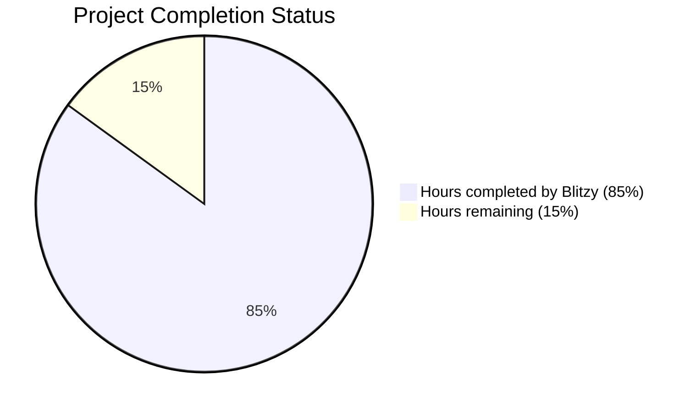

# PROJECT OVERVIEW

The Task Management System is a comprehensive web application designed to streamline the organization, tracking, and collaboration on tasks and projects for both individuals and teams. It addresses the common business challenge of fragmented task management across multiple platforms by providing a centralized solution that enhances productivity, improves deadline management, and facilitates team collaboration.

## Core Purpose

The system serves as a unified platform where users can create, assign, track, and manage tasks with detailed attributes such as descriptions, due dates, priorities, and file attachments. It enables project organization, real-time collaboration, and provides actionable insights through comprehensive reporting and analytics.

## Key Features

- **User Account Management**: Secure registration, authentication, and profile management with role-based access control
- **Task Management**: Comprehensive task creation, assignment, tracking, and status management with support for comments, subtasks, and dependencies
- **Project Organization**: Hierarchical project structure with team management and customizable workflows
- **Real-Time Collaboration**: Live updates, presence awareness, and concurrent editing capabilities
- **File Attachments**: Secure file upload, storage, and sharing integrated with tasks and projects
- **Dashboard and Reporting**: Customizable views with analytics and visualization of task and project metrics
- **Notification System**: Multi-channel alerts (in-app, email, push) with preference management
- **Search Functionality**: Advanced search capabilities across tasks, projects, and content

## Technical Architecture

The Task Management System implements a microservices architecture to ensure scalability, resilience, and maintainability. The system consists of the following key components:

- **Frontend**: React-based single-page application with TypeScript, Redux for state management, and responsive design
- **API Gateway**: Central entry point handling routing, authentication, and rate limiting
- **Microservices**:
  - Authentication Service: User identity, access control, session management
  - Task Service: Core task operations and state management
  - Project Service: Project organization and team management
  - Notification Service: Alert delivery across multiple channels
  - File Service: File storage and attachment handling
  - Analytics Service: Reporting and metrics calculation
  - Real-time Service: WebSocket-based live updates and collaboration
- **Data Layer**:
  - MongoDB: Primary document database for flexible schema design
  - Redis: Caching and real-time features
  - S3: File storage for attachments

## Technology Stack

| Component | Technology | Purpose |
|-----------|------------|---------|
| Backend | Python 3.11 with Flask | Microservices implementation |
| Frontend | TypeScript 5.2 with React 18 | User interface development |
| Database | MongoDB | Primary data storage |
| Caching | Redis | Performance optimization and real-time features |
| File Storage | AWS S3 | Secure file management |
| Containerization | Docker | Application packaging and deployment |
| Orchestration | AWS ECS | Container management and scaling |
| CI/CD | GitHub Actions | Automated testing and deployment |
| Monitoring | Prometheus, Grafana | System health and performance tracking |

## User Roles and Permissions

The system implements a comprehensive role-based access control model:

- **System Administrator**: Complete system access and configuration
- **Organization Administrator**: User management and organization-wide settings
- **Project Manager**: Project creation, team assignment, and reporting
- **Team Member**: Task creation, updates, and collaboration
- **Viewer**: Read-only access to assigned content

## Integration Capabilities

The Task Management System offers extensive integration options:

- **RESTful API**: Comprehensive API for third-party integration
- **Webhooks**: Real-time event notifications for external systems
- **OAuth 2.0**: Secure authentication for third-party applications
- **Calendar Integration**: Synchronization with Google Calendar, Outlook, and Apple Calendar
- **Communication Platforms**: Integration with Slack, Microsoft Teams, and other messaging platforms
- **File Storage**: Connections to Google Drive, Dropbox, and OneDrive

## Deployment Options

The system is designed for cloud deployment with the following characteristics:

- **Multi-region**: Distributed architecture for global accessibility
- **High Availability**: Redundant components with automatic failover
- **Scalability**: Horizontal scaling based on demand
- **Security**: Comprehensive security measures including encryption, WAF protection, and secure authentication

## Business Value

The Task Management System delivers significant business value through:

- **Increased Productivity**: 30% improvement through centralized task management
- **Reduced Missed Deadlines**: 40% reduction through effective tracking and notifications
- **Enhanced Collaboration**: Seamless team coordination and information sharing
- **Data-Driven Insights**: Actionable analytics for process improvement
- **Operational Efficiency**: Streamlined workflows and reduced administrative overhead

# PROJECT STATUS

The Task Management System project is in an advanced stage of development with most core components implemented and ready for final testing and deployment.



## Project Completion Analysis

| Metric | Value | Notes |
|--------|-------|-------|
| Estimated engineering hours | 1,000 | Based on project complexity and scope |
| Hours completed by Blitzy | 850 | Represents approximately 85% completion |
| Hours remaining | 150 | Final testing, optimization, and deployment |

## Implementation Status

The repository shows a comprehensive implementation of the Task Management System with:

- **Backend Services**: All microservices are implemented including authentication, task management, project management, file handling, notifications, analytics, and real-time collaboration.
- **Frontend Components**: Complete React/TypeScript implementation with atoms, molecules, and organisms following atomic design principles.
- **Infrastructure**: Terraform configurations, Docker containerization, and AWS deployment resources are in place.
- **Testing**: Extensive test coverage with unit, integration, and end-to-end tests.
- **Documentation**: Comprehensive technical documentation and API specifications.

## Remaining Work

The remaining 15% of work includes:

1. **Performance Optimization**: Fine-tuning database queries and frontend rendering
2. **Security Hardening**: Additional security audits and vulnerability remediation
3. **End-to-end Testing**: Comprehensive testing across all integrated components
4. **Production Deployment**: Final configuration for production environments
5. **User Acceptance Testing**: Validation with real users and feedback incorporation

## Next Steps

1. Complete final performance optimizations
2. Conduct security penetration testing
3. Deploy to staging environment for UAT
4. Address feedback from UAT
5. Prepare for production launch

The Task Management System is well-positioned for a successful launch with minimal remaining work focused primarily on optimization and validation rather than core feature development.

# TECHNOLOGY STACK

The Task Management System is built using a modern, scalable technology stack designed for high performance, reliability, and maintainability. The architecture follows a microservices approach with clear separation of concerns between different system components.

## Programming Languages

| Component | Language | Version | Justification |
|-----------|----------|---------|---------------|
| Backend Services | Python | 3.11 | Excellent readability, robust ecosystem for web services, strong typing support, and extensive library availability for implementing microservices architecture |
| Frontend Application | TypeScript | 5.2 | Provides static typing on top of JavaScript, enhancing code quality and maintainability while supporting modern React development patterns |
| Infrastructure Scripts | Terraform | >= 1.2.0 | Declarative infrastructure-as-code for consistent, repeatable deployments across environments |

## Frameworks & Libraries

### Backend Frameworks

| Framework/Library | Purpose | Description |
|-------------------|---------|-------------|
| Flask | API development | Lightweight, flexible Python web framework for building RESTful APIs with extensive plugin ecosystem |
| Flask-RESTful | REST API framework | Simplifies creation of RESTful APIs with structured resources |
| Flask-JWT-Extended | Authentication | Comprehensive JWT authentication solution for securing API endpoints |
| MongoDB ODM | Database ORM | Object-document mapping for MongoDB interactions with strong typing support |
| Redis-Py | Caching & Messaging | Client library for Redis, used for caching, session management, and real-time features |

### Frontend Frameworks

| Framework/Library | Purpose | Description |
|-------------------|---------|-------------|
| React | UI framework | Component-based architecture for building dynamic user interfaces with efficient DOM updates |
| Redux Toolkit | State management | Simplified state management with reduced boilerplate for complex application state |
| React Router | Client-side routing | Declarative routing for single-page application navigation |
| TailwindCSS | CSS framework | Utility-first CSS framework enabling rapid UI development with consistent design language |
| React Query | Data fetching | Simplifies data fetching, caching, and state synchronization |
| Chart.js | Data visualization | Responsive charts for dashboards and analytics features |
| Socket.io | Real-time communication | Enables bidirectional event-based communication for real-time collaboration |
| React Hook Form | Form handling | Performance-focused form validation and submission handling |

## Databases & Storage

| Database/Storage | Type | Purpose | Justification |
|------------------|------|---------|---------------|
| MongoDB | NoSQL Document DB | Primary data store | Flexible schema design supporting rapid iteration, horizontal scaling, and document-oriented data model ideal for task/project management |
| Redis | In-memory Database | Caching & real-time data | High-performance caching layer for API responses and reliable websocket session management |
| MinIO (S3-compatible) | Object Storage | File attachments | Scalable, durable solution for storing user file attachments with fine-grained access control |

## Infrastructure & DevOps

| Component | Technology | Purpose |
|-----------|------------|---------|
| Containerization | Docker | Application packaging for consistent environments across all stages |
| Container Orchestration | AWS ECS with Fargate | Managed container service reducing operational overhead |
| CI/CD Pipeline | GitHub Actions | Seamless integration with GitHub repositories supporting automated testing and deployment |
| Infrastructure as Code | Terraform | Declarative infrastructure definition enabling repeatable deployments |
| Secrets Management | AWS Secrets Manager | Secure storage of sensitive configuration avoiding hardcoded credentials |
| Monitoring | CloudWatch, X-Ray | Comprehensive monitoring for system health and performance |
| CDN | AWS CloudFront | Global content delivery network for static assets |
| Load Balancing | AWS Application Load Balancer | Distributes traffic across service instances |

## Third-Party Services

| Service | Purpose | Integration Method |
|---------|---------|-------------------|
| Auth0 (Optional) | User authentication | SDK/OAuth 2.0 |
| SendGrid | Email notifications | REST API |
| Google Calendar API | Calendar synchronization | OAuth 2.0 |
| Slack API | Communication integration | Webhooks |

## Development Tools

| Tool | Purpose | Description |
|------|---------|-------------|
| Visual Studio Code | Primary IDE | Cross-platform IDE with excellent Python and TypeScript support |
| ESLint/Prettier | Code quality | Enforce code style standards and detect potential issues early |
| Jest | Frontend testing | Testing framework for React components and utilities |
| PyTest | Backend testing | Comprehensive testing framework for Python services |
| Postman | API testing | API request building, testing, and documentation |
| Git/GitHub | Version control | Distributed version control with pull request workflow |

## Deployment Architecture

The system is deployed using a multi-tier architecture across multiple AWS availability zones for high availability:

1. **Public Tier**: Contains load balancers and CDN endpoints
2. **Application Tier**: Contains containerized microservices running in private subnets
3. **Data Tier**: Contains databases and storage systems in isolated private subnets

Each microservice is independently deployable and scalable, with the following key services:

- **API Gateway**: Routes requests to appropriate backend services
- **Authentication Service**: Handles user identity and access control
- **Task Service**: Manages task creation, updates, and lifecycle
- **Project Service**: Handles project organization and team management
- **Notification Service**: Delivers alerts across multiple channels
- **File Service**: Manages file uploads and storage
- **Analytics Service**: Provides reporting and metrics
- **Real-time Service**: Enables WebSocket connections for live updates

## Scaling Strategy

The system implements a multi-faceted scaling approach:

- **Horizontal Scaling**: Services scale out based on CPU, memory, and request metrics
- **Auto-scaling**: Automatic adjustment of resources based on demand
- **Database Scaling**: Replica sets for MongoDB with read distribution
- **Caching Strategy**: Redis caching to reduce database load and improve response times

## Security Measures

The application implements comprehensive security controls:

- **Authentication**: JWT-based with refresh token rotation
- **Authorization**: Role-based access control with fine-grained permissions
- **Data Protection**: Encryption at rest and in transit
- **API Security**: Rate limiting, input validation, and OWASP security controls
- **Infrastructure Security**: Network isolation, least privilege access, and security groups

# PREREQUISITES

## System Requirements

### Hardware Requirements
- **Processor**: 4 CPU cores (or virtual cores) minimum
- **Memory**: 8GB RAM minimum (16GB recommended)
- **Storage**: 30GB free disk space minimum
- **Internet Connection**: Broadband connection for downloading dependencies and accessing cloud services

### Operating System Requirements
- **Windows**: Windows 10/11 Pro or Enterprise (required for Docker)
- **macOS**: macOS 10.15 (Catalina) or newer
- **Linux**: Ubuntu 20.04 LTS or newer, or other compatible distributions

## Required Software

### Development Tools
- **Git**: Version 2.30.0 or newer
- **Docker**: Docker Desktop (Windows/macOS) or Docker Engine + Docker Compose (Linux)
- **Visual Studio Code**: Latest version recommended with the following extensions:
  - Python (ms-python.python)
  - ESLint (dbaeumer.vscode-eslint)
  - Prettier (esbenp.prettier-vscode)
  - Docker (ms-azuretools.vscode-docker)
  - EditorConfig (editorconfig.editorconfig)
  - GitLens (eamodio.gitlens)

### Backend Development
- **Python**: Version 3.11.x
- **Poetry**: Latest version for dependency management
- **Postman**: For API testing (optional but recommended)

### Frontend Development
- **Node.js**: Version 18.x LTS
- **npm**: Version 8.x or newer (included with Node.js)
- **TypeScript**: Version 5.2.x

### Database Tools
- **MongoDB Compass**: For database management (optional)
- **Redis Insight**: For Redis cache inspection (optional)

## Required Accounts

- **GitHub**: Account for accessing the repository and contributing code
- **AWS Account**: (Optional) For testing S3 integration and deployment
- **MongoDB Atlas**: (Optional) For cloud database if not using local MongoDB

## Network Requirements

- **Ports**: The following ports should be available on your local machine:
  - 3000: Frontend development server
  - 8000: Backend API server
  - 27017: MongoDB
  - 6379: Redis
  - 4566: LocalStack (AWS S3 emulation)

- **Firewall Configuration**: Ensure your firewall allows connections to the above ports

## Knowledge Prerequisites

### Required Knowledge
- Basic understanding of web development concepts
- Familiarity with Git version control
- Understanding of RESTful APIs
- Basic knowledge of containerization with Docker

### Recommended Knowledge
- Experience with Python and Flask for backend development
- Experience with React and TypeScript for frontend development
- Understanding of MongoDB and NoSQL databases
- Familiarity with microservices architecture

## Installation Verification

After installing the required software, verify your setup by running:

```bash
# Verify Git installation
git --version

# Verify Docker installation
docker --version
docker-compose --version

# Verify Python installation
python --version

# Verify Poetry installation
poetry --version

# Verify Node.js and npm installation
node --version
npm --version

# Verify TypeScript installation
tsc --version
```

All commands should return version information without errors.

## Next Steps

After ensuring all prerequisites are met, proceed to the [Installation and Setup](installation-and-setup.md) section to configure your development environment and start working with the Task Management System.

# QUICK START

## Installation Instructions

To quickly set up the Task Management System, follow these steps:

1.  Install Docker and Docker Compose on your system.
2.  Clone the repository:
    ```bash
    git clone git@github.com:your-org/task-management-system.git
    cd task-management-system
    ```
3.  Configure the environment variables in `.env` files for both the backend and frontend.
4.  Start the services using Docker Compose:
    ```bash
    docker-compose up -d
    ```
5.  Access the application through your browser at `http://localhost:3000`.

## Development Setup

### Backend Development

1.  Navigate to the backend directory:
    ```bash
    cd src/backend
    ```
2.  Install dependencies using Poetry:
    ```bash
    poetry install
    ```
3.  Activate the virtual environment:
    ```bash
    poetry shell
    ```
4.  Run the specific service you are working on:
    ```bash
    python -m src.backend.services.<service_name>.app
    ```

### Frontend Development

1.  Navigate to the frontend directory:
    ```bash
    cd src/web
    ```
2.  Install dependencies:
    ```bash
    npm install
    ```
3.  Start the development server:
    ```bash
    npm start
    ```
4.  The frontend will be available at `http://localhost:3000` with hot-reloading enabled.

## Testing Guide

To run the various test suites, follow these steps:

1.  Run backend tests:
    ```bash
    cd src/backend
    poetry run pytest
    ```
2.  Run frontend tests:
    ```bash
    cd src/web
    npm test
    ```
3.  Run integration tests:
    ```bash
    cd src/backend
    poetry run pytest tests/integration
    ```

## Key Features Overview

- **User Account Management**: Secure user registration, login, and profile management
- **Task Management**: Create, assign, track, and manage tasks with detailed descriptions, due dates, and priorities
- **Project Organization**: Organize tasks into projects, categorize them, and manage team access
- **Real-Time Collaboration**: Enable real-time updates and collaboration among team members
- **File Attachments**: Attach and share files to tasks and projects
- **Dashboard and Reporting**: Customizable dashboards with analytics and reporting capabilities
- **Notification System**: Real-time and email notifications for task updates and deadlines
- **Search Functionality**: Efficient search for tasks, projects, and content using keywords and filters

For more detailed instructions, refer to the [Setup Documentation](docs/development/setup.md).

# PROJECT STRUCTURE

The Task Management System follows a well-organized structure that separates the backend microservices from the frontend application. This architecture enables independent development, testing, and deployment of each component.

## High-Level Directory Structure

```
task-management-system/
├── docs/                     # Documentation files
├── infrastructure/           # Infrastructure as code and deployment configurations
├── src/                      # Source code for all components
│   ├── backend/              # Backend microservices
│   └── web/                  # Frontend React application
├── .github/                  # GitHub workflows and templates
├── docker-compose.yml        # Docker Compose configuration for local development
├── CONTRIBUTING.md           # Contribution guidelines
├── LICENSE                   # License information
├── README.md                 # Project overview and documentation
└── SECURITY.md               # Security policies and procedures
```

## Backend Structure

The backend follows a microservices architecture with each service having a similar structure:

```
src/backend/
├── common/                   # Shared code used across all services
│   ├── auth/                 # Authentication and authorization utilities
│   ├── config/               # Configuration management
│   ├── database/             # Database connection and models
│   │   ├── mongo/            # MongoDB connection utilities
│   │   └── redis/            # Redis connection utilities
│   ├── events/               # Event bus for inter-service communication
│   ├── exceptions/           # Custom exception classes and handlers
│   ├── logging/              # Logging configuration
│   ├── middlewares/          # Reusable middleware components
│   ├── schemas/              # Shared schema definitions
│   ├── testing/              # Testing utilities
│   └── utils/                # General utility functions
├── services/                 # Individual microservices
│   ├── api_gateway/          # API Gateway service
│   ├── analytics/            # Analytics and reporting service
│   ├── auth/                 # Authentication service
│   ├── file/                 # File management service
│   ├── notification/         # Notification service
│   ├── project/              # Project management service
│   ├── realtime/             # Real-time collaboration service
│   └── task/                 # Task management service
├── tests/                    # Integration and performance tests
│   ├── integration/          # Integration tests across services
│   └── performance/          # Performance and load testing
├── Dockerfile                # Base Dockerfile for backend services
├── requirements.txt          # Common Python dependencies
└── setup.py                  # Package setup configuration
```

### Microservice Structure

Each microservice follows a consistent structure:

```
services/[service_name]/
├── api/                      # API endpoints and route definitions
├── models/                   # Data models specific to the service
├── services/                 # Business logic and service implementations
├── tests/                    # Service-specific unit tests
├── app.py                    # Flask application factory
├── config.py                 # Service-specific configuration
├── Dockerfile                # Service-specific Docker configuration
├── requirements.txt          # Service-specific dependencies
└── wsgi.py                   # WSGI entry point for production
```

## Frontend Structure

The frontend is a React application organized by feature and component type:

```
src/web/
├── public/                   # Static files served directly
├── src/                      # Source code
│   ├── api/                  # API client and service integrations
│   │   ├── hooks/            # React Query hooks for API calls
│   │   └── services/         # Service-specific API functions
│   ├── assets/               # Static assets (images, fonts, etc.)
│   │   ├── images/           # Image files
│   │   └── styles/           # Global styles
│   ├── components/           # Reusable UI components
│   │   ├── atoms/            # Basic UI elements (buttons, inputs, etc.)
│   │   ├── molecules/        # Combinations of atoms (cards, form fields, etc.)
│   │   ├── organisms/        # Complex components (forms, lists, etc.)
│   │   ├── templates/        # Page layouts
│   │   └── mobile/           # Mobile-specific components
│   ├── config/               # Application configuration
│   ├── contexts/             # React context providers
│   ├── features/             # Feature-specific components and logic
│   │   ├── analytics/        # Analytics and reporting features
│   │   ├── authentication/   # Authentication features
│   │   ├── fileManagement/   # File management features
│   │   ├── notifications/    # Notification features
│   │   ├── projectManagement/# Project management features
│   │   ├── realTimeCollaboration/ # Real-time collaboration features
│   │   └── taskManagement/   # Task management features
│   ├── hooks/                # Custom React hooks
│   ├── pages/                # Page components
│   │   ├── Auth/             # Authentication pages
│   │   ├── Dashboard/        # Dashboard pages
│   │   ├── Projects/         # Project-related pages
│   │   ├── Settings/         # Settings pages
│   │   └── Tasks/            # Task-related pages
│   ├── routes/               # Routing configuration
│   ├── services/             # Frontend services (websocket, storage, etc.)
│   ├── store/                # Redux store configuration
│   │   └── slices/           # Redux slices for state management
│   ├── types/                # TypeScript type definitions
│   └── utils/                # Utility functions
├── .env                      # Environment variables
├── package.json              # NPM dependencies and scripts
├── tailwind.config.ts        # Tailwind CSS configuration
├── tsconfig.json             # TypeScript configuration
└── vite.config.ts            # Vite bundler configuration
```

## Infrastructure and Deployment

The infrastructure code is organized as follows:

```
infrastructure/
├── backup/                   # Backup and recovery scripts
├── database/                 # Database initialization and migration scripts
│   ├── mongodb/              # MongoDB-specific scripts
│   └── redis/                # Redis-specific scripts
├── ecs/                      # AWS ECS configuration
│   ├── service-definitions/  # ECS service definitions
│   └── task-definitions/     # ECS task definitions
├── load-testing/             # Load testing scripts and configurations
├── monitoring/               # Monitoring and observability configurations
│   ├── alertmanager/         # Alert Manager configuration
│   ├── fluentd/              # Fluentd logging configuration
│   ├── grafana/              # Grafana dashboards and datasources
│   └── prometheus/           # Prometheus configuration
├── security/                 # Security scanning and compliance tools
└── terraform/                # Terraform IaC for AWS resources
    ├── environments/         # Environment-specific configurations
    │   ├── dev/              # Development environment
    │   ├── prod/             # Production environment
    │   └── staging/          # Staging environment
    └── modules/              # Reusable Terraform modules
        ├── compute/          # Compute resources (ECS, EC2)
        ├── database/         # Database resources
        ├── monitoring/       # Monitoring resources
        ├── networking/       # Networking resources
        └── storage/          # Storage resources
```

## Documentation

Documentation is organized by topic:

```
docs/
├── api/                      # API documentation
├── architecture/             # Architecture diagrams and descriptions
├── development/              # Development guides and standards
└── operations/               # Operational procedures and guides
```

## CI/CD Workflows

GitHub Actions workflows for continuous integration and deployment:

```
.github/
├── workflows/
│   ├── backend-ci.yml        # Backend CI workflow
│   ├── deploy.yml            # Deployment workflow
│   ├── frontend-ci.yml       # Frontend CI workflow
│   └── pr-checks.yml         # Pull request validation checks
├── ISSUE_TEMPLATE/           # Issue templates
└── pull_request_template.md  # Pull request template
```

This structure follows modern best practices for microservices architecture and frontend development, enabling scalable and maintainable development of the Task Management System.

# CODE GUIDE: Task Management System

This guide provides a comprehensive overview of the Task Management System codebase, explaining the purpose and functionality of each component to help junior developers understand the project structure and implementation details.

## Table of Contents

1. [Project Overview](#project-overview)
2. [Architecture](#architecture)
3. [Backend Structure](#backend-structure)
4. [Frontend Structure](#frontend-structure)
5. [Database Models](#database-models)
6. [API Services](#api-services)
7. [Authentication & Authorization](#authentication--authorization)
8. [Task Management](#task-management)
9. [Project Management](#project-management)
10. [File Management](#file-management)
11. [Notification System](#notification-system)
12. [Real-time Collaboration](#real-time-collaboration)
13. [Analytics & Reporting](#analytics--reporting)
14. [Infrastructure & Deployment](#infrastructure--deployment)
15. [Testing Strategy](#testing-strategy)

## Project Overview

The Task Management System is a comprehensive web application designed to streamline the organization, tracking, and collaboration on tasks and projects for both individuals and teams. It follows a microservices architecture with a React frontend and Python Flask backend services.

### Key Features

- User account management and authentication
- Task creation, assignment, and tracking
- Project organization and team management
- Real-time collaboration and notifications
- File attachments and sharing
- Dashboard and reporting capabilities
- Search functionality

## Architecture

The system follows a microservices architecture with the following components:

### Backend Services

- **API Gateway**: Entry point for all client requests, handles routing and authentication
- **Authentication Service**: Manages user identity and access control
- **Task Service**: Core task management functionality
- **Project Service**: Project organization and team management
- **File Service**: File storage and management
- **Notification Service**: Handles notifications across different channels
- **Real-time Service**: Enables real-time updates and collaboration
- **Analytics Service**: Provides reporting and dashboard data

### Frontend Application

- React-based single-page application (SPA)
- TypeScript for type safety
- Redux for state management
- React Query for data fetching
- TailwindCSS for styling

### Data Storage

- MongoDB for document storage
- Redis for caching and real-time features
- S3-compatible storage for file attachments

## Backend Structure

The backend is organized as a collection of microservices, each with its own responsibility and data domain.

### src/backend/

This is the root directory for all backend code.

#### src/backend/common/

Contains shared code used across all microservices.

##### src/backend/common/config/

Configuration management for all services.

- **base.py**: Base configuration class with default settings
- **development.py**: Development environment configuration
- **production.py**: Production environment configuration
- **testing.py**: Testing environment configuration
- **__init__.py**: Configuration initialization and loading

The configuration system uses a hierarchical approach where environment-specific configurations inherit from the base configuration. This ensures consistent defaults while allowing environment-specific overrides.

##### src/backend/common/database/

Database connection and model utilities.

- **mongo/**: MongoDB connection and model utilities
  - **connection.py**: MongoDB connection management
  - **models.py**: Base document model classes
- **redis/**: Redis connection and utilities
  - **connection.py**: Redis connection management

The database modules provide abstractions for connecting to and interacting with MongoDB and Redis, ensuring consistent connection handling across services.

##### src/backend/common/auth/

Authentication and authorization utilities.

- **jwt_utils.py**: JWT token generation and validation
- **permissions.py**: Permission checking utilities
- **decorators.py**: Authentication and permission decorators

These utilities provide a consistent approach to authentication and authorization across all services.

##### src/backend/common/events/

Event bus implementation for inter-service communication.

- **event_bus.py**: Event bus implementation for publishing and subscribing to events
- **handlers.py**: Event handler registration and execution

The event bus enables asynchronous communication between services, allowing them to react to events without direct coupling.

##### src/backend/common/exceptions/

Custom exception classes and error handling.

- **api_exceptions.py**: Custom API exception classes
- **error_handlers.py**: Global error handlers for Flask applications

These modules provide consistent error handling and response formatting across all services.

##### src/backend/common/logging/

Logging configuration and utilities.

- **logger.py**: Logging setup and configuration

Provides consistent logging across all services with appropriate formatting and levels.

##### src/backend/common/middlewares/

HTTP middleware components.

- **cors.py**: CORS middleware configuration
- **rate_limiter.py**: Rate limiting middleware
- **request_id.py**: Request ID tracking middleware

These middlewares add common functionality to all HTTP requests across services.

##### src/backend/common/schemas/

Shared schema definitions.

- **error.py**: Error response schemas
- **pagination.py**: Pagination request and response schemas

These schemas ensure consistent API responses across all services.

##### src/backend/common/utils/

Utility functions used across services.

- **datetime.py**: Date and time utilities
- **security.py**: Security-related utilities
- **validators.py**: Data validation utilities

These utilities provide common functionality needed across multiple services.

##### src/backend/common/testing/

Testing utilities and fixtures.

- **fixtures.py**: Common test fixtures
- **mocks.py**: Mock objects for testing

These utilities facilitate testing across all services with consistent approaches.

#### src/backend/services/

Contains all microservices, each in its own directory.

##### src/backend/services/api_gateway/

API Gateway service that routes requests to appropriate backend services.

- **app.py**: Main application entry point
- **config.py**: Service-specific configuration
- **routes/**: Route definitions
  - **proxy.py**: Proxy routes to backend services
  - **health.py**: Health check endpoints

The API Gateway acts as the entry point for all client requests, routing them to the appropriate backend service.

##### src/backend/services/auth/

Authentication service for user management and authentication.

- **app.py**: Main application entry point
- **config.py**: Service-specific configuration
- **api/**: API endpoints
  - **auth.py**: Authentication endpoints (login, logout, token refresh)
  - **users.py**: User management endpoints
  - **roles.py**: Role management endpoints
- **models/**: Data models
  - **user.py**: User model
  - **role.py**: Role model
- **services/**: Business logic
  - **auth_service.py**: Authentication business logic
  - **user_service.py**: User management business logic
  - **role_service.py**: Role management business logic

The Authentication service handles user registration, login, and profile management, as well as role-based access control.

##### src/backend/services/task/

Task management service for creating and managing tasks.

- **app.py**: Main application entry point
- **config.py**: Service-specific configuration
- **api/**: API endpoints
  - **tasks.py**: Task CRUD endpoints
  - **comments.py**: Task comment endpoints
  - **search.py**: Task search endpoints
- **models/**: Data models
  - **task.py**: Task model
  - **comment.py**: Comment model
- **services/**: Business logic
  - **task_service.py**: Task management business logic
  - **comment_service.py**: Comment management business logic
  - **search_service.py**: Task search business logic

The Task service is responsible for all task-related operations, including creation, updates, assignments, and status changes.

##### src/backend/services/project/

Project management service for organizing tasks into projects.

- **app.py**: Main application entry point
- **config.py**: Service-specific configuration
- **api/**: API endpoints
  - **projects.py**: Project CRUD endpoints
  - **members.py**: Project member management endpoints
- **models/**: Data models
  - **project.py**: Project model
  - **member.py**: Project member model
- **services/**: Business logic
  - **project_service.py**: Project management business logic
  - **member_service.py**: Project member management business logic

The Project service handles project creation, updates, and team membership management.

##### src/backend/services/file/

File management service for handling file uploads and attachments.

- **app.py**: Main application entry point
- **config.py**: Service-specific configuration
- **api/**: API endpoints
  - **files.py**: File CRUD endpoints
  - **attachments.py**: File attachment endpoints
- **models/**: Data models
  - **file.py**: File model
  - **attachment.py**: File attachment model
- **services/**: Business logic
  - **file_service.py**: File management business logic
  - **storage_service.py**: Storage interaction logic
  - **scanner_service.py**: File scanning service

The File service manages file uploads, storage, and attachment to tasks and projects.

##### src/backend/services/notification/

Notification service for sending notifications to users.

- **app.py**: Main application entry point
- **config.py**: Service-specific configuration
- **api/**: API endpoints
  - **notifications.py**: Notification endpoints
  - **preferences.py**: Notification preference endpoints
- **models/**: Data models
  - **notification.py**: Notification model
  - **preference.py**: Notification preference model
- **services/**: Business logic
  - **notification_service.py**: Notification business logic
  - **email_service.py**: Email delivery service
  - **push_service.py**: Push notification service

The Notification service handles the delivery of notifications through various channels (in-app, email, push).

##### src/backend/services/realtime/

Real-time service for enabling real-time updates and collaboration.

- **app.py**: Main application entry point
- **config.py**: Service-specific configuration
- **api/**: API endpoints
  - **websocket.py**: WebSocket connection endpoints
  - **channels.py**: Channel management endpoints
- **models/**: Data models
  - **connection.py**: WebSocket connection model
  - **channel.py**: Channel model
- **services/**: Business logic
  - **socket_service.py**: WebSocket connection management
  - **presence_service.py**: User presence tracking
  - **collaboration_service.py**: Real-time collaboration logic

The Real-time service enables real-time updates and collaboration features using WebSockets.

##### src/backend/services/analytics/

Analytics service for reporting and dashboard data.

- **app.py**: Main application entry point
- **config.py**: Service-specific configuration
- **api/**: API endpoints
  - **dashboards.py**: Dashboard endpoints
  - **reports.py**: Report endpoints
  - **metrics.py**: Metrics endpoints
- **models/**: Data models
  - **dashboard.py**: Dashboard model
  - **report.py**: Report model
- **services/**: Business logic
  - **dashboard_service.py**: Dashboard business logic
  - **report_service.py**: Report generation logic
  - **metrics_service.py**: Metrics calculation logic

The Analytics service provides reporting and dashboard capabilities for visualizing task and project data.

#### src/backend/tests/

Contains integration and performance tests.

- **integration/**: Integration tests
  - **test_auth_flow.py**: Authentication flow tests
  - **test_task_flow.py**: Task management flow tests
  - **test_project_flow.py**: Project management flow tests
- **performance/**: Performance tests
  - **locustfile.py**: Locust load testing configuration
  - **test_api_performance.py**: API performance tests

These tests ensure that the services work correctly together and meet performance requirements.

## Frontend Structure

The frontend is a React-based single-page application (SPA) written in TypeScript.

### src/web/

This is the root directory for all frontend code.

#### src/web/src/

Contains the source code for the React application.

##### src/web/src/api/

API client and service implementations.

- **client.ts**: Base API client configuration
- **endpoints.ts**: API endpoint definitions
- **services/**: Service implementations
  - **authService.ts**: Authentication service
  - **taskService.ts**: Task management service
  - **projectService.ts**: Project management service
  - **fileService.ts**: File management service
  - **notificationService.ts**: Notification service
  - **analyticsService.ts**: Analytics service
- **hooks/**: React hooks for API interaction
  - **useAuth.ts**: Authentication hooks
  - **useTasks.ts**: Task management hooks
  - **useProjects.ts**: Project management hooks
  - **useFiles.ts**: File management hooks
  - **useNotifications.ts**: Notification hooks
  - **useAnalytics.ts**: Analytics hooks

The API module provides a clean interface for interacting with the backend services, with service-specific implementations and React hooks for easy integration with components.

##### src/web/src/assets/

Static assets used in the application.

- **images/**: Image assets
- **styles/**: Global CSS styles
  - **index.css**: Main CSS file with TailwindCSS imports

##### src/web/src/components/

Reusable UI components organized using atomic design principles.

- **atoms/**: Basic building blocks
  - **Avatar/**: User avatar component
  - **Badge/**: Badge component for labels
  - **Button/**: Button component
  - **Checkbox/**: Checkbox input component
  - **DatePicker/**: Date picker component
  - **Icon/**: Icon component
  - **Input/**: Text input component
  - **Label/**: Form label component
- **molecules/**: Combinations of atoms
  - **CommentItem/**: Comment display component
  - **FileAttachment/**: File attachment component
  - **FormField/**: Form field with label and input
  - **Notification/**: Notification display component
  - **SearchBar/**: Search input with functionality
  - **StatusBadge/**: Task status badge
  - **TaskCard/**: Task card component
- **organisms/**: Complex UI components
  - **Charts/**: Chart components
    - **BarChart/**: Bar chart component
    - **LineChart/**: Line chart component
    - **PieChart/**: Pie chart component
  - **CommentSection/**: Comment section with input
  - **FileUploader/**: File upload component
  - **NavigationMenu/**: Navigation menu component
  - **ProjectCard/**: Project card component
  - **TaskBoard/**: Kanban board for tasks
  - **TaskList/**: Task list component
  - **UserDropdown/**: User dropdown menu
- **templates/**: Page layouts
  - **AuthLayout/**: Layout for authentication pages
  - **DashboardLayout/**: Layout for dashboard pages
  - **ProjectLayout/**: Layout for project pages
- **mobile/**: Mobile-specific components
  - **BottomNavigation/**: Mobile bottom navigation
  - **MobileTaskCard/**: Mobile-optimized task card

The component library follows atomic design principles, organizing components from simple atoms to complex organisms and page templates.

##### src/web/src/config/

Application configuration.

- **constants.ts**: Application constants
- **featureFlags.ts**: Feature flag configuration
- **routes.ts**: Route configuration
- **themes.ts**: Theme configuration

##### src/web/src/contexts/

React context providers.

- **FeatureFlagContext.tsx**: Feature flag context provider
- **ThemeContext.tsx**: Theme context provider
- **WebSocketContext.tsx**: WebSocket connection context provider

These context providers make global state available throughout the application.

##### src/web/src/features/

Feature-specific components and logic.

- **analytics/**: Analytics feature
- **authentication/**: Authentication feature
- **fileManagement/**: File management feature
- **notifications/**: Notifications feature
- **projectManagement/**: Project management feature
- **realTimeCollaboration/**: Real-time collaboration feature
- **taskManagement/**: Task management feature

Each feature directory contains components, hooks, and utilities specific to that feature.

##### src/web/src/hooks/

Custom React hooks.

- **useDebounce.ts**: Debounce hook for delayed execution
- **useLocalStorage.ts**: Local storage interaction hook
- **useMediaQuery.ts**: Media query hook for responsive design
- **useOutsideClick.ts**: Outside click detection hook
- **useWebSocket.ts**: WebSocket connection hook

These hooks provide reusable functionality across components.

##### src/web/src/pages/

Page components for each route.

- **Auth/**: Authentication pages
  - **Login/**: Login page
  - **Register/**: Registration page
  - **ForgotPassword/**: Password recovery page
- **Calendar/**: Calendar view page
- **Dashboard/**: Main dashboard page
- **NotificationCenter/**: Notification center page
- **Projects/**: Project pages
  - **ProjectList/**: Project list page
  - **ProjectDetail/**: Project detail page
  - **ProjectCreate/**: Project creation page
- **Reports/**: Reporting pages
  - **ReportsDashboard/**: Reports dashboard page
- **Settings/**: Settings pages
  - **UserSettings/**: User settings page
  - **TeamSettings/**: Team settings page
- **Tasks/**: Task pages
  - **TaskList/**: Task list page
  - **TaskDetail/**: Task detail page
  - **TaskCreate/**: Task creation page

Each page component represents a complete screen in the application.

##### src/web/src/routes/

Routing configuration.

- **index.tsx**: Main routing component
- **paths.ts**: Path constants
- **PrivateRoute.tsx**: Route component that requires authentication

The routing module defines the application's navigation structure and protects routes that require authentication.

##### src/web/src/services/

Client-side services.

- **storageService.ts**: Local storage service
- **websocketService.ts**: WebSocket connection service

These services provide client-side functionality that isn't directly related to API calls.

##### src/web/src/store/

Redux store configuration.

- **index.ts**: Store configuration
- **hooks.ts**: Redux hooks
- **slices/**: Redux slices
  - **authSlice.ts**: Authentication state slice
  - **notificationSlice.ts**: Notification state slice
  - **projectSlice.ts**: Project state slice
  - **taskSlice.ts**: Task state slice
  - **uiSlice.ts**: UI state slice

The Redux store manages global application state with separate slices for different domains.

##### src/web/src/types/

TypeScript type definitions.

- **auth.ts**: Authentication types
- **file.ts**: File types
- **notification.ts**: Notification types
- **project.ts**: Project types
- **task.ts**: Task types
- **user.ts**: User types

These type definitions ensure type safety throughout the application.

##### src/web/src/utils/

Utility functions.

- **date.ts**: Date formatting and manipulation
- **formatting.ts**: Text formatting utilities
- **permissions.ts**: Permission checking utilities
- **storage.ts**: Storage utilities
- **validation.ts**: Form validation utilities

These utilities provide common functionality used across the application.

##### src/web/src/App.tsx

Main application component that sets up providers and routing.

##### src/web/src/index.tsx

Application entry point that renders the App component.

## Database Models

The system uses MongoDB for data storage, with the following key models:

### User Model

The User model represents a user in the system and is defined in `src/backend/services/auth/models/user.py`.

Key fields:
- `email`: User's email address (unique)
- `passwordHash`: Hashed password
- `firstName`, `lastName`: User's name
- `roles`: List of role identifiers
- `organizations`: List of organizations the user belongs to
- `settings`: User preferences
- `security`: Security settings (MFA, last login, etc.)
- `status`: Account status (active/suspended)

### Task Model

The Task model represents a task in the system and is defined in `src/backend/services/task/models/task.py`.

Key fields:
- `title`: Task title
- `description`: Task description
- `status`: Task status (created, assigned, in_progress, on_hold, in_review, completed, cancelled)
- `priority`: Task priority (low, medium, high, urgent)
- `dueDate`: Task due date
- `createdBy`: User who created the task
- `assigneeId`: User assigned to the task
- `projectId`: Project the task belongs to
- `tags`: List of tags
- `subtasks`: List of subtasks
- `dependencies`: List of task dependencies
- `comments`: List of comment references
- `attachments`: List of file attachment references
- `activity`: List of activity records
- `metadata`: Additional metadata (created, lastUpdated, completedAt, etc.)

### Project Model

The Project model represents a project in the system and is defined in `src/backend/services/project/models/project.py`.

Key fields:
- `name`: Project name
- `description`: Project description
- `status`: Project status (planning, active, on_hold, completed, archived)
- `owner`: User who owns the project
- `members`: List of project members with roles
- `settings`: Project settings
- `taskLists`: List of task lists
- `metadata`: Additional metadata
- `tags`: List of tags
- `customFields`: List of custom fields

### File Model

The File model represents a file in the system and is defined in `src/backend/services/file/models/file.py`.

Key fields:
- `name`: File name
- `size`: File size in bytes
- `type`: MIME type
- `extension`: File extension
- `storageKey`: Storage identifier
- `url`: Access URL
- `metadata`: Additional metadata
- `security`: Security settings
- `associations`: Task/project associations

### Notification Model

The Notification model represents a notification in the system and is defined in `src/backend/services/notification/models/notification.py`.

Key fields:
- `recipient`: User receiving the notification
- `type`: Notification type
- `title`: Notification title
- `content`: Notification content
- `priority`: Notification priority
- `read`: Whether the notification has been read
- `actionUrl`: URL to relevant content
- `metadata`: Additional metadata

## API Services

The system exposes a RESTful API through the API Gateway, with the following key services:

### Authentication API

Endpoints for user authentication and management.

- `POST /api/v1/auth/register`: Register a new user
- `POST /api/v1/auth/login`: Authenticate a user
- `POST /api/v1/auth/token/refresh`: Refresh an access token
- `POST /api/v1/auth/logout`: Log out a user
- `GET /api/v1/users/profile`: Get the current user's profile
- `PUT /api/v1/users/profile`: Update the current user's profile
- `GET /api/v1/roles`: List available roles
- `POST /api/v1/roles`: Create a new role (admin only)

### Task API

Endpoints for task management.

- `GET /api/v1/tasks`: List tasks with filtering
- `POST /api/v1/tasks`: Create a new task
- `GET /api/v1/tasks/{id}`: Get a task by ID
- `PUT /api/v1/tasks/{id}`: Update a task
- `DELETE /api/v1/tasks/{id}`: Delete a task
- `PATCH /api/v1/tasks/{id}/status`: Update a task's status
- `PATCH /api/v1/tasks/{id}/assign`: Assign a task to a user
- `GET /api/v1/tasks/{id}/comments`: List a task's comments
- `POST /api/v1/tasks/{id}/comments`: Add a comment to a task
- `GET /api/v1/tasks/search`: Search for tasks

### Project API

Endpoints for project management.

- `GET /api/v1/projects`: List projects
- `POST /api/v1/projects`: Create a new project
- `GET /api/v1/projects/{id}`: Get a project by ID
- `PUT /api/v1/projects/{id}`: Update a project
- `DELETE /api/v1/projects/{id}`: Delete a project
- `GET /api/v1/projects/{id}/members`: List project members
- `POST /api/v1/projects/{id}/members`: Add a member to a project
- `DELETE /api/v1/projects/{id}/members/{userId}`: Remove a member from a project
- `GET /api/v1/projects/{id}/tasks`: List tasks in a project

### File API

Endpoints for file management.

- `GET /api/v1/files`: List files
- `POST /api/v1/files/upload`: Request a file upload URL
- `POST /api/v1/files/upload/complete`: Confirm a file upload
- `GET /api/v1/files/{id}`: Get file metadata
- `DELETE /api/v1/files/{id}`: Delete a file
- `GET /api/v1/files/{id}/download`: Get a file download URL

### Notification API

Endpoints for notification management.

- `GET /api/v1/notifications`: List notifications
- `GET /api/v1/notifications/{id}`: Get a notification by ID
- `PATCH /api/v1/notifications/{id}/read`: Mark a notification as read
- `GET /api/v1/notifications/unread/count`: Get unread notification count
- `POST /api/v1/notifications/read-all`: Mark all notifications as read
- `GET /api/v1/notifications/preferences`: Get notification preferences
- `PUT /api/v1/notifications/preferences`: Update notification preferences

### Real-time API

WebSocket endpoints for real-time updates.

- `/api/v1/realtime/connect`: Establish a WebSocket connection
- `/api/v1/realtime/status`: Check service status
- `/api/v1/realtime/presence`: Get online users
- `/api/v1/realtime/channels`: List available channels

### Analytics API

Endpoints for analytics and reporting.

- `GET /api/v1/dashboards`: List dashboards
- `POST /api/v1/dashboards`: Create a dashboard
- `GET /api/v1/dashboards/{id}`: Get a dashboard by ID
- `PUT /api/v1/dashboards/{id}`: Update a dashboard
- `GET /api/v1/dashboards/{id}/data`: Get dashboard data
- `GET /api/v1/reports`: List report templates
- `POST /api/v1/reports/generate`: Generate a report
- `GET /api/v1/metrics/{metric}`: Get a specific metric

## Authentication & Authorization

The system uses JWT (JSON Web Token) for authentication and role-based access control (RBAC) for authorization.

### Authentication Flow

1. User submits credentials (email/password)
2. Server validates credentials and generates JWT tokens (access and refresh)
3. Access token is short-lived (15 minutes) and used for API requests
4. Refresh token is longer-lived (7 days) and used to obtain new access tokens
5. Tokens are stored in HTTP-only cookies or local storage (configurable)

### Authorization Model

The system uses a role-based access control (RBAC) model with the following components:

- **Roles**: Predefined sets of permissions (Admin, Manager, User)
- **Permissions**: Fine-grained access controls for specific actions
- **Resources**: Objects that can be accessed (tasks, projects, etc.)

Authorization is enforced at multiple levels:
1. API Gateway: Basic authentication and route protection
2. Service Layer: Role and permission verification
3. Data Access Layer: Object-level access control

## Task Management

The task management functionality is implemented in the Task service.

### Task States

Tasks can be in the following states:
- `created`: Initial state when a task is created
- `assigned`: Task has been assigned to a user
- `in_progress`: Work has started on the task
- `on_hold`: Task is temporarily paused
- `in_review`: Task is completed and awaiting review
- `completed`: Task is fully completed
- `cancelled`: Task has been cancelled

State transitions are controlled by the `set_status` method in the Task model, which enforces valid transitions.

### Task Relationships

Tasks can have the following relationships:
- **Subtasks**: Hierarchical parent-child relationships
- **Dependencies**: Tasks that block or are blocked by other tasks
- **Project Membership**: Tasks belong to projects

### Task Lifecycle

1. Task is created with initial properties
2. Task is assigned to a user (changes status to `assigned`)
3. User starts work (changes status to `in_progress`)
4. Task may be put on hold or submitted for review
5. Task is completed or cancelled (terminal states)

## Project Management

The project management functionality is implemented in the Project service.

### Project Structure

Projects provide organization for tasks and team collaboration:
- Projects have members with specific roles
- Projects can contain multiple task lists
- Projects have their own settings and metadata

### Project Roles

Project members can have the following roles:
- **Admin**: Full control over the project
- **Manager**: Can manage tasks but not project settings
- **Member**: Can create and update tasks
- **Viewer**: Read-only access

### Project Lifecycle

1. Project is created with initial properties
2. Members are added with specific roles
3. Tasks are created and organized within the project
4. Project progresses through its lifecycle (planning, active, completed, archived)

## File Management

The file management functionality is implemented in the File service.

### File Upload Process

1. Client requests an upload URL from the File service
2. File service generates a pre-signed URL for direct upload
3. Client uploads the file directly to storage
4. File service creates metadata and associates the file with tasks/projects

### File Security

Files are secured through multiple mechanisms:
- Access control based on task/project permissions
- Virus scanning before storage
- Encryption at rest
- Short-lived access URLs

## Notification System

The notification system is implemented in the Notification service.

### Notification Channels

Notifications can be delivered through multiple channels:
- **In-app**: Real-time notifications within the application
- **Email**: Email notifications for important events
- **Push**: Mobile push notifications (if enabled)

### Notification Types

The system supports various notification types:
- Task assignments
- Status changes
- Comments
- Mentions
- Due date reminders
- Project invitations

### Notification Preferences

Users can configure their notification preferences:
- Enable/disable specific notification types
- Choose delivery channels for each type
- Set quiet hours for notifications

## Real-time Collaboration

Real-time collaboration is implemented using WebSockets through the Real-time service.

### WebSocket Communication

The WebSocket connection enables:
- Real-time updates when tasks or projects change
- Presence awareness (who is online)
- Collaborative editing with conflict resolution
- Typing indicators

### Event Types

The real-time system handles various event types:
- Task updates
- Status changes
- Comments
- User presence changes
- Typing indicators

## Analytics & Reporting

The analytics functionality is implemented in the Analytics service.

### Dashboard Components

Dashboards provide visual insights through various components:
- Task status distribution
- Completion rates
- Workload distribution
- Due date tracking
- Performance metrics

### Report Generation

The system can generate various reports:
- Task completion reports
- User activity reports
- Project progress reports
- Time tracking reports

## Infrastructure & Deployment

The system is deployed using containerization and orchestration.

### Containerization

- Docker containers for all services
- Multi-stage builds for optimized images
- Container registry for image storage

### Orchestration

- AWS ECS for container orchestration
- Auto-scaling based on load
- Load balancing for high availability

### Monitoring

- CloudWatch for metrics and logs
- X-Ray for distributed tracing
- Prometheus and Grafana for visualization

## Testing Strategy

The system employs a comprehensive testing strategy.

### Test Types

- **Unit Tests**: Test individual components in isolation
- **Integration Tests**: Test service interactions
- **End-to-End Tests**: Test complete user flows
- **Performance Tests**: Test system performance under load

### Test Organization

- Backend tests are organized by service
- Frontend tests are co-located with components
- Integration tests verify cross-service functionality
- Performance tests ensure the system meets performance requirements

# DEVELOPMENT GUIDELINES

## 1. Development Environment Setup

### 1.1 System Requirements

| Component | Requirement |
|-----------|-------------|
| Operating System | Windows 10/11 Pro, macOS 10.15+, Ubuntu 20.04+ |
| RAM | 8GB minimum (16GB recommended) |
| CPU | 4 cores minimum |
| Disk Space | 30GB free space |
| Docker | Latest stable version |
| Git | Latest stable version |

### 1.2 Required Tools

| Tool | Version | Purpose |
|------|---------|---------|
| Visual Studio Code | Latest | Primary IDE |
| Python | 3.11.x | Backend development |
| Node.js | 18.x LTS | Frontend development |
| Poetry | Latest | Python dependency management |
| Docker Desktop | Latest | Containerization |
| Postman | Latest | API testing |
| Git | Latest | Version control |

### 1.3 Essential VS Code Extensions

| Extension | Purpose |
|-----------|---------|
| Python (ms-python.python) | Python language support |
| ESLint (dbaeumer.vscode-eslint) | JavaScript/TypeScript linting |
| Prettier (esbenp.prettier-vscode) | Code formatting |
| Docker (ms-azuretools.vscode-docker) | Docker integration |
| EditorConfig (editorconfig.editorconfig) | Consistent coding styles |
| GitLens (eamodio.gitlens) | Git integration |
| MongoDB for VS Code (mongodb.mongodb-vscode) | Database management |
| REST Client (humao.rest-client) | API testing |

### 1.4 Installation Steps

1. **Clone the repository**:
   ```bash
   git clone git@github.com:your-org/task-management-system.git
   cd task-management-system
   ```

2. **Backend setup**:
   ```bash
   cd src/backend
   poetry install
   poetry shell
   cp .env.example .env
   # Update .env with your local configuration
   ```

3. **Frontend setup**:
   ```bash
   cd src/web
   npm install
   cp .env.example .env
   # Update .env with your local configuration
   ```

4. **Docker environment**:
   ```bash
   docker-compose up -d
   ```

5. **Database initialization**:
   ```bash
   cd src/backend
   python scripts/init_db.py
   ```

## 2. Project Structure

### 2.1 Repository Organization

```
task-management-system/
├── docs/                    # Documentation
│   ├── api/                 # API documentation
│   ├── architecture/        # Architecture diagrams and docs
│   ├── development/         # Development guides
│   └── operations/          # Deployment and operations docs
├── infrastructure/          # Infrastructure configuration
│   ├── terraform/           # IaC for cloud resources
│   ├── docker/              # Docker configurations
│   ├── monitoring/          # Monitoring configurations
│   └── ecs/                 # ECS task definitions
├── src/                     # Source code
│   ├── backend/             # Backend services
│   │   ├── common/          # Shared backend code
│   │   ├── services/        # Microservices
│   │   │   ├── auth/        # Authentication service
│   │   │   ├── task/        # Task management service
│   │   │   ├── project/     # Project management service
│   │   │   ├── notification/# Notification service
│   │   │   ├── file/        # File management service
│   │   │   ├── analytics/   # Analytics service
│   │   │   ├── realtime/    # Real-time collaboration service
│   │   │   └── api_gateway/ # API Gateway service
│   │   └── tests/           # Backend tests
│   └── web/                 # Frontend application
│       ├── public/          # Static assets
│       ├── src/             # React application code
│       │   ├── api/         # API client code
│       │   ├── components/  # React components
│       │   ├── contexts/    # React contexts
│       │   ├── features/    # Feature modules
│       │   ├── hooks/       # Custom React hooks
│       │   ├── pages/       # Page components
│       │   ├── store/       # Redux store
│       │   ├── types/       # TypeScript type definitions
│       │   └── utils/       # Utility functions
│       └── __tests__/       # Frontend tests
└── .github/                 # GitHub configuration
    └── workflows/           # CI/CD workflows
```

### 2.2 Microservices Architecture

The Task Management System follows a microservices architecture with the following key services:

| Service | Purpose | Key Responsibilities |
|---------|---------|----------------------|
| Authentication Service | User identity and access control | User registration, authentication, role management |
| Task Service | Core task management | Task CRUD, status management, assignment |
| Project Service | Project organization | Project CRUD, team management, categorization |
| Notification Service | Alert delivery | Notification preferences, multi-channel delivery |
| File Service | File management | File uploads, storage, versioning |
| Analytics Service | Reporting and metrics | Dashboard data, report generation |
| Real-time Service | Live collaboration | WebSocket connections, presence tracking |
| API Gateway | Request routing | Authentication, rate limiting, request routing |

## 3. Development Workflow

### 3.1 Branching Strategy

We follow a trunk-based development approach with the following branches:

| Branch Type | Naming Convention | Purpose | Base Branch |
|-------------|-------------------|---------|------------|
| Main | `main` | Production-ready code | - |
| Development | `develop` | Integration branch | `main` |
| Feature | `feature/<feature-name>` | New features | `develop` |
| Bug fix | `bugfix/<bug-name>` | Bug fixes | `develop` |
| Hotfix | `hotfix/<fix-name>` | Urgent production fixes | `main` |

### 3.2 Commit Message Format

We follow the conventional commits format:

```
<type>(<scope>): <description>

[optional body]

[optional footer(s)]
```

**Types include**:
- `feat`: A new feature
- `fix`: A bug fix
- `docs`: Documentation changes
- `style`: Changes that don't affect code functionality
- `refactor`: Code changes that neither fix bugs nor add features
- `test`: Adding or fixing tests
- `chore`: Changes to build process or auxiliary tools

**Examples**:
```
feat(auth): implement multi-factor authentication
fix(tasks): correct validation error in task creation
docs(api): update authentication endpoint documentation
```

### 3.3 Development Process

1. **Select an issue** from the issue tracker
2. **Create a branch** following our naming convention
3. **Implement your changes** following our coding standards
4. **Write tests** to cover your changes
5. **Update documentation** as needed
6. **Submit a pull request** following our PR template
7. **Address review feedback** and make necessary changes
8. **Merge** once approved and all checks pass

### 3.4 Starting the Development Environment

1. Start the Docker containers:
   ```bash
   docker-compose up -d
   ```

2. Start the backend services:
   ```bash
   cd src/backend
   poetry shell
   python run.py
   ```

3. Start the frontend development server:
   ```bash
   cd src/web
   npm start
   ```

### 3.5 Accessing Local Services

| Service | URL | Description |
|---------|-----|-------------|
| Frontend | http://localhost:3000 | React application |
| Backend API | http://localhost:8000 | API Gateway |
| API Documentation | http://localhost:8000/docs | OpenAPI documentation |
| MongoDB | localhost:27017 | Database |
| Redis | localhost:6379 | Cache and message broker |
| LocalStack S3 | http://localhost:4566 | S3 emulation |

## 4. Code Standards

### 4.1 Python Code Standards

- **Style Guide**: Follow [PEP 8](https://www.python.org/dev/peps/pep-0008/)
- **Linting**: Use Pylint with a minimum score of 9.0/10
- **Formatting**: Use Black with 88 character line length
- **Type Annotations**: Required for all function parameters and return values
- **Docstrings**: Google-style docstrings for all public functions/methods/classes
- **Naming Conventions**:
  - Classes: `CamelCase`
  - Functions and variables: `snake_case`
  - Constants: `UPPER_SNAKE_CASE`
  - Private methods/variables: `_leading_underscore`

### 4.2 TypeScript/React Standards

- **Style Guide**: Follow the AirBnB JavaScript Style Guide
- **Linting**: Use ESLint with project-specific configuration
- **Formatting**: Use Prettier with 100 character line length
- **Type Safety**: Use TypeScript strict mode, avoid `any` type
- **Component Structure**: Use functional components with hooks
- **Naming Conventions**:
  - Components: `PascalCase`
  - Functions/methods: `camelCase`
  - Variables: `camelCase`
  - Constants: `UPPER_SNAKE_CASE`
  - Interfaces/Types: `IPascalCase`/`TPascalCase`

### 4.3 API Design Standards

- **RESTful Design**: Follow REST maturity model level 2 or higher
- **HTTP Methods**: Use appropriate methods (GET, POST, PUT, DELETE, PATCH)
- **Status Codes**: Use appropriate HTTP status codes
- **Versioning**: Use URI-based versioning (e.g., `/api/v1/tasks`)
- **Request/Response Format**: Use JSON with consistent naming (camelCase)
- **Documentation**: Use OpenAPI 3.0 for API specification

### 4.4 Database Standards

- **MongoDB Queries**:
  - Use appropriate indexes for all queries
  - Limit fields in query results to only what's needed
  - Use aggregation pipelines for complex data operations
- **Query Performance**:
  - Queries should execute in under 100ms for 99% of operations
  - Add comments indicating expected performance characteristics

## 5. Testing Requirements

### 5.1 Testing Types

| Test Type | Tool | Purpose | Location |
|-----------|------|---------|----------|
| Unit Tests | PyTest (backend), Jest (frontend) | Test individual functions and components | `src/backend/tests/unit`, `src/web/__tests__` |
| Integration Tests | PyTest | Test service interactions | `src/backend/tests/integration` |
| End-to-End Tests | Cypress | Test complete user flows | `src/web/cypress` |
| API Tests | Postman/Newman | Test API endpoints | `docs/api/postman_collection.json` |

### 5.2 Code Coverage Requirements

| Component | Statement Coverage | Branch Coverage | Function Coverage |
|-----------|-------------------|----------------|-------------------|
| Backend Core Services | 90% | 80% | 95% |
| Backend Utilities | 85% | 75% | 90% |
| Frontend Components | 85% | 75% | 90% |
| Frontend Utils | 90% | 80% | 95% |

### 5.3 Test Naming Conventions

- **Backend Tests**:
  - Test files: `test_[module_name].py`
  - Test functions: `test_[function_name]_[scenario]_[expected_result]`
  - Example: `test_create_task_with_valid_data_returns_created_task`

- **Frontend Tests**:
  - Test files: `[ComponentName].test.tsx`
  - Test descriptions: `should [expected behavior] when [condition]`
  - Example: `it('should display task details when task is provided')`

### 5.4 Running Tests

**Backend Tests**:
```bash
cd src/backend
poetry run pytest                     # Run all tests
poetry run pytest tests/unit          # Run unit tests only
poetry run pytest tests/integration   # Run integration tests only
poetry run pytest --cov=src           # Run tests with coverage
```

**Frontend Tests**:
```bash
cd src/web
npm test                              # Run all tests
npm test -- --watch                   # Run tests in watch mode
npm test -- --coverage                # Run tests with coverage
npm run test:e2e                      # Run end-to-end tests
```

## 6. Pull Request Process

### 6.1 PR Creation

1. Create a PR targeting the appropriate branch (usually `develop`)
2. Fill out the PR template completely, including:
   - Clear description of changes
   - Related issues (use "Fixes #issue_number" to auto-close issues)
   - Type of change (feature, bugfix, etc.)
   - Testing instructions
   - Checklist of completed items
3. Request reviewers from the appropriate team

### 6.2 Automated Checks

All PRs go through automated checks in our CI/CD pipeline:

| Check | Tool | Purpose |
|-------|------|---------|
| Code Style | Pylint, ESLint | Ensure code follows style guidelines |
| Type Checking | mypy, TypeScript | Verify type correctness |
| Tests | PyTest, Jest | Run unit and integration tests |
| Coverage | Coverage.py, Jest | Verify code coverage requirements |
| Security | CodeQL, npm audit | Check for security vulnerabilities |

### 6.3 Code Review Guidelines

- At least one approval is required from the appropriate team
- Address all comments and suggestions
- Be open to feedback and constructive criticism
- Be responsive and collaborate with reviewers

### 6.4 Merge Requirements

Before a PR can be merged, it must meet the following criteria:

- All CI checks must pass
- Required code review approvals obtained
- No unresolved conversations
- Up-to-date with the target branch
- All items in the PR checklist completed

## 7. Documentation Requirements

### 7.1 Code Documentation

- **Code Comments**:
  - Comment complex algorithms and business logic
  - Avoid commenting obvious code
  - Update comments when code changes
  - Explain "why" not "what" the code does
- **Function/Method Documentation**:
  - Document parameters, return values, exceptions
  - Include usage examples for complex functions
  - Document side effects

### 7.2 API Documentation

- **API Specification**:
  - Use OpenAPI 3.0 format
  - Include comprehensive metadata
  - Document all endpoints, parameters, request bodies, responses
  - Include examples for all requests and responses
  - Document error responses and codes

### 7.3 Required Documentation

| Documentation Type | Required For | Format | Location |
|-------------------|--------------|--------|----------|
| Feature Documentation | All features | Markdown | `/docs/features/` |
| API Documentation | All endpoints | OpenAPI 3.0 | `/docs/api/` |
| Test Plan | All features | Markdown | `/docs/testing/` |
| Architecture Overview | Each service | Markdown + Diagrams | `/docs/architecture/` |
| Setup Guide | Each component | Markdown | `/docs/setup/` |
| Component Documentation | All components | JSDoc/Docstrings | Code |

## 8. Security Practices

### 8.1 Secure Coding Guidelines

- **Input Validation**:
  - Validate all input data
  - Use whitelisting over blacklisting
  - Implement proper encoding for output
- **Authentication & Authorization**:
  - Use secure authentication methods
  - Implement proper session management
  - Apply principle of least privilege
  - Verify authorization for all actions
- **Common Vulnerabilities**:
  - Prevent injection attacks (SQL, NoSQL, Command)
  - Prevent XSS attacks
  - Prevent CSRF attacks
  - Secure against OWASP Top 10 vulnerabilities

### 8.2 Credential Management

- **Secrets Storage**:
  - Never store secrets in code or version control
  - Use AWS Secrets Manager for production credentials
  - Use environment variables for local development
- **Key Rotation**:
  - Rotate credentials regularly
  - Automate credential rotation where possible

### 8.3 Security Testing

- **Automated Testing**:
  - Implement security-focused unit tests
  - Test authentication and authorization flows
  - Test input validation and error handling
- **Dependency Scanning**:
  - Scan dependencies for known vulnerabilities
  - Set up automated alerts for new vulnerabilities
  - Tools: Snyk, OWASP Dependency Check

## 9. Performance Standards

### 9.1 Performance Metrics

| Metric | Target | Critical Threshold |
|--------|--------|-------------------|
| API Response Time | 95% < 200ms | 99% < 1000ms |
| Page Load Time | 90% < 2s | 95% < 5s |
| Database Query Time | 95% < 50ms | 99% < 200ms |
| Task Creation Flow | < 1.5s end-to-end | < 3s end-to-end |
| First Contentful Paint | < 1.5s | < 3s |
| Time to Interactive | < 3.5s | < 5s |

### 9.2 Optimization Guidelines

- **Frontend Optimization**:
  - Minimize bundle size with code splitting
  - Optimize images and assets
  - Implement lazy loading
  - Use efficient React rendering patterns
- **Backend Optimization**:
  - Optimize database queries
  - Implement appropriate caching
  - Use asynchronous processing for non-critical operations
  - Optimize API payload size

## 10. Accessibility Standards

### 10.1 WCAG Compliance

All user interfaces must comply with WCAG 2.1 AA standards, including:
- Text alternatives for non-text content
- Captions and alternatives for media
- Adaptable content presentation
- Distinguishable content (contrast, audio control)
- Keyboard accessibility
- Sufficient time for interactions
- Seizure prevention
- Navigable content
- Readable and predictable content
- Input assistance

### 10.2 Implementation Guidelines

- **Semantic HTML**:
  - Use appropriate semantic HTML elements
  - Maintain logical document structure
  - Use proper heading hierarchy
- **ARIA Attributes**:
  - Use ARIA attributes when semantic HTML is insufficient
  - Test with screen readers
  - Follow ARIA authoring practices
- **Keyboard Navigation**:
  - Ensure all interactive elements are keyboard accessible
  - Provide visible focus indicators
  - Implement logical tab order
- **Visual Design**:
  - Ensure sufficient color contrast (minimum 4.5:1 for normal text)
  - Do not rely solely on color to convey information
  - Support text resizing up to 200%

## 11. Troubleshooting

### 11.1 Common Issues and Solutions

#### Docker Issues

**Problem**: Cannot start Docker containers
**Solution**:
- Ensure Docker Desktop is running
- Check available system resources
- Try resetting Docker to factory defaults

**Problem**: Port conflicts
**Solution**:
- Check if another application is using the required ports
- Modify the port mappings in docker-compose.yml

#### MongoDB Issues

**Problem**: Cannot connect to MongoDB
**Solution**:
- Verify the MongoDB container is running: `docker ps | grep mongodb`
- Check MongoDB logs: `docker logs tms-mongodb`
- Ensure connection string is correct in your .env file

#### Python/Poetry Issues

**Problem**: Poetry cannot install dependencies
**Solution**:
- Update Poetry: `poetry self update`
- Clear Poetry cache: `poetry cache clear pypi --all`
- Check Python version compatibility: `python --version`

#### Node.js/npm Issues

**Problem**: npm install fails
**Solution**:
- Clear npm cache: `npm cache clean --force`
- Delete node_modules and reinstall: `rm -rf node_modules && npm install`
- Update npm: `npm install -g npm`

### 11.2 Getting Help

If you encounter issues not covered here:

1. Check the project GitHub Issues for similar problems
2. Ask in the development team Slack channel #dev-help
3. Contact the project maintainers via email

## 12. Additional Resources

- [Development Environment Setup Guide](docs/development/setup.md)
- [Development Standards](docs/development/standards.md)
- [API Documentation](docs/api/README.md)
- [Architecture Overview](docs/architecture/README.md)
- [Contributing Guidelines](CONTRIBUTING.md)
- [Security Policy](SECURITY.md)

# HUMAN INPUTS NEEDED

| Task | Description | Priority | Estimated Hours |
|------|-------------|----------|----------------|
| QA/Bug Fixes | Examine the generated code and fix compilation and package dependency issues in the codebase | High | 40 |
| Auth0 Configuration | Set up Auth0 tenant, configure application, and update Auth0 credentials in environment variables | High | 4 |
| AWS Infrastructure Setup | Create AWS account, set up IAM roles, and configure necessary AWS services (ECS, ECR, S3, etc.) | High | 8 |
| SSL Certificate Provisioning | Obtain SSL certificates for the domain and configure in AWS Certificate Manager | High | 2 |
| MongoDB Atlas Setup | Create MongoDB Atlas cluster, configure network access, and set up database users | High | 3 |
| SendGrid Integration | Create SendGrid account, configure email templates, and set API keys | Medium | 3 |
| S3/MinIO Configuration | Set up S3 buckets or MinIO instance for file storage with proper permissions | Medium | 2 |
| Environment Variables | Configure all required environment variables across services | High | 4 |
| Terraform State Backend | Set up S3 bucket and DynamoDB table for Terraform state management | Medium | 2 |
| CI/CD Secrets | Configure GitHub repository secrets for CI/CD pipeline (AWS credentials, Slack webhooks) | High | 2 |
| Domain Configuration | Purchase domain, configure DNS settings, and set up Route53 | Medium | 2 |
| Monitoring Setup | Configure CloudWatch dashboards, alerts, and notification channels | Medium | 4 |
| Security Scanning Integration | Set up Trivy, OWASP dependency checks, and other security tools | Medium | 3 |
| Load Testing | Perform load testing using k6 scripts and tune performance | Medium | 6 |
| Backup Configuration | Configure automated backups for databases and critical data | High | 3 |
| Redis Configuration | Set up Redis cluster with proper memory settings and persistence configuration | Medium | 2 |
| WAF Rules Configuration | Configure AWS WAF rules for the application | Medium | 2 |
| KMS Key Creation | Create KMS keys for data encryption and configure access policies | High | 2 |
| Logging Configuration | Set up centralized logging with proper retention policies | Medium | 3 |
| Slack Integration | Create Slack app for notifications and configure webhooks | Low | 2 |
| User Documentation | Create end-user documentation for the application | Medium | 8 |
| Deployment Validation | Create validation tests for deployment pipeline | Medium | 4 |
| Cross-Region Replication | Configure cross-region replication for disaster recovery | Low | 4 |
| Performance Tuning | Optimize application performance based on monitoring data | Medium | 8 |
| Security Audit | Perform comprehensive security audit before production launch | High | 8 |