# Technical Specifications

## 1. INTRODUCTION

### 1.1 EXECUTIVE SUMMARY

| Component | Description |
|-----------|-------------|
| Project Overview | The Task Management System is a comprehensive web application designed to streamline the organization, tracking, and collaboration on tasks and projects for both individuals and teams. |
| Business Problem | Organizations and individuals struggle with fragmented task management across multiple platforms, leading to missed deadlines, unclear priorities, and inefficient collaboration. The lack of centralized task tracking results in reduced productivity and accountability. |
| Key Stakeholders | • Administrators: System oversight and configuration<br>• Project Managers: Project planning and resource allocation<br>• Team Members: Task execution and collaboration<br>• Individual Users: Personal task management |
| Value Proposition | The system will increase productivity by 30%, reduce missed deadlines by 40%, improve team collaboration, provide actionable insights through reporting, and create a single source of truth for all task-related activities. |

### 1.2 SYSTEM OVERVIEW

#### 1.2.1 Project Context

| Aspect | Details |
|--------|---------|
| Business Context | The Task Management System positions itself in the productivity software market, focusing on organizations seeking to improve workflow efficiency and team collaboration without complex enterprise software overhead. |
| Current Limitations | Existing solutions often suffer from feature bloat, poor usability, limited integration capabilities, insufficient real-time collaboration, and inadequate reporting functionality. |
| Enterprise Integration | The system will integrate with existing email services, calendar applications, file storage systems, and communication platforms to create a seamless workflow within the enterprise ecosystem. |

#### 1.2.2 High-Level Description

| Component | Description |
|-----------|-------------|
| Primary Capabilities | • Task creation, assignment, and tracking<br>• Project organization and categorization<br>• Real-time collaboration and updates<br>• Progress visualization and reporting<br>• Role-based access control<br>• File attachment and sharing |
| Key Architectural Decisions | • Cloud-based web application with responsive design<br>• Microservices architecture for scalability<br>• RESTful API for integration flexibility<br>• Real-time data synchronization<br>• Secure multi-tenant data storage |
| Major System Components | • User management module<br>• Task management core<br>• Project organization system<br>• Notification engine<br>• Reporting and analytics module<br>• Integration framework |
| Core Technical Approach | Built using modern web frameworks with a focus on responsive design, the system employs a secure database for persistent storage, real-time websocket connections for collaboration, and a comprehensive API layer for extensibility. |

#### 1.2.3 Success Criteria

| Criteria Type | Metrics |
|---------------|---------|
| Measurable Objectives | • System uptime of 99.9%<br>• Page load times under 2 seconds<br>• Support for 10,000+ concurrent users<br>• Data backup recovery time under 4 hours |
| Critical Success Factors | • Intuitive user interface requiring minimal training<br>• Seamless integration with existing enterprise tools<br>• Reliable real-time collaboration features<br>• Comprehensive yet understandable reporting |
| Key Performance Indicators | • 85% user adoption within 3 months of deployment<br>• 40% reduction in time spent on task management<br>• 95% user satisfaction rating<br>• 30% improvement in on-time task completion |

### 1.3 SCOPE

#### 1.3.1 In-Scope

| Category | Elements |
|----------|----------|
| Core Features | • User account management and authentication<br>• Task creation, editing, assignment, and tracking<br>• Project organization and categorization<br>• Real-time notifications and updates<br>• File attachments and sharing<br>• Dashboard with customizable views<br>• Basic and advanced search functionality<br>• Reporting and analytics |
| Implementation Boundaries | • Web application with responsive design for desktop and mobile browsers<br>• Role-based access control (Admin, Manager, Team Member)<br>• Initial support for English language<br>• Data domains including user profiles, tasks, projects, comments, and attachments |

#### 1.3.2 Out-of-Scope

| Category | Elements |
|----------|----------|
| Excluded Features | • Native mobile applications (planned for future phase)<br>• Advanced resource management and capacity planning<br>• Time tracking and invoicing<br>• AI-powered task automation<br>• Complex workflow automation |
| Future Considerations | • Multi-language support<br>• Enhanced mobile experience<br>• Advanced analytics and predictive capabilities<br>• Custom plugin/extension ecosystem<br>• Enterprise SSO integration |
| Unsupported Use Cases | • Replacement for full project management suites (e.g., MS Project)<br>• Financial management and budgeting<br>• Customer relationship management<br>• Standalone document management system |

## 2. PRODUCT REQUIREMENTS

### 2.1 FEATURE CATALOG

#### F-001: User Account Management and Authentication

| Feature Metadata | Details |
|------------------|---------|
| Feature Name | User Account Management and Authentication |
| Feature Category | Security & Access Control |
| Priority Level | Critical |
| Status | Approved |

**Description**
- Overview: Enables users to register, login, manage profiles, and securely access the system
- Business Value: Ensures secure access to the system and maintains user data privacy
- User Benefits: Personalized experience and secure storage of personal task information
- Technical Context: Provides foundation for user identity and role-based access throughout the system

**Dependencies**
- Prerequisite Features: None
- System Dependencies: Database, Email service for verification
- External Dependencies: None
- Integration Requirements: Enterprise directory services (optional)

#### F-002: Task Management Core

| Feature Metadata | Details |
|------------------|---------|
| Feature Name | Task Management Core |
| Feature Category | Core Functionality |
| Priority Level | Critical |
| Status | Approved |

**Description**
- Overview: Enables creation, editing, and tracking of tasks with due dates, priorities, and assignments
- Business Value: Centralizes work management and increases accountability
- User Benefits: Organized work lists, clear visibility of responsibilities, deadline tracking
- Technical Context: Central data entity that connects with most other system components

**Dependencies**
- Prerequisite Features: User Account Management (F-001)
- System Dependencies: Database, Notification Engine
- External Dependencies: None
- Integration Requirements: Calendar systems for due date synchronization

#### F-003: Project Organization

| Feature Metadata | Details |
|------------------|---------|
| Feature Name | Project Organization |
| Feature Category | Core Functionality |
| Priority Level | High |
| Status | Approved |

**Description**
- Overview: Enables grouping of related tasks into projects with categorization capabilities
- Business Value: Provides structure for work organization and facilitates team collaboration
- User Benefits: Better work organization, simplified management of task collections
- Technical Context: Hierarchical structure above tasks that enables higher-level organization

**Dependencies**
- Prerequisite Features: Task Management Core (F-002)
- System Dependencies: Database
- External Dependencies: None
- Integration Requirements: None

#### F-004: Role-Based Access Control

| Feature Metadata | Details |
|------------------|---------|
| Feature Name | Role-Based Access Control |
| Feature Category | Security & Access Control |
| Priority Level | High |
| Status | Approved |

**Description**
- Overview: Implements permission system with predefined roles (Admin, Manager, Team Member)
- Business Value: Ensures appropriate access levels across the organization
- User Benefits: Protected sensitive information, clear permissions based on responsibility
- Technical Context: Security layer that governs all user interactions with system resources

**Dependencies**
- Prerequisite Features: User Account Management (F-001)
- System Dependencies: Authentication system
- External Dependencies: None
- Integration Requirements: None

#### F-005: Real-Time Collaboration

| Feature Metadata | Details |
|------------------|---------|
| Feature Name | Real-Time Collaboration |
| Feature Category | Collaboration |
| Priority Level | High |
| Status | Approved |

**Description**
- Overview: Enables multiple users to see updates on tasks and projects in real-time
- Business Value: Enhances team productivity and reduces communication overhead
- User Benefits: Immediate visibility of changes, improved coordination
- Technical Context: Requires real-time data synchronization technology

**Dependencies**
- Prerequisite Features: Task Management Core (F-002), Project Organization (F-003)
- System Dependencies: WebSocket server, Notification service
- External Dependencies: None
- Integration Requirements: None

#### F-006: File Attachments

| Feature Metadata | Details |
|------------------|---------|
| Feature Name | File Attachments |
| Feature Category | Content Management |
| Priority Level | Medium |
| Status | Approved |

**Description**
- Overview: Allows users to attach and share files to tasks and projects
- Business Value: Centralizes project-related documents, reducing content fragmentation
- User Benefits: Easy access to relevant files, reduced context switching between applications
- Technical Context: Requires secure file storage and access control

**Dependencies**
- Prerequisite Features: Task Management Core (F-002), Role-Based Access Control (F-004)
- System Dependencies: File storage system
- External Dependencies: None
- Integration Requirements: None

#### F-007: Dashboard and Reporting

| Feature Metadata | Details |
|------------------|---------|
| Feature Name | Dashboard and Reporting |
| Feature Category | Analytics & Visualization |
| Priority Level | Medium |
| Status | Approved |

**Description**
- Overview: Provides customizable views of tasks and projects with analytics capabilities
- Business Value: Enables progress tracking and data-driven decision making
- User Benefits: Visual understanding of workload, priorities, and progress
- Technical Context: Aggregates data from multiple system components to present unified views

**Dependencies**
- Prerequisite Features: Task Management Core (F-002), Project Organization (F-003)
- System Dependencies: Database, Reporting engine
- External Dependencies: None
- Integration Requirements: None

#### F-008: Notification System

| Feature Metadata | Details |
|------------------|---------|
| Feature Name | Notification System |
| Feature Category | Communication |
| Priority Level | Medium |
| Status | Approved |

**Description**
- Overview: Delivers real-time and email notifications about task updates and deadlines
- Business Value: Ensures timely communication and reduces missed deadlines
- User Benefits: Stays informed of relevant changes without manual checking
- Technical Context: Event-driven system that monitors changes and user interactions

**Dependencies**
- Prerequisite Features: User Account Management (F-001), Task Management Core (F-002)
- System Dependencies: Messaging queue, Email service
- External Dependencies: Email delivery service
- Integration Requirements: None

#### F-009: Search Functionality

| Feature Metadata | Details |
|------------------|---------|
| Feature Name | Search Functionality |
| Feature Category | Utility |
| Priority Level | Medium |
| Status | Approved |

**Description**
- Overview: Enables users to find tasks, projects, and content using keywords and filters
- Business Value: Improves productivity through faster information retrieval
- User Benefits: Reduced time spent looking for information
- Technical Context: Indexing and search algorithms applied to system content

**Dependencies**
- Prerequisite Features: Task Management Core (F-002), Project Organization (F-003)
- System Dependencies: Search index, Database
- External Dependencies: None
- Integration Requirements: None

### 2.2 FUNCTIONAL REQUIREMENTS TABLE

#### F-001: User Account Management and Authentication

| Requirement Details | Description |
|---------------------|-------------|
| F-001-RQ-001 | The system shall allow users to register with email and password |
| Acceptance Criteria | • Registration form includes email, password, name fields<br>• Email verification sent upon registration<br>• Password meets security requirements |
| Priority | Must-Have |
| Complexity | Medium |

| Technical Specifications | Description |
|--------------------------|-------------|
| Input Parameters | Email address, password, name |
| Output/Response | User account created, verification email sent |
| Performance Criteria | Account creation completed in < 3 seconds |
| Data Requirements | User profile data stored securely in database |

| Validation Rules | Description |
|------------------|-------------|
| Business Rules | Email must be unique in the system |
| Data Validation | Email format validation, password strength requirements |
| Security Requirements | Passwords must be hashed, not stored in plaintext |
| Compliance Requirements | User data protection compliance |

#### F-002: Task Management Core

| Requirement Details | Description |
|---------------------|-------------|
| F-002-RQ-001 | Users shall be able to create tasks with title, description, due date, priority, and assignee |
| Acceptance Criteria | • Task creation form with all required fields<br>• Task appears in assignee's task list<br>• Due date appears on calendar view |
| Priority | Must-Have |
| Complexity | Medium |

| Technical Specifications | Description |
|--------------------------|-------------|
| Input Parameters | Task title, description, due date, priority level, assignee |
| Output/Response | Task created and assigned, appears in relevant views |
| Performance Criteria | Task creation and assignment completed in < 2 seconds |
| Data Requirements | Task data stored with relationships to users and projects |

| Validation Rules | Description |
|------------------|-------------|
| Business Rules | Tasks must have at least a title and due date |
| Data Validation | Due dates cannot be in the past, priority must be valid value |
| Security Requirements | Users can only create tasks they have permission for |
| Compliance Requirements | Audit trail of task creation and modifications |

#### F-003: Project Organization

| Requirement Details | Description |
|---------------------|-------------|
| F-003-RQ-001 | Users shall be able to create projects and categorize tasks within them |
| Acceptance Criteria | • Project creation with name, description, and category<br>• Tasks can be assigned to projects<br>• Projects appear in organization hierarchy |
| Priority | Must-Have |
| Complexity | Medium |

| Technical Specifications | Description |
|--------------------------|-------------|
| Input Parameters | Project name, description, category, member list |
| Output/Response | Project created and visible to all members |
| Performance Criteria | Project creation completed in < 2 seconds |
| Data Requirements | Project data with parent-child relationships to tasks |

| Validation Rules | Description |
|------------------|-------------|
| Business Rules | Projects must have unique names within a user's workspace |
| Data Validation | Project name length constraints, valid category selection |
| Security Requirements | Only authorized users can create or modify projects |
| Compliance Requirements | Project deletion must archive rather than permanently delete |

### 2.3 FEATURE RELATIONSHIPS

#### Feature Dependencies Map

| Feature ID | Feature Name | Depends On | Required For |
|------------|--------------|------------|-------------|
| F-001 | User Account Management | None | F-002, F-003, F-004, F-005, F-006, F-007, F-008, F-009 |
| F-002 | Task Management Core | F-001 | F-003, F-005, F-006, F-007, F-008, F-009 |
| F-003 | Project Organization | F-001, F-002 | F-005, F-007, F-009 |
| F-004 | Role-Based Access Control | F-001 | F-005, F-006 |
| F-005 | Real-Time Collaboration | F-001, F-002, F-003, F-004 | None |
| F-006 | File Attachments | F-001, F-002, F-004 | None |
| F-007 | Dashboard and Reporting | F-001, F-002, F-003 | None |
| F-008 | Notification System | F-001, F-002 | None |
| F-009 | Search Functionality | F-001, F-002, F-003 | None |

#### Integration Points

| Integration Point | Related Features | Description |
|-------------------|------------------|-------------|
| Email Service | F-001, F-008 | Used for account verification and notifications |
| Calendar Applications | F-002, F-008 | Task due dates sync with external calendars |
| File Storage Systems | F-006 | Integration with cloud storage for attachments |
| Communication Platforms | F-005, F-008 | Real-time updates and notifications |

#### Shared Components

| Component | Related Features | Description |
|-----------|------------------|-------------|
| User Authentication | F-001, F-004 | Provides identity verification and access control |
| Database Layer | All Features | Central data store for all system entities |
| Notification Engine | F-005, F-008 | Manages and delivers system notifications |
| Search Index | F-002, F-003, F-009 | Enables quick retrieval of system content |

### 2.4 IMPLEMENTATION CONSIDERATIONS

#### F-001: User Account Management and Authentication

| Consideration Type | Description |
|--------------------|-------------|
| Technical Constraints | Must use industry-standard authentication protocols |
| Performance Requirements | Login process must complete in under 1 second |
| Scalability Considerations | User database must support up to 10,000 users in initial phase |
| Security Implications | Password storage using strong hashing algorithms, protection against brute force attacks |
| Maintenance Requirements | Regular security audits, user database maintenance and backup |

#### F-002: Task Management Core

| Consideration Type | Description |
|--------------------|-------------|
| Technical Constraints | Database must support complex querying for task filtering |
| Performance Requirements | Task lists must load in under 2 seconds even with 1000+ tasks |
| Scalability Considerations | Architecture must support millions of tasks across all users |
| Security Implications | Tasks visibility restricted based on user permissions |
| Maintenance Requirements | Database indexing and optimization for fast retrieval |

#### F-003: Project Organization

| Consideration Type | Description |
|--------------------|-------------|
| Technical Constraints | Must support hierarchical data structures |
| Performance Requirements | Project views must load in under 2 seconds with all associated tasks |
| Scalability Considerations | Support for hundreds of projects per user with thousands of tasks |
| Security Implications | Project access controls must be enforced consistently |
| Maintenance Requirements | Regular optimization of project-task relationship queries |

#### F-004: Role-Based Access Control

| Consideration Type | Description |
|--------------------|-------------|
| Technical Constraints | Role definitions must be flexible but secure |
| Performance Requirements | Permission checks must not significantly impact system performance |
| Scalability Considerations | Must support complex organizational structures |
| Security Implications | Critical for overall system security, must be thoroughly tested |
| Maintenance Requirements | Regular security reviews and role configuration audits |

## 3. TECHNOLOGY STACK

### 3.1 PROGRAMMING LANGUAGES

| Component | Language | Justification |
|-----------|----------|---------------|
| Backend Services | Python 3.11 | Excellent readability, robust ecosystem for web services, strong typing support, and extensive library availability for implementing microservices architecture |
| Frontend Application | TypeScript 5.2 | Provides static typing on top of JavaScript, enhancing code quality and maintainability while supporting modern React development patterns |
| Infrastructure Scripts | Python 3.11 | Consistent language choice for infrastructure automation, simplifying team skills requirements and code maintenance |
| Database Scripts | Python 3.11 | Unified language approach for database operations, migrations, and data manipulation using ORM patterns |

### 3.2 FRAMEWORKS & LIBRARIES

#### Backend Frameworks

| Framework/Library | Version | Purpose | Justification |
|-------------------|---------|---------|---------------|
| Flask | 2.3.x | API development | Lightweight, flexible framework for building RESTful APIs with extensive plugin ecosystem |
| Flask-RESTful | 0.3.x | REST API framework | Simplifies creation of RESTful APIs with structured resources |
| Flask-SocketIO | 5.3.x | Real-time communications | Enables bidirectional event-based communication for real-time collaboration features |
| Flask-SQLAlchemy | 3.0.x | ORM | Object-relational mapping for database interactions with strong typing support |
| Flask-Migrate | 4.0.x | Database migrations | Handles database schema evolution while preserving data |
| Flask-JWT-Extended | 4.5.x | Authentication | Comprehensive JWT authentication solution for securing API endpoints |
| Celery | 5.3.x | Task queue | Asynchronous task processing for notifications and background jobs |
| PyTest | 7.4.x | Testing | Comprehensive testing framework with fixture and mocking support |

#### Frontend Frameworks

| Framework/Library | Version | Purpose | Justification |
|-------------------|---------|---------|---------------|
| React | 18.2.x | UI framework | Component-based architecture for building dynamic user interfaces with efficient DOM updates |
| Redux Toolkit | 1.9.x | State management | Simplified state management with reduced boilerplate for complex application state |
| React Router | 6.15.x | Client-side routing | Declarative routing for single-page application navigation |
| TailwindCSS | 3.3.x | CSS framework | Utility-first CSS framework enabling rapid UI development with consistent design language |
| Axios | 1.5.x | HTTP client | Promise-based HTTP client for API communication with interceptor support |
| React Query | 4.35.x | Data fetching | Simplifies data fetching, caching, and state synchronization |
| Chart.js | 4.4.x | Data visualization | Responsive charts for dashboards and analytics features |
| DnD Kit | 6.0.x | Drag and drop | Accessible drag-and-drop functionality for task kanban views |
| React Hook Form | 7.46.x | Form handling | Performance-focused form validation and submission handling |

### 3.3 DATABASES & STORAGE

| Database/Storage | Type | Purpose | Justification |
|------------------|------|---------|---------------|
| MongoDB | NoSQL Document DB | Primary data store | Flexible schema design supporting rapid iteration, horizontal scaling, and document-oriented data model ideal for task/project management |
| Redis | In-memory Database | Caching & real-time data | High-performance caching layer for API responses and reliable websocket session management |
| AWS S3 | Object Storage | File attachments | Scalable, durable solution for storing user file attachments with fine-grained access control |
| MongoDB Atlas Search | Search Engine | Advanced search | Integrated full-text search capabilities avoiding additional search infrastructure |

#### Data Persistence Strategy

| Data Type | Storage Solution | Backup Strategy |
|-----------|-----------------|-----------------|
| User Profiles & Authentication | MongoDB with indexed fields | Daily snapshots with 30-day retention |
| Tasks & Projects | MongoDB with appropriate indexes | Daily snapshots with 60-day retention |
| Real-time Collaboration State | Redis with MongoDB persistence | Redis persistence enabled with MongoDB synchronization |
| File Attachments | S3 with metadata in MongoDB | S3 versioning enabled with lifecycle policies |
| System Audit Logs | MongoDB with time-to-live indexes | 90-day retention with archival to S3 for compliance |

#### Caching Strategy

| Cache Type | Implementation | Eviction Policy |
|------------|----------------|-----------------|
| API Response Cache | Redis with request-based keys | Time-based expiration (5 minutes) |
| User Session Cache | Redis with JWT reference | Sliding expiration (24 hours) |
| Frequently Accessed Data | Redis with entity-based keys | LRU with selective invalidation |
| Aggregation Results | Redis with query-based hashing | Time-based expiration (15 minutes) |

### 3.4 THIRD-PARTY SERVICES

| Service | Purpose | Integration Method | Justification |
|---------|---------|-------------------|---------------|
| Auth0 | User authentication | SDK/OAuth 2.0 | Enterprise-grade authentication supporting social logins, SSO, and MFA |
| SendGrid | Email notifications | REST API | Reliable email delivery with templates and analytics for system notifications |
| AWS CloudFront | Content delivery network | Direct integration | Global edge caching for static assets improving load times |
| Google Calendar API | Calendar synchronization | OAuth 2.0 | Bi-directional sync of task due dates with users' existing calendars |
| Slack API | Communication integration | Webhooks | Real-time notifications in team communication channels |
| Dropbox/Google Drive API | File storage integration | OAuth 2.0 | Integration with popular storage services for attachments |
| AWS CloudWatch | Monitoring and logging | SDK | Comprehensive monitoring for system health and performance |
| Sentry | Error tracking | SDK | Real-time error tracking and debugging capabilities |

### 3.5 DEVELOPMENT & DEPLOYMENT

#### Development Tools

| Tool | Purpose | Justification |
|------|---------|---------------|
| Visual Studio Code | Primary IDE | Cross-platform IDE with excellent Python and TypeScript support |
| PyLint/ESLint | Code quality | Enforce code style standards and detect potential issues early |
| Poetry | Python dependency management | Deterministic dependency resolution and virtual environment management |
| npm | JavaScript package management | Industry standard for frontend dependency management |
| Docker Desktop | Local development | Containerized development environments matching production |
| Postman | API testing | API request building, testing, and documentation |
| Git/GitHub | Version control | Distributed version control with pull request workflow |

#### Deployment Infrastructure

| Component | Technology | Justification |
|-----------|------------|---------------|
| Cloud Platform | AWS | Comprehensive service offering with global infrastructure and security compliance |
| Containerization | Docker | Application packaging for consistent environments across all stages |
| Container Orchestration | AWS ECS | Managed container service reducing operational overhead |
| CI/CD Pipeline | GitHub Actions | Seamless integration with GitHub repositories supporting automated testing and deployment |
| Infrastructure as Code | Terraform | Declarative infrastructure definition enabling repeatable deployments |
| Secrets Management | AWS Secrets Manager | Secure storage of sensitive configuration avoiding hardcoded credentials |
| Database Hosting | MongoDB Atlas | Fully managed MongoDB service with automated backups and scaling |

#### Deployment Pipeline

| Stage | Environment | Purpose |
|-------|------------|---------|
| Build | CI/CD Runner | Compile code, run tests, build containers |
| Deployment: Development | AWS (dev) | Developer testing and feature integration |
| Deployment: Staging | AWS (staging) | Pre-production validation with production-like data |
| Deployment: Production | AWS (production) | Live system with high availability configuration |

### 3.6 SYSTEM ARCHITECTURE DIAGRAM

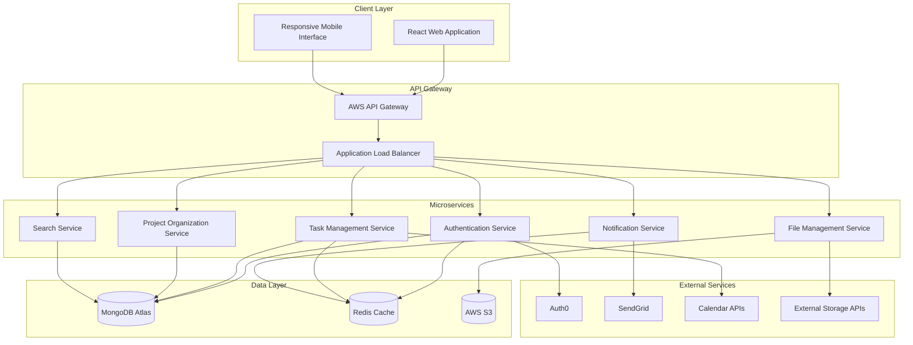
```mermaid
graph TD
    subgraph "Client Layer"
        WebApp[React Web Application]
        Mobile[Responsive Mobile Interface]
    end

    subgraph "API Gateway"
        Gateway[AWS API Gateway]
        LB[Application Load Balancer]
    end

    subgraph "Microservices"
        Auth[Authentication Service]
        Task[Task Management Service]
        Project[Project Organization Service]
        Notification[Notification Service]
        Search[Search Service]
        File[File Management Service]
    end

    subgraph "Data Layer"
        MongoDB[(MongoDB Atlas)]
        Redis[(Redis Cache)]
        S3[(AWS S3)]
    end

    subgraph "External Services"
        Auth0[Auth0]
        SendGrid[SendGrid]
        Calendar[Calendar APIs]
        Storage[External Storage APIs]
    end

    WebApp --> Gateway
    Mobile --> Gateway
    
    Gateway --> LB
    LB --> Auth
    LB --> Task
    LB --> Project
    LB --> Notification
    LB --> Search
    LB --> File
    
    Auth --> Auth0
    Auth --> MongoDB
    Auth --> Redis
    
    Task --> MongoDB
    Task --> Redis
    Task --> Calendar
    
    Project --> MongoDB
    
    Notification --> Redis
    Notification --> SendGrid
    
    Search --> MongoDB
    
    File --> S3
    File --> Storage
```

### 3.7 DATA FLOW DIAGRAM

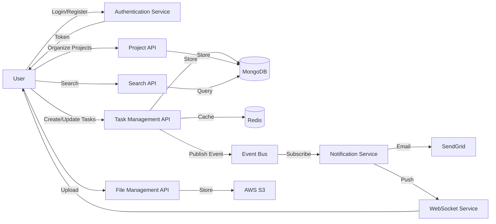
```mermaid
flowchart LR
    User[User] --> |Login/Register| Auth[Authentication Service]
    Auth --> |Token| User
    
    User --> |Create/Update Tasks| TaskAPI[Task Management API]
    TaskAPI --> |Store| MongoDB[(MongoDB)]
    TaskAPI --> |Cache| Redis[(Redis)]
    TaskAPI --> |Publish Event| EventBus[Event Bus]
    
    User --> |Organize Projects| ProjectAPI[Project API]
    ProjectAPI --> |Store| MongoDB
    
    EventBus --> |Subscribe| Notifier[Notification Service]
    Notifier --> |Email| SendGrid[SendGrid]
    Notifier --> |Push| WebSocket[WebSocket Service]
    WebSocket --> User
    
    User --> |Upload| FileAPI[File Management API]
    FileAPI --> |Store| S3[AWS S3]
    
    User --> |Search| SearchAPI[Search API]
    SearchAPI --> |Query| MongoDB
```

### 3.8 DEPLOYMENT PIPELINE DIAGRAM

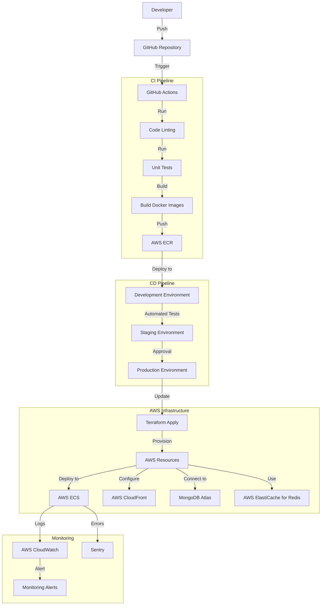
```mermaid
flowchart TD
    Developer[Developer] -->|Push| GitHub[GitHub Repository]
    
    GitHub -->|Trigger| Actions[GitHub Actions]
    
    subgraph "CI Pipeline"
        Actions -->|Run| Lint[Code Linting]
        Lint -->|Run| Test[Unit Tests]
        Test -->|Build| DockerBuild[Build Docker Images]
        DockerBuild -->|Push| ECR[AWS ECR]
    end
    
    subgraph "CD Pipeline"
        ECR -->|Deploy to| Dev[Development Environment]
        Dev -->|Automated Tests| Stage[Staging Environment]
        Stage -->|Approval| Prod[Production Environment]
    end
    
    subgraph "AWS Infrastructure"
        Prod -->|Update| TF[Terraform Apply]
        TF -->|Provision| Resources[AWS Resources]
        Resources -->|Deploy to| ECS[AWS ECS]
        Resources -->|Configure| CloudFront[AWS CloudFront]
        Resources -->|Connect to| Atlas[MongoDB Atlas]
        Resources -->|Use| ElastiCache[AWS ElastiCache for Redis]
    end
    
    subgraph "Monitoring"
        ECS -->|Logs| CloudWatch[AWS CloudWatch]
        CloudWatch -->|Alert| Alerts[Monitoring Alerts]
        ECS -->|Errors| Sentry[Sentry]
    end
```

## 4. PROCESS FLOWCHART

### 4.1 SYSTEM WORKFLOWS

#### 4.1.1 Core Business Processes

##### User Authentication Flow

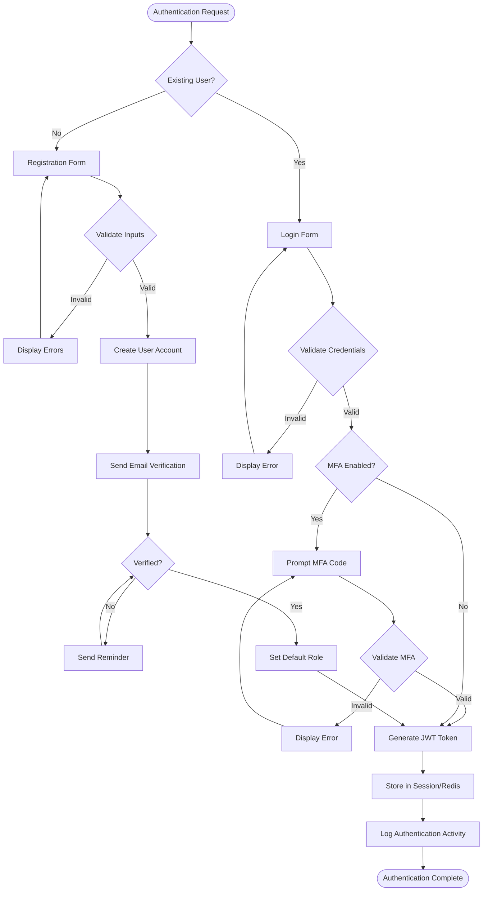
```mermaid
flowchart TD
    Start([Authentication Request]) --> Existing{Existing User?}
    
    Existing -->|No| RegisterForm[Registration Form]
    RegisterForm --> ValidateReg{Validate Inputs}
    ValidateReg -->|Invalid| RegError[Display Errors]
    RegError --> RegisterForm
    ValidateReg -->|Valid| CreateUser[Create User Account]
    CreateUser --> EmailVerif[Send Email Verification]
    EmailVerif --> VerifStatus{Verified?}
    VerifStatus -->|No| Reminder[Send Reminder]
    Reminder --> VerifStatus
    VerifStatus -->|Yes| SetRole[Set Default Role]
    
    Existing -->|Yes| LoginForm[Login Form]
    LoginForm --> ValidateLogin{Validate Credentials}
    ValidateLogin -->|Invalid| LoginError[Display Error]
    LoginError --> LoginForm
    ValidateLogin -->|Valid| CheckMFA{MFA Enabled?}
    
    CheckMFA -->|Yes| PromptMFA[Prompt MFA Code]
    PromptMFA --> ValidateMFA{Validate MFA}
    ValidateMFA -->|Invalid| MFAError[Display Error]
    MFAError --> PromptMFA
    ValidateMFA -->|Valid| GenerateToken[Generate JWT Token]
    
    CheckMFA -->|No| GenerateToken
    GenerateToken --> StoreSession[Store in Session/Redis]
    
    SetRole --> GenerateToken
    
    StoreSession --> LogActivity[Log Authentication Activity]
    LogActivity --> End([Authentication Complete])
```

**Validation Rules:**
- Email must be in valid format and unique in system
- Password must meet complexity requirements (8+ chars, upper/lowercase, numbers, symbols)
- MFA validation has 3 retry limit before temporary account lockout
- Session tokens expire after 24 hours of inactivity
- Authentication failures are rate-limited to prevent brute force attacks

##### Task Management Flow

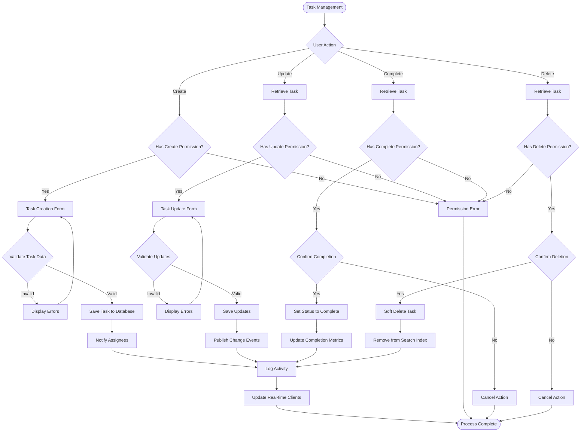
```mermaid
flowchart TD
    Start([Task Management]) --> Action{User Action}
    
    Action -->|Create| CheckCreatePerm{Has Create Permission?}
    CheckCreatePerm -->|No| PermError[Permission Error]
    CheckCreatePerm -->|Yes| TaskForm[Task Creation Form]
    TaskForm --> ValidateTask{Validate Task Data}
    ValidateTask -->|Invalid| FormErrors[Display Errors]
    FormErrors --> TaskForm
    ValidateTask -->|Valid| SaveTask[Save Task to Database]
    SaveTask --> NotifyAssignees[Notify Assignees]
    
    Action -->|Update| FindTask[Retrieve Task]
    FindTask --> CheckUpdatePerm{Has Update Permission?}
    CheckUpdatePerm -->|No| PermError
    CheckUpdatePerm -->|Yes| UpdateForm[Task Update Form]
    UpdateForm --> ValidateUpdate{Validate Updates}
    ValidateUpdate -->|Invalid| UpdateErrors[Display Errors]
    UpdateErrors --> UpdateForm
    ValidateUpdate -->|Valid| SaveUpdates[Save Updates]
    SaveUpdates --> PublishChanges[Publish Change Events]
    
    Action -->|Complete| FindTaskC[Retrieve Task]
    FindTaskC --> CheckCompletePerm{Has Complete Permission?}
    CheckCompletePerm -->|No| PermError
    CheckCompletePerm -->|Yes| ConfirmComplete{Confirm Completion}
    ConfirmComplete -->|No| CancelComplete[Cancel Action]
    ConfirmComplete -->|Yes| MarkComplete[Set Status to Complete]
    MarkComplete --> UpdateMetrics[Update Completion Metrics]
    
    Action -->|Delete| FindTaskD[Retrieve Task]
    FindTaskD --> CheckDeletePerm{Has Delete Permission?}
    CheckDeletePerm -->|No| PermError
    CheckDeletePerm -->|Yes| ConfirmDelete{Confirm Deletion}
    ConfirmDelete -->|No| CancelDelete[Cancel Action]
    ConfirmDelete -->|Yes| SoftDelete[Soft Delete Task]
    SoftDelete --> RemoveSearch[Remove from Search Index]
    
    NotifyAssignees & PublishChanges & UpdateMetrics & RemoveSearch --> LogActivity[Log Activity]
    LogActivity --> UpdateRealtime[Update Real-time Clients]
    UpdateRealtime --> End([Process Complete])
    
    PermError & CancelComplete & CancelDelete --> End
```

**Validation Rules:**
- Tasks must have title, due date (if applicable must be future date)
- Priority must be a valid enumeration value
- Assignees must have active accounts and project membership
- Updates restricted based on user role and task ownership
- Task completion may require approval based on project settings

##### Project Management Flow

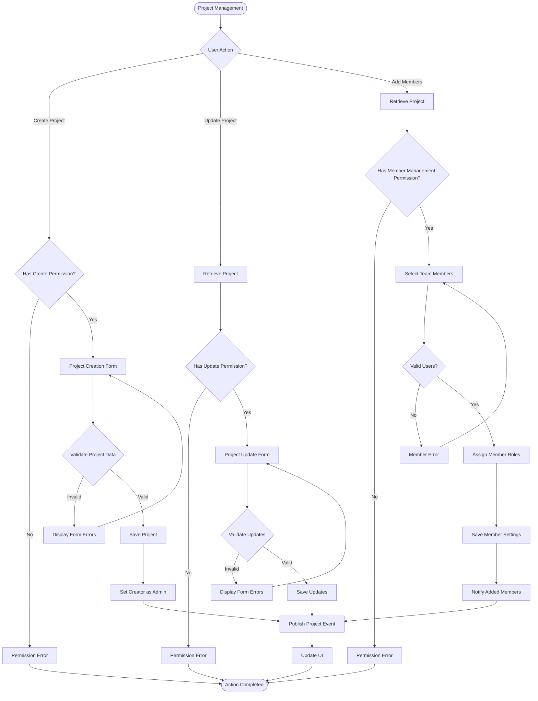
```mermaid
flowchart TD
    Start([Project Management]) --> Action{User Action}
    
    Action -->|Create Project| CheckCreatePerm{Has Create Permission?}
    CheckCreatePerm -->|No| CreatePermError[Permission Error]
    CreatePermError --> End([Action Failed])
    CheckCreatePerm -->|Yes| ProjectForm[Project Creation Form]
    ProjectForm --> ValidateProject{Validate Project Data}
    ValidateProject -->|Invalid| ProjectFormErrors[Display Form Errors]
    ProjectFormErrors --> ProjectForm
    ValidateProject -->|Valid| SaveProject[Save Project]
    SaveProject --> SetCreatorAdmin[Set Creator as Admin]
    
    Action -->|Update Project| FindProject[Retrieve Project]
    FindProject --> CheckUpdatePerm{Has Update Permission?}
    CheckUpdatePerm -->|No| UpdatePermError[Permission Error]
    UpdatePermError --> End
    CheckUpdatePerm -->|Yes| UpdateForm[Project Update Form]
    UpdateForm --> ValidateUpdate{Validate Updates}
    ValidateUpdate -->|Invalid| UpdateFormErrors[Display Form Errors]
    UpdateFormErrors --> UpdateForm
    ValidateUpdate -->|Valid| SaveUpdates[Save Updates]
    
    Action -->|Add Members| FindProjectM[Retrieve Project]
    FindProjectM --> CheckMemberPerm{Has Member Management Permission?}
    CheckMemberPerm -->|No| MemberPermError[Permission Error]
    MemberPermError --> End
    CheckMemberPerm -->|Yes| SelectMembers[Select Team Members]
    SelectMembers --> ValidateMembers{Valid Users?}
    ValidateMembers -->|No| MemberError[Member Error]
    MemberError --> SelectMembers
    ValidateMembers -->|Yes| AssignRoles[Assign Member Roles]
    AssignRoles --> SaveMembers[Save Member Settings]
    SaveMembers --> NotifyMembers[Notify Added Members]
    
    SetCreatorAdmin & SaveUpdates & NotifyMembers --> PublishProjectEvent[Publish Project Event]
    PublishProjectEvent --> UpdateUI[Update UI]
    UpdateUI --> End([Action Completed])
```

**Validation Rules:**
- Projects must have unique names within organization/user workspace
- Project creator automatically assigned admin role
- Member management restricted to project admins and organization admins
- Role assignments must be valid for project type
- Project updates generate notification events

#### 4.1.2 Integration Workflows

##### Calendar Synchronization Flow

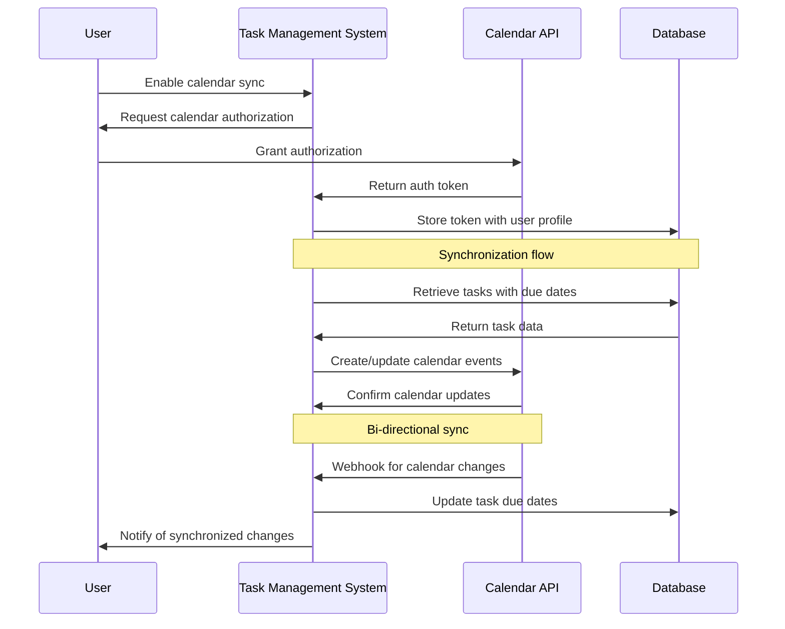
```mermaid
sequenceDiagram
    participant U as User
    participant TMS as Task Management System
    participant API as Calendar API
    participant DB as Database
    
    U->>TMS: Enable calendar sync
    TMS->>U: Request calendar authorization
    U->>API: Grant authorization
    API->>TMS: Return auth token
    TMS->>DB: Store token with user profile
    
    Note over TMS,DB: Synchronization flow
    
    TMS->>DB: Retrieve tasks with due dates
    DB->>TMS: Return task data
    TMS->>API: Create/update calendar events
    API->>TMS: Confirm calendar updates
    
    Note over TMS,API: Bi-directional sync
    
    API->>TMS: Webhook for calendar changes
    TMS->>DB: Update task due dates
    TMS->>U: Notify of synchronized changes
```

**Validation Rules:**
- OAuth token must be valid and not expired
- Tasks must have due dates to be synced
- Calendar events must only be modified via the system's API
- Conflict resolution favors the most recent change

##### External Storage Integration

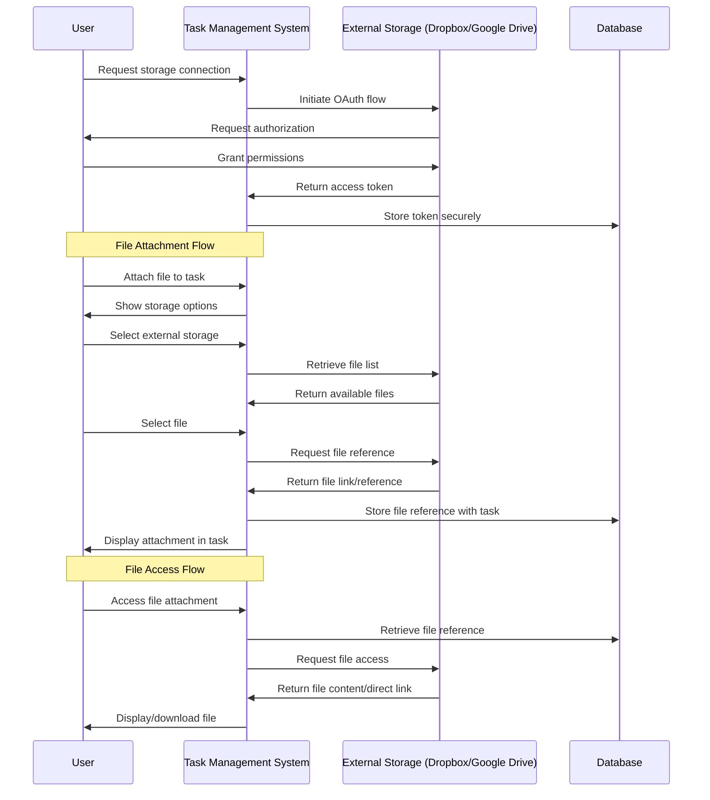
```mermaid
sequenceDiagram
    participant U as User
    participant TMS as Task Management System
    participant ES as External Storage (Dropbox/Google Drive)
    participant DB as Database
    
    U->>TMS: Request storage connection
    TMS->>ES: Initiate OAuth flow
    ES->>U: Request authorization
    U->>ES: Grant permissions
    ES->>TMS: Return access token
    TMS->>DB: Store token securely
    
    Note over U,TMS: File Attachment Flow
    
    U->>TMS: Attach file to task
    TMS->>U: Show storage options
    U->>TMS: Select external storage
    TMS->>ES: Retrieve file list
    ES->>TMS: Return available files
    U->>TMS: Select file
    TMS->>ES: Request file reference
    ES->>TMS: Return file link/reference
    TMS->>DB: Store file reference with task
    TMS->>U: Display attachment in task
    
    Note over U,TMS: File Access Flow
    
    U->>TMS: Access file attachment
    TMS->>DB: Retrieve file reference
    TMS->>ES: Request file access
    ES->>TMS: Return file content/direct link
    TMS->>U: Display/download file
```

**Validation Rules:**
- OAuth tokens must be refreshed before expiry
- File references must be validated before display
- File size limits apply based on subscription level
- Only supported file types are allowed for attachment

##### Notification Delivery Workflow

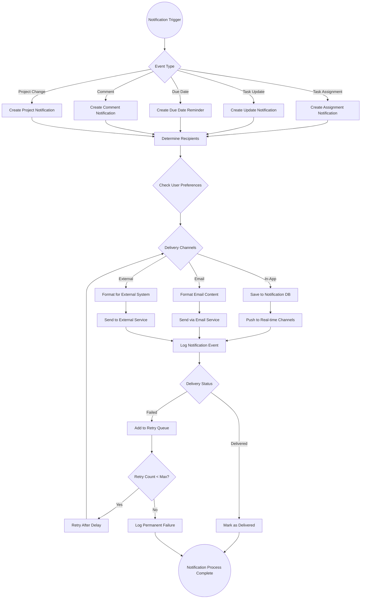
```mermaid
flowchart TD
    Start((Notification Trigger))
    EventType{Event Type}
    TaskAssignNotif[Create Assignment Notification]
    TaskUpdateNotif[Create Update Notification]
    DueDateNotif[Create Due Date Reminder]
    CommentNotif[Create Comment Notification]
    ProjectNotif[Create Project Notification]
    GetRecipients[Determine Recipients]
    CheckPrefs{Check User Preferences}
    Delivery{Delivery Channels}
    SaveNotif[Save to Notification DB]
    PushRealtime[Push to Real-time Channels]
    FormatEmail[Format Email Content]
    SendEmail[Send via Email Service]
    FormatExternal[Format for External System]
    SendExternal[Send to External Service]
    LogNotification[Log Notification Event]
    NotifStatus{Delivery Status}
    RetryQueue[Add to Retry Queue]
    RetryCount{"Retry Count < Max?"}
    RetryDelivery[Retry After Delay]
    LogFailure[Log Permanent Failure]
    MarkDelivered[Mark as Delivered]
    End((Notification Process Complete))
    
    Start --> EventType
    EventType -->|Task Assignment| TaskAssignNotif
    EventType -->|Task Update| TaskUpdateNotif
    EventType -->|Due Date| DueDateNotif
    EventType -->|Comment| CommentNotif
    EventType -->|Project Change| ProjectNotif
    
    TaskAssignNotif --> GetRecipients
    TaskUpdateNotif --> GetRecipients
    DueDateNotif --> GetRecipients
    CommentNotif --> GetRecipients
    ProjectNotif --> GetRecipients
    
    GetRecipients --> CheckPrefs
    CheckPrefs --> Delivery
    
    Delivery -->|In-App| SaveNotif
    SaveNotif --> PushRealtime
    
    Delivery -->|Email| FormatEmail
    FormatEmail --> SendEmail
    
    Delivery -->|External| FormatExternal
    FormatExternal --> SendExternal
    
    PushRealtime --> LogNotification
    SendEmail --> LogNotification
    SendExternal --> LogNotification
    
    LogNotification --> NotifStatus
    
    NotifStatus -->|Failed| RetryQueue
    RetryQueue --> RetryCount
    RetryCount -->|Yes| RetryDelivery
    RetryDelivery --> Delivery
    RetryCount -->|No| LogFailure
    
    NotifStatus -->|Delivered| MarkDelivered
    MarkDelivered --> End
    LogFailure --> End
```

**Validation Rules:**
- Notification frequency respects user preferences and quiet hours
- Email delivery attempts limited to 3 retries with exponential backoff
- External integrations have fallback mechanisms if unavailable
- System notifications have priority levels determining their display

### 4.2 FLOWCHART REQUIREMENTS

#### 4.2.1 Real-Time Collaboration Flow

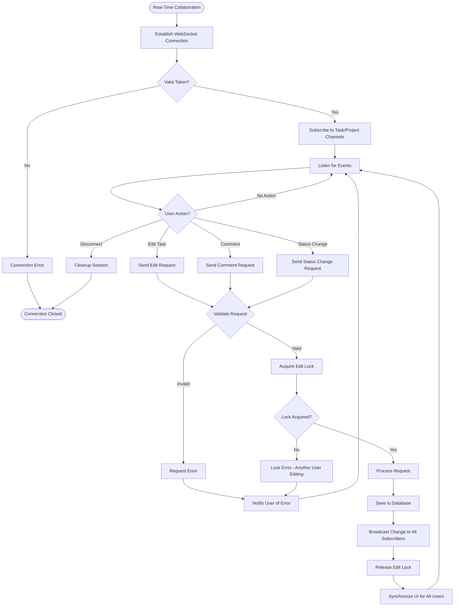
```mermaid
flowchart TD
    Start([Real-Time Collaboration]) --> EstablishWS[Establish WebSocket Connection]
    EstablishWS --> ValidateToken{Valid Token?}
    ValidateToken -->|No| WSError[Connection Error]
    WSError --> End([Connection Failed])
    
    ValidateToken -->|Yes| Subscribe[Subscribe to Task/Project Channels]
    Subscribe --> ListenEvents[Listen for Events]
    
    ListenEvents --> UserAction{User Action?}
    UserAction -->|Edit Task| EditRequest[Send Edit Request]
    UserAction -->|Comment| CommentRequest[Send Comment Request]
    UserAction -->|Status Change| StatusRequest[Send Status Change Request]
    UserAction -->|No Action| ListenEvents
    
    EditRequest & CommentRequest & StatusRequest --> ValidateRequest{Validate Request}
    ValidateRequest -->|Invalid| RequestError[Request Error]
    RequestError --> NotifyUser[Notify User of Error]
    NotifyUser --> ListenEvents
    
    ValidateRequest -->|Valid| AcquireLock[Acquire Edit Lock]
    AcquireLock --> LockStatus{Lock Acquired?}
    LockStatus -->|No| LockError[Lock Error - Another User Editing]
    LockError --> NotifyUser
    
    LockStatus -->|Yes| ProcessRequest[Process Request]
    ProcessRequest --> SaveData[Save to Database]
    SaveData --> BroadcastChange[Broadcast Change to All Subscribers]
    BroadcastChange --> ReleaseLock[Release Edit Lock]
    ReleaseLock --> SyncUI[Synchronize UI for All Users]
    SyncUI --> ListenEvents
    
    UserAction -->|Disconnect| CleanupSession[Cleanup Session]
    CleanupSession --> End([Connection Closed])
```

**Authorization Checkpoints:**
- JWT token validation required for WebSocket connection
- Permission checks on each edit request
- Object-level locking prevents concurrent conflicting edits
- Edit history maintained for audit trail
- Automatic timeout of inactive locks after 5 minutes

**Timing Considerations:**
- Real-time updates must be delivered within 500ms
- Lock acquisition timeout after 3 seconds
- Connection heartbeat every 30 seconds
- Automatic reconnection attempt on disconnection

#### 4.2.2 File Management Process

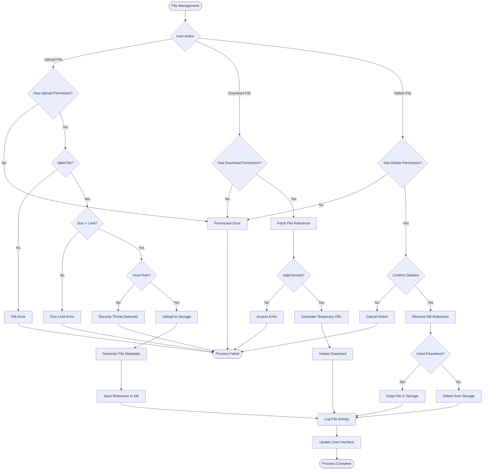
```mermaid
flowchart TD
    Start([File Management]) --> Action{User Action}
    
    Action -->|Upload File| CheckUploadPerm{Has Upload Permission?}
    CheckUploadPerm -->|No| PermError[Permission Error]
    CheckUploadPerm -->|Yes| ValidateFile{Valid File?}
    ValidateFile -->|No| FileError[File Error]
    FileError --> EndFail([Process Failed])
    ValidateFile -->|Yes| CheckSize{Size < Limit?}
    CheckSize -->|No| SizeError[Size Limit Error]
    SizeError --> EndFail
    CheckSize -->|Yes| ScanVirus{Virus Free?}
    ScanVirus -->|No| VirusError[Security Threat Detected]
    VirusError --> EndFail
    ScanVirus -->|Yes| UploadStorage[Upload to Storage]
    UploadStorage --> GenerateMetadata[Generate File Metadata]
    GenerateMetadata --> SaveReference[Save Reference in DB]
    
    Action -->|Download File| CheckDownloadPerm{Has Download Permission?}
    CheckDownloadPerm -->|No| PermError
    CheckDownloadPerm -->|Yes| FetchReference[Fetch File Reference]
    FetchReference --> ValidateAccess{Valid Access?}
    ValidateAccess -->|No| AccessError[Access Error]
    AccessError --> EndFail
    ValidateAccess -->|Yes| GenerateURL[Generate Temporary URL]
    GenerateURL --> DownloadFile[Initiate Download]
    
    Action -->|Delete File| CheckDeletePerm{Has Delete Permission?}
    CheckDeletePerm -->|No| PermError
    CheckDeletePerm -->|Yes| ConfirmDelete{Confirm Deletion}
    ConfirmDelete -->|No| CancelAction[Cancel Action]
    CancelAction --> EndFail
    ConfirmDelete -->|Yes| RemoveReference[Remove DB Reference]
    RemoveReference --> CheckUsage{Used Elsewhere?}
    CheckUsage -->|Yes| KeepFile[Keep File in Storage]
    CheckUsage -->|No| DeleteStorage[Delete from Storage]
    
    SaveReference --> LogActivity[Log File Activity]
    DownloadFile --> LogActivity
    KeepFile --> LogActivity
    DeleteStorage --> LogActivity
    LogActivity --> UpdateUI[Update User Interface]
    UpdateUI --> EndSuccess([Process Complete])
    
    PermError --> EndFail
```

**Validation Rules:**
- Only approved file types are allowed (document, image, spreadsheet, pdf)
- Maximum file size based on subscription tier (10MB-100MB)
- All files scanned for viruses/malware before storage
- Files referenced in tasks cannot be permanently deleted without confirmation
- File access requires explicit task/project permission

**SLA Considerations:**
- File upload processing completed within 5 seconds for files under 10MB
- Download links generated within 1 second
- Virus scanning timeout after 10 seconds with fallback to async scanning
- Temporary download URLs valid for 15 minutes only

### 4.3 TECHNICAL IMPLEMENTATION

#### 4.3.1 Task State Management

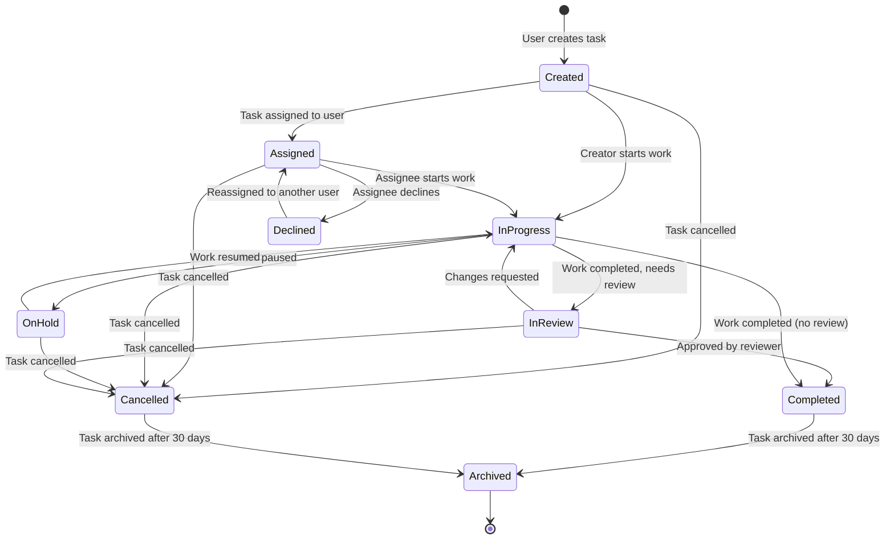
```mermaid
stateDiagram-v2
    [*] --> Created: User creates task
    
    Created --> Assigned: Task assigned to user
    Created --> InProgress: Creator starts work
    
    Assigned --> InProgress: Assignee starts work
    Assigned --> Declined: Assignee declines
    Declined --> Assigned: Reassigned to another user
    
    InProgress --> OnHold: Work paused
    OnHold --> InProgress: Work resumed
    
    InProgress --> InReview: Work completed, needs review
    InReview --> InProgress: Changes requested
    InReview --> Completed: Approved by reviewer
    
    InProgress --> Completed: Work completed (no review)
    
    Completed --> Archived: Task archived after 30 days
    Archived --> [*]
    
    Created --> Cancelled: Task cancelled
    Assigned --> Cancelled: Task cancelled
    InProgress --> Cancelled: Task cancelled
    OnHold --> Cancelled: Task cancelled
    InReview --> Cancelled: Task cancelled
    
    Cancelled --> Archived: Task archived after 30 days
```

**State Transition Rules:**
- Only task creator, assignee, or manager can change task state
- State changes generate system events for notification and logging
- Completed tasks cannot be returned to InProgress without manager approval
- Tasks in Declined state must be reassigned within 24 hours
- Only tasks in Completed or Cancelled state can be archived

**Data Persistence:**
- Each state change stored with timestamp and user information
- Task history maintained for audit and reporting purposes
- Caching of current task state for performance optimization
- Transaction boundaries ensure complete state transitions

#### 4.3.2 Error Handling Process

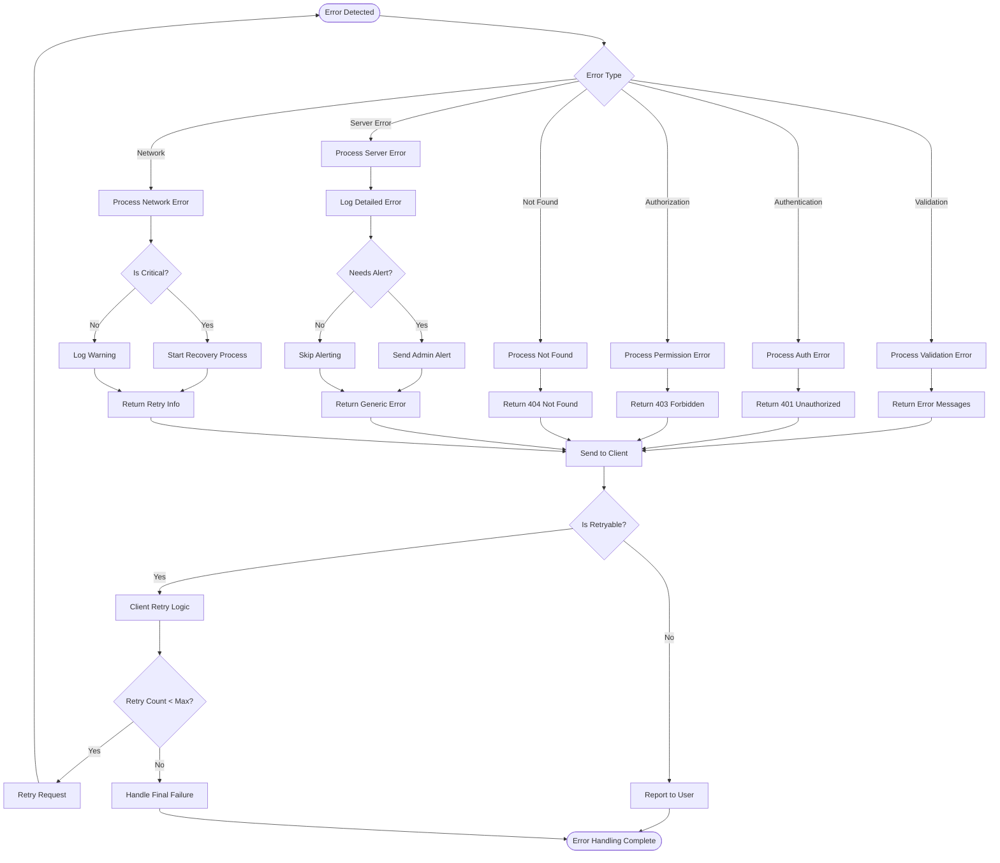
```mermaid
flowchart TD
    StartNode([Error Detected])
    EndNode([Error Handling Complete])
    ErrorType{Error Type}
    
    StartNode --> ErrorType
    
    ErrorType -->|Validation| HandleValidation[Process Validation Error]
    HandleValidation --> ReturnErrors[Return Error Messages]
    ReturnErrors --> ClientResponse[Send to Client]
    
    ErrorType -->|Authentication| HandleAuth[Process Auth Error]
    HandleAuth --> AuthResponse[Return 401 Unauthorized]
    AuthResponse --> ClientResponse
    
    ErrorType -->|Authorization| HandlePermission[Process Permission Error]
    HandlePermission --> PermResponse[Return 403 Forbidden]
    PermResponse --> ClientResponse
    
    ErrorType -->|Not Found| HandleNotFound[Process Not Found]
    HandleNotFound --> NotFoundResponse[Return 404 Not Found]
    NotFoundResponse --> ClientResponse
    
    ErrorType -->|Server Error| HandleServer[Process Server Error]
    HandleServer --> LogError[Log Detailed Error]
    LogError --> Alerting{Needs Alert?}
    Alerting -->|Yes| SendAlert[Send Admin Alert]
    Alerting -->|No| SkipAlert[Skip Alerting]
    SendAlert --> ReturnGeneric[Return Generic Error]
    SkipAlert --> ReturnGeneric
    ReturnGeneric --> ClientResponse
    
    ErrorType -->|Network| HandleNetwork[Process Network Error]
    HandleNetwork --> IsCritical{Is Critical?}
    IsCritical -->|Yes| StartRecovery[Start Recovery Process]
    IsCritical -->|No| LogWarning[Log Warning]
    StartRecovery --> ClientRetry[Return Retry Info]
    LogWarning --> ClientRetry
    ClientRetry --> ClientResponse
    
    ClientResponse --> IsRetryable{Is Retryable?}
    IsRetryable -->|Yes| RetryLogic[Client Retry Logic]
    RetryLogic --> RetryCount{Retry Count < Max?}
    RetryCount -->|Yes| RetryRequest[Retry Request]
    RetryRequest --> StartNode
    RetryCount -->|No| FinalFailure[Handle Final Failure]
    
    IsRetryable -->|No| ReportError[Report to User]
    ReportError --> EndNode
    FinalFailure --> EndNode
```

**Retry Mechanisms:**
- Exponential backoff for retryable errors (network issues, rate limits)
- Circuit breaker pattern for failing external services
- Dead letter queues for unprocessable events
- Selective retries based on operation idempotence

**Recovery Procedures:**
- Automated recovery for non-destructive operations
- Manual intervention required for critical data errors
- Session recovery for authentication failures
- Database transaction rollback on persistence failures
- Graceful degradation for non-critical service failures

### 4.4 SYSTEM INTEGRATION OVERVIEW

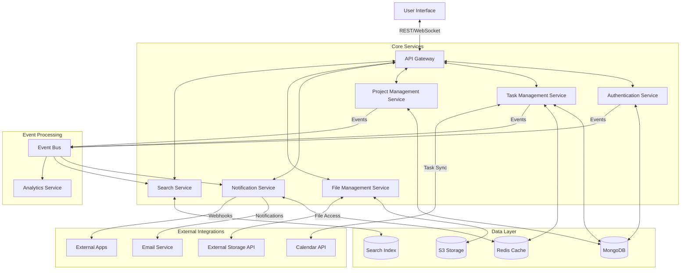
```mermaid
flowchart TD
    User[User Interface] <-->|REST/WebSocket| APIGateway[API Gateway]
    
    subgraph "Core Services"
        APIGateway <--> AuthService[Authentication Service]
        APIGateway <--> TaskService[Task Management Service]
        APIGateway <--> ProjectService[Project Management Service]
        APIGateway <--> NotificationService[Notification Service]
        APIGateway <--> FileService[File Management Service]
        APIGateway <--> SearchService[Search Service]
    end
    
    subgraph "Data Layer"
        TaskService <--> MongoDB[(MongoDB)]
        ProjectService <--> MongoDB
        AuthService <--> MongoDB
        
        TaskService <--> Redis[(Redis Cache)]
        NotificationService <--> Redis
        
        FileService <--> S3[(S3 Storage)]
        SearchService <--> SearchIndex[(Search Index)]
    end
    
    subgraph "Event Processing"
        TaskService -->|Events| EventBus[Event Bus]
        ProjectService -->|Events| EventBus
        AuthService -->|Events| EventBus
        
        EventBus --> NotificationService
        EventBus --> SearchService
        EventBus --> AnalyticsService[Analytics Service]
    end
    
    subgraph "External Integrations"
        TaskService <-->|Task Sync| CalendarAPI[Calendar API]
        FileService <-->|File Access| StorageAPI[External Storage API]
        NotificationService -->|Notifications| EmailService[Email Service]
        NotificationService -->|Webhooks| ExtApps[External Apps]
    end
```

**Data Flow Considerations:**
- Event-driven architecture for decoupled service communication
- API Gateway handles authentication, rate limiting, and request routing
- Cache invalidation triggered by relevant data mutations
- External service failures isolated through circuit breakers
- Event sourcing for critical data changes enabling audit and replay

**Transaction Boundaries:**
- Database transactions limited to single service operations
- Eventual consistency model for cross-service operations
- Idempotent API operations supporting safe retries
- Distributed transactions avoided in favor of compensating actions
- Event acknowledgment ensures reliable processing

## 5. SYSTEM ARCHITECTURE

### 5.1 HIGH-LEVEL ARCHITECTURE

#### 5.1.1 System Overview

The Task Management System implements a microservices architecture pattern to achieve modularity, scalability, and maintainability. This architectural approach decomposes the application into loosely coupled, independently deployable services that communicate through well-defined APIs. The system follows several key architectural principles:

- **Separation of Concerns**: Each microservice focuses on a specific business capability (authentication, task management, notifications, etc.)
- **API-First Design**: All services expose REST APIs for standardized communication
- **Event-Driven Architecture**: Real-time updates and cross-service communication utilize event streams
- **Single Responsibility**: Each service owns its data and business logic
- **Defense in Depth**: Multiple security layers protect sensitive user data

The system establishes clear boundaries between frontend components, backend services, and external integrations. The browser-based client application communicates with backend services through a unified API Gateway that handles routing, authentication, and request validation. Internal services communicate through a combination of synchronous (REST) and asynchronous (event-based) patterns depending on the operation requirements.

#### 5.1.2 Core Components Table

| Component Name | Primary Responsibility | Key Dependencies | Integration Points | Critical Considerations |
|----------------|------------------------|------------------|-------------------|------------------------|
| API Gateway | Request routing, authentication, rate limiting | Auth Service | All client applications | Single point of failure, requires high availability |
| Authentication Service | User identity, access control, session management | User database, token store | External identity providers, all services | Security-critical, must be highly reliable |
| Task Management Service | Task CRUD, state management, assignment | Project Service, User Service | Calendar systems | Core business logic, needs strong consistency |
| Project Management Service | Project organization, team management | User Service | Task Service | Hierarchical data model, complex permissions |
| Notification Service | Alert delivery, notification preferences | Task Service, Project Service | Email providers, push services | Eventual consistency, retry mechanisms |
| File Management Service | File storage, attachment handling, versioning | Task Service | Cloud storage providers | Large data volumes, bandwidth considerations |
| Analytics Service | Reporting, dashboards, metrics calculation | Task Service, Project Service | Data warehouse | Complex queries, potential performance impact |
| Real-time Collaboration Service | Live updates, presence tracking | Task Service, Project Service | WebSocket gateway | Connection management, state synchronization |

#### 5.1.3 Data Flow Description

The Task Management System's data flows follow consistent patterns across its components. User interactions begin at the web application, which sends authenticated requests to the API Gateway. The gateway validates tokens, routes requests to appropriate services, and returns responses to the client.

For core task operations, the Task Management Service receives create/update/delete requests, validates them against business rules, and persists changes to its database. Upon successful persistence, it publishes events to a message bus notifying other services of the change. The Notification Service consumes these events to determine if any alerts should be generated, while the Real-time Collaboration Service broadcasts updates to connected clients.

File attachments follow a direct upload pattern where the client requests a pre-signed URL from the File Management Service, then uploads directly to the storage provider. The service then creates a metadata record linking the file to the appropriate task or project.

Data aggregation for reporting flows from the operational databases to a dedicated analytics store optimized for read-heavy workloads. The Analytics Service queries this store to generate reports and dashboard metrics without impacting operational performance.

Cache invalidation occurs through event subscription, where services maintaining caches listen for relevant data change events and update or invalidate their cached data accordingly.

#### 5.1.4 External Integration Points

| System Name | Integration Type | Data Exchange Pattern | Protocol/Format | SLA Requirements |
|-------------|------------------|------------------------|-----------------|------------------|
| Email Service (SendGrid) | Notification delivery | Asynchronous push | REST API / JSON | 99.5% delivery rate, 5-minute max delay |
| Calendar Systems (Google/Outlook) | Task synchronization | Bi-directional sync | OAuth 2.0 / REST / iCal | 99% sync success, 15-minute sync frequency |
| Cloud Storage (AWS S3) | File storage | Direct upload with signed URLs | HTTPS / Binary | 99.9% availability, 3-second max upload initiation |
| External Authentication (Auth0) | Identity verification | Delegated authentication | OAuth 2.0 / OIDC | 99.99% availability, 300ms response time |

### 5.2 COMPONENT DETAILS

#### 5.2.1 Authentication Service

**Purpose and Responsibilities**:
- User registration, authentication, and session management
- Role-based access control enforcement
- Token issuance, validation, and revocation
- User profile management
- Security policy enforcement (password rules, MFA)

**Technologies and Frameworks**:
- Flask-based Python service
- JWT for token management
- Redis for token blacklisting and session storage
- MongoDB for user profile data
- bcrypt for password hashing

**Key Interfaces**:
- `/auth/register`: User registration endpoint
- `/auth/login`: Authentication endpoint
- `/auth/token/refresh`: Token renewal endpoint
- `/auth/token/revoke`: Token invalidation endpoint
- `/users/profile`: User profile management

**Data Persistence**:
- User profiles stored in MongoDB
- Active sessions tracked in Redis
- Authentication events logged to dedicated audit collection

**Scaling Considerations**:
- Stateless design for horizontal scaling
- Token validation caching for high-traffic scenarios
- Read replicas for user profile queries

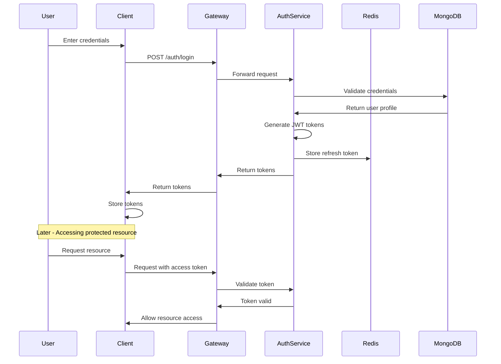
```mermaid
sequenceDiagram
    participant User
    participant Client
    participant Gateway
    participant AuthService
    participant Redis
    participant MongoDB
    
    User->>Client: Enter credentials
    Client->>Gateway: POST /auth/login
    Gateway->>AuthService: Forward request
    AuthService->>MongoDB: Validate credentials
    MongoDB->>AuthService: Return user profile
    AuthService->>AuthService: Generate JWT tokens
    AuthService->>Redis: Store refresh token
    AuthService->>Gateway: Return tokens
    Gateway->>Client: Return tokens
    Client->>Client: Store tokens
    
    Note over User,Client: Later - Accessing protected resource
    
    User->>Client: Request resource
    Client->>Gateway: Request with access token
    Gateway->>AuthService: Validate token
    AuthService->>Gateway: Token valid
    Gateway->>Client: Allow resource access
```

#### 5.2.2 Task Management Service

**Purpose and Responsibilities**:
- Task creation, updating, and deletion
- Task assignment and reassignment
- Status tracking and state transitions
- Task filtering and sorting
- Task relationships and dependencies

**Technologies and Frameworks**:
- Flask-based Python service
- SQLAlchemy ORM
- PostgreSQL for relational data
- Redis for caching and task locking

**Key Interfaces**:
- `/tasks`: CRUD operations for tasks
- `/tasks/search`: Advanced task search
- `/tasks/{id}/assign`: Assignment management
- `/tasks/{id}/status`: Status transitions
- `/tasks/{id}/attachments`: Attachment management

**Data Persistence**:
- Task data in PostgreSQL for ACID compliance
- Task status history maintained for audit
- Task counters and aggregates cached in Redis

**Scaling Considerations**:
- Read replicas for high-volume queries
- Service partitioning by organization/tenant
- Caching of frequently accessed tasks

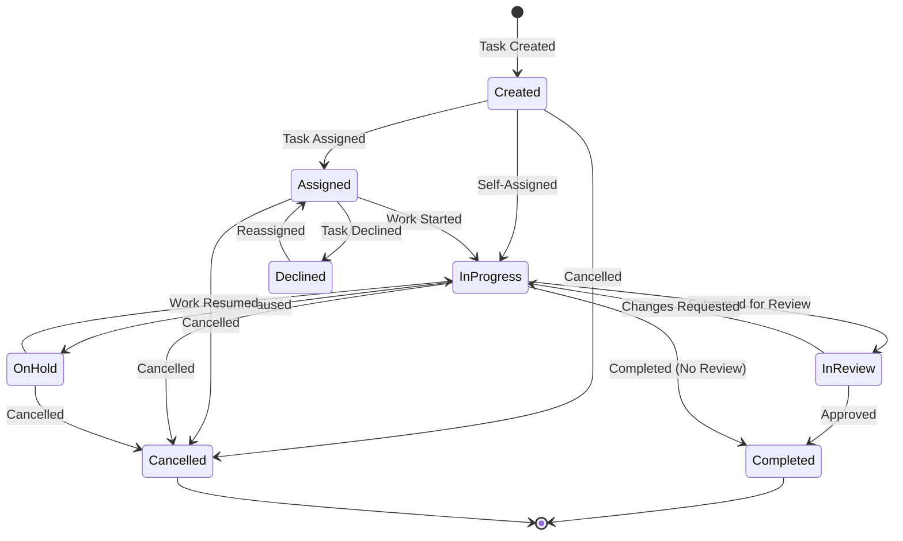
```mermaid
stateDiagram-v2
    [*] --> Created: Task Created
    Created --> Assigned: Task Assigned
    Created --> InProgress: Self-Assigned
    Assigned --> InProgress: Work Started
    Assigned --> Declined: Task Declined
    Declined --> Assigned: Reassigned
    InProgress --> OnHold: Work Paused
    OnHold --> InProgress: Work Resumed
    InProgress --> InReview: Submitted for Review
    InReview --> InProgress: Changes Requested
    InReview --> Completed: Approved
    InProgress --> Completed: Completed (No Review)
    Completed --> [*]
    
    Created --> Cancelled: Cancelled
    Assigned --> Cancelled: Cancelled
    InProgress --> Cancelled: Cancelled
    OnHold --> Cancelled: Cancelled
    Cancelled --> [*]
```

#### 5.2.3 Project Management Service

**Purpose and Responsibilities**:
- Project creation and organization
- Team membership management
- Project hierarchies and categorization
- Resource allocation and capacity planning
- Project templates and workflows

**Technologies and Frameworks**:
- Flask-based Python service
- SQLAlchemy ORM
- PostgreSQL for relational data
- Redis for caching

**Key Interfaces**:
- `/projects`: CRUD operations for projects
- `/projects/{id}/members`: Team management
- `/projects/{id}/tasks`: Project task listing
- `/projects/templates`: Project template management

**Data Persistence**:
- Project data in PostgreSQL with hierarchical structures
- Project membership in many-to-many relationship tables
- Project metrics cached for dashboard rendering

**Scaling Considerations**:
- Denormalization of frequently accessed hierarchies
- Caching of project structure and membership
- Pagination for large project listings

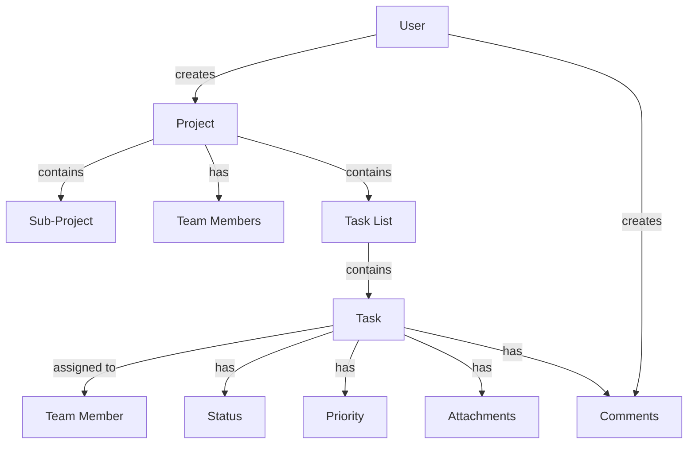
```mermaid
flowchart TD
    User[User] -->|creates| Project[Project]
    Project -->|contains| SubProject[Sub-Project]
    Project -->|has| Team[Team Members]
    Project -->|contains| TaskList[Task List]
    TaskList -->|contains| Task[Task]
    Task -->|assigned to| Member[Team Member]
    Task -->|has| Status[Status]
    Task -->|has| Priority[Priority]
    Task -->|has| Attachments[Attachments]
    Task -->|has| Comments[Comments]
    User -->|creates| Comments
```

#### 5.2.4 Real-time Collaboration Service

**Purpose and Responsibilities**:
- WebSocket connection management
- Real-time updates broadcasting
- Presence tracking
- Collaborative editing facilitation
- Activity feeds

**Technologies and Frameworks**:
- Node.js with Socket.IO
- Redis for pub/sub and presence data
- MongoDB for activity persistence

**Key Interfaces**:
- WebSocket connection endpoint
- Channel subscription API
- Broadcast API for other services
- Presence information API

**Data Persistence**:
- Connection state in Redis
- User presence information in Redis
- Activity feed data in MongoDB

**Scaling Considerations**:
- Stateful service requiring sticky sessions
- Clustered deployment with Redis for cross-node communication
- Connection limits per node

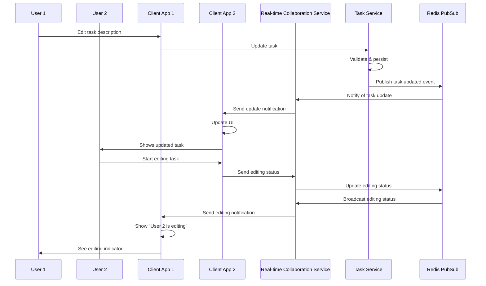
```mermaid
sequenceDiagram
    participant User1 as User 1
    participant User2 as User 2
    participant Client1 as Client App 1
    participant Client2 as Client App 2
    participant RTC as Real-time Collaboration Service
    participant TaskSvc as Task Service
    participant Redis as Redis PubSub
    
    User1->>Client1: Edit task description
    Client1->>TaskSvc: Update task
    TaskSvc->>TaskSvc: Validate & persist
    TaskSvc->>Redis: Publish task:updated event
    Redis->>RTC: Notify of task update
    RTC->>Client2: Send update notification
    Client2->>Client2: Update UI
    Client2->>User2: Shows updated task
    
    User2->>Client2: Start editing task
    Client2->>RTC: Send editing status
    RTC->>Redis: Update editing status
    Redis->>RTC: Broadcast editing status
    RTC->>Client1: Send editing notification
    Client1->>Client1: Show "User 2 is editing"
    Client1->>User1: See editing indicator
```

### 5.3 TECHNICAL DECISIONS

#### 5.3.1 Architecture Style Decisions

| Decision | Options | Selected Approach | Rationale |
|----------|---------|-------------------|-----------|
| Overall Architecture | Monolith vs. Microservices | Microservices | Allows independent scaling of components, team autonomy, and technology flexibility |
| Communication Pattern | Synchronous vs. Asynchronous | Hybrid | Synchronous for user-facing operations, asynchronous for background processing and notifications |
| API Style | REST vs. GraphQL | REST with specific GraphQL endpoints | REST for broad compatibility, GraphQL for complex data requirements in the dashboard |
| Frontend Architecture | MPA vs. SPA | SPA with React | Provides responsive user experience with minimal page refreshes |

The adoption of microservices architecture is driven by the need to scale different components independently. For example, the Notification Service may require different scaling characteristics than the Task Management Service. This approach also enables resilience through service isolation, where failures in one component won't cascade to others.

The hybrid communication pattern optimizes for different use cases. User actions like task creation use synchronous REST calls for immediate feedback, while notifications and analytics updates use asynchronous event-based communication to decouple services and improve resilience.

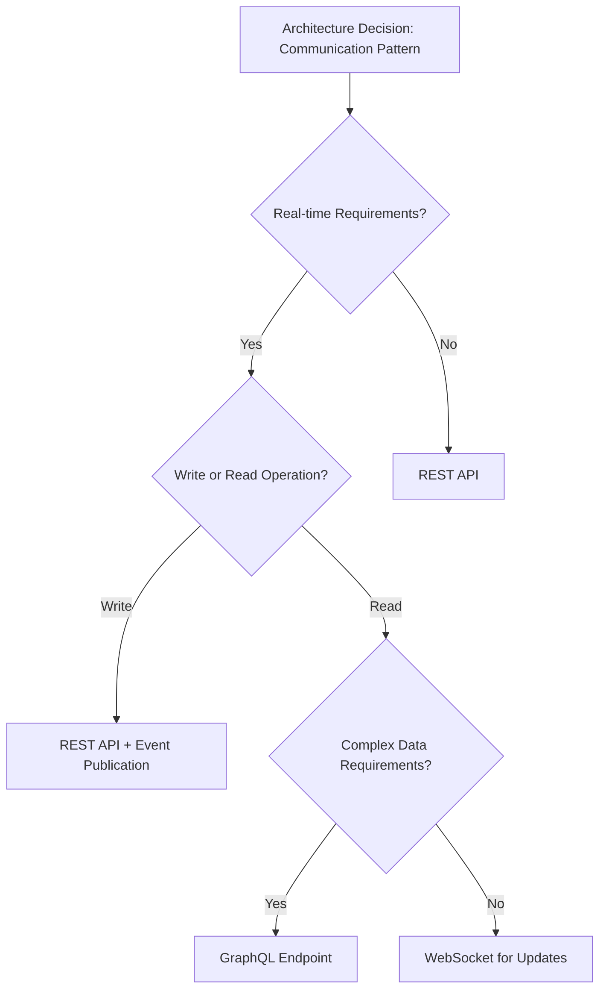
```mermaid
flowchart TD
    A[Architecture Decision: Communication Pattern] --> B{Real-time Requirements?}
    B -->|Yes| C{Write or Read Operation?}
    B -->|No| D[REST API]
    C -->|Write| E[REST API + Event Publication]
    C -->|Read| F{Complex Data Requirements?}
    F -->|Yes| G[GraphQL Endpoint]
    F -->|No| H[WebSocket for Updates]
```

#### 5.3.2 Data Storage Solution Rationale

| Data Type | Options | Selected Approach | Rationale |
|-----------|---------|-------------------|-----------|
| User Data | RDBMS vs. NoSQL | MongoDB | Flexible schema for user preferences and profile data, good query performance |
| Task & Project Data | RDBMS vs. NoSQL | PostgreSQL | Complex relationships, transaction support for critical business data |
| File Metadata | RDBMS vs. NoSQL | MongoDB | Schemaless for diverse file attributes, integrated with file storage service |
| Analytics Data | OLTP vs. OLAP | Dedicated OLAP Store | Optimized for analytical queries without impacting operational databases |

The decision to use PostgreSQL for core business data provides strong consistency guarantees and robust transaction support for critical operations like task assignments and status updates. MongoDB offers flexibility for user data, which may have varying attributes based on role or preferences.

Redis is employed as a caching layer and for real-time features requiring high performance, including:
- Session data for quick authentication
- Frequently accessed task lists
- Real-time collaboration presence data
- Notification delivery status

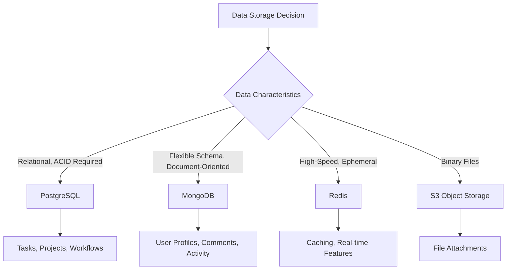
```mermaid
flowchart TD
    A[Data Storage Decision] --> B{Data Characteristics}
    B -->|Relational, ACID Required| C[PostgreSQL]
    B -->|Flexible Schema, Document-Oriented| D[MongoDB]
    B -->|High-Speed, Ephemeral| E[Redis]
    B -->|Binary Files| F[S3 Object Storage]
    
    C --> G[Tasks, Projects, Workflows]
    D --> H[User Profiles, Comments, Activity]
    E --> I[Caching, Real-time Features]
    F --> J[File Attachments]
```

#### 5.3.3 Caching Strategy Justification

| Cache Type | Implementation | Purpose | Invalidation Strategy |
|------------|----------------|---------|------------------------|
| API Response Cache | Redis | Reduce database load for repeated queries | Time-based expiration + explicit invalidation on writes |
| User Session Cache | Redis | Fast authentication verification | Token-based with JWT expiration |
| Task List Cache | Redis | Accelerate dashboard loading | Event-based invalidation when tasks change |
| User Presence Cache | Redis | Track online users for collaboration | Heartbeat-based with TTL |

The caching strategy uses Redis as a central cache store, with different caching patterns for different data types. API response caching significantly reduces database load for common read operations, while maintaining data integrity through a combination of time-based expiration and explicit invalidation when data changes.

For real-time collaboration, the caching strategy prioritizes consistency by using event-driven invalidation. When a task is updated, an event is published that triggers cache invalidation across all affected services.

```mermaid
sequenceDiagram
    participant Client
    participant API as API Gateway
    participant Service as Task Service
    participant Cache as Redis Cache
    participant DB as Database
    
    Client->>API: GET /tasks?filter=today
    API->>Cache: Check cache
    
    alt Cache Hit
        Cache->>API: Return cached data
        API->>Client: Return response
    else Cache Miss
        Cache->>API: Cache miss
        API->>Service: Forward request
        Service->>DB: Query database
        DB->>Service: Return data
        Service->>Cache: Update cache with TTL
        Service->>API: Return data
        API->>Client: Return response
    end
    
    Client->>API: PATCH /tasks/123
    API->>Service: Update task
    Service->>DB: Persist changes
    Service->>Cache: Invalidate related caches
    Service->>API: Confirm update
    API->>Client: Return success
```

### 5.4 CROSS-CUTTING CONCERNS

#### 5.4.1 Monitoring and Observability Approach

The system implements a comprehensive monitoring strategy with multiple layers:

- **Infrastructure Monitoring**: CPU, memory, disk usage, and network metrics for all services
- **Application Metrics**: Request rates, response times, error rates, and business KPIs
- **User Experience Monitoring**: Page load times, client-side errors, and user journey tracking
- **Dependency Monitoring**: Database performance, cache hit rates, and external API availability

Metrics are collected using Prometheus and visualized through Grafana dashboards. Each service exposes a `/metrics` endpoint with standardized operational metrics including:

- Request count and latency by endpoint
- Error count by type and endpoint
- Business metrics (tasks created, completed, etc.)
- Resource utilization

Distributed tracing using OpenTelemetry provides end-to-end visibility of requests flowing through the system. Each request receives a correlation ID that is propagated across service boundaries, allowing for tracing the complete request lifecycle.

Alerting is configured with escalation paths based on severity:
- P1 (Critical): Immediate notification via PagerDuty for production outages
- P2 (High): Email and chat alerts for degraded service
- P3 (Medium): Ticket creation for non-urgent issues
- P4 (Low): Logged for regular review

#### 5.4.2 Logging and Tracing Strategy

| Log Category | Purpose | Retention Period | Storage Location |
|--------------|---------|------------------|------------------|
| Application Logs | Debugging, audit trail | 30 days | Elasticsearch |
| Access Logs | Security monitoring, usage patterns | 90 days | Elasticsearch |
| Audit Logs | Compliance, security investigation | 1 year | Secure storage |
| Error Logs | Issue resolution | 60 days | Elasticsearch |

The logging strategy follows structured logging principles, with each log entry containing:
- Timestamp in ISO 8601 format
- Service name and instance ID
- Log level (INFO, WARN, ERROR, DEBUG)
- Correlation ID for request tracing
- Operation context (user ID, organization ID)
- Structured message payload in JSON format

Sensitive data is redacted from logs according to data protection requirements. PII (Personally Identifiable Information) is either omitted or replaced with tokenized values before storage.

Log aggregation uses Fluentd to collect logs from all services, with Elasticsearch for storage and Kibana for visualization and analysis. Custom dashboards provide visibility into system health and user activity patterns.

#### 5.4.3 Error Handling Patterns

The system implements a consistent approach to error handling across all services:

- **Boundary Controller Pattern**: All external inputs are validated at service boundaries
- **Circuit Breaker Pattern**: Prevents cascading failures when dependent services fail
- **Fallback Mechanism**: Provides degraded functionality when primary capabilities are unavailable
- **Retry with Exponential Backoff**: For transient failures in service-to-service communication
- **Dead Letter Queues**: For failed asynchronous processing requiring manual intervention

```mermaid
flowchart TD
    A[Error Detected] --> B{Error Type}
    
    B -->|Validation Error| C[Return 400 Bad Request]
    C --> C1[Log Validation Details]
    C1 --> Z[Return to Client]
    
    B -->|Authentication Error| D[Return 401 Unauthorized]
    D --> D1[Log Security Event]
    D1 --> Z
    
    B -->|Authorization Error| E[Return 403 Forbidden]
    E --> E1[Log Security Event]
    E1 --> Z
    
    B -->|Resource Not Found| F[Return 404 Not Found]
    F --> F1[Log Missing Resource]
    F1 --> Z
    
    B -->|Service Error| G[Return 500 Internal Error]
    G --> G1[Log Detailed Error]
    G1 --> G2[Send Alert]
    G2 --> G3{Retry Possible?}
    G3 -->|Yes| G4[Queue for Retry]
    G3 -->|No| G5[Record Permanent Failure]
    G4 & G5 --> Z
    
    B -->|Dependency Failure| H[Circuit Breaker Check]
    H --> H1{Circuit Open?}
    H1 -->|Yes| H2[Return Fallback Response]
    H1 -->|No| H3[Attempt Operation]
    H3 --> H4{Operation Successful?}
    H4 -->|Yes| H5[Return Success]
    H4 -->|No| H6[Record Failure]
    H6 --> H7{Failure Threshold?}
    H7 -->|Reached| H8[Open Circuit]
    H7 -->|Not Reached| H9[Return Error]
    H8 --> H2
    H2 & H5 & H9 --> Z
```

#### 5.4.4 Authentication and Authorization Framework

The system uses a comprehensive security framework with the following components:

- **Authentication**: JWT-based token authentication with refresh token rotation
- **Multi-factor Authentication**: Optional for sensitive operations and admin accounts
- **Authorization**: Role-Based Access Control (RBAC) with fine-grained permissions
- **API Security**: Rate limiting, input validation, and OWASP security controls

Authorization is implemented at multiple levels:
1. **Route-level**: Basic access control at API Gateway
2. **Service-level**: Role verification within each service
3. **Resource-level**: Object-level permissions for specific tasks, projects, and files
4. **Field-level**: Attribute-based restrictions on sensitive data fields

The permission model follows a hierarchical structure:
- **System Roles**: Admin, Manager, User
- **Organization Roles**: Owner, Admin, Member
- **Project Roles**: Project Admin, Project Manager, Contributor, Viewer
- **Custom Roles**: User-defined with customizable permission sets

All authentication and authorization decisions are logged for audit purposes, with sensitive operations requiring additional verification steps.

#### 5.4.5 Performance Requirements and SLAs

| Metric | Target | Critical Threshold | Measurement Method |
|--------|--------|-------------------|-------------------|
| API Response Time | 95% < 200ms | 99% < 1000ms | Request timing at API Gateway |
| Page Load Time | 90% < 2s | 95% < 5s | Client-side navigation timing |
| Database Query Time | 99% < 100ms | 100% < 500ms | Database query logs |
| Authentication Time | 99% < 300ms | 100% < 1s | Auth service metrics |
| Availability | 99.9% uptime | < 99.5% uptime | Synthetic monitoring |

The system is designed to handle the following load profiles:
- **Peak concurrent users**: 10,000
- **Average requests per second**: 500
- **Peak requests per second**: 2,000
- **Data storage growth**: 100GB per month

Horizontal scaling capabilities allow for elastic expansion during peak usage periods, with auto-scaling configured based on CPU utilization, request queue depth, and response time metrics.

#### 5.4.6 Disaster Recovery Procedures

The system implements a multi-tier disaster recovery strategy:

- **Data Backup**: Automated daily backups with point-in-time recovery
- **Infrastructure**: Infrastructure-as-Code (Terraform) for rapid reconstruction
- **Geographic Redundancy**: Multi-region deployment for critical services
- **Recovery Automation**: Scripted recovery procedures for common failure scenarios

Recovery Time Objectives (RTO) and Recovery Point Objectives (RPO):
- **Tier 1 (Critical)**: RTO 1 hour, RPO 5 minutes
- **Tier 2 (Important)**: RTO 4 hours, RPO 1 hour
- **Tier 3 (Non-critical)**: RTO 24 hours, RPO 24 hours

Regular disaster recovery testing is scheduled quarterly, with scenarios including:
- Database corruption recovery
- Region failure failover
- Simulated data center outage
- Malicious activity containment

Documentation and runbooks detail step-by-step recovery procedures for each scenario, with assigned responsibilities and communication protocols.

## 6. SYSTEM COMPONENTS DESIGN

### 6.1 USER INTERFACE COMPONENTS

#### 6.1.1 Component Overview

The user interface layer comprises a set of React components organized in a hierarchical structure to provide intuitive task and project management capabilities. The UI follows atomic design principles with components categorized into atoms, molecules, organisms, templates, and pages.

| Component Category | Description | Examples |
|-------------------|-------------|----------|
| Atoms | Basic building blocks | Buttons, Input fields, Icons, Labels |
| Molecules | Simple component combinations | Form fields, Task cards, Search bars |
| Organisms | Complex functional units | Task lists, Project cards, Navigation menus |
| Templates | Page layouts without content | Dashboard layout, Project view layout |
| Pages | Complete screens with content | Task board, Project details, Reports |

#### 6.1.2 Key UI Components

| Component | Purpose | Properties | States | Events |
|-----------|---------|------------|--------|--------|
| TaskCard | Display individual task details | task, isAssigned, isOverdue, priority | normal, hover, selected, dragging | onClick, onAssign, onStatusChange |
| TaskBoard | Kanban-style view of tasks | tasks, columns, filters | loading, loaded, error | onTaskMove, onFilterChange |
| ProjectSelector | Navigation between projects | projects, currentProject | collapsed, expanded | onProjectSelect |
| DatePicker | Select task due dates | initialDate, minDate, maxDate | open, closed, selecting | onDateSelect, onClear |
| UserAvatar | Display user profile images | user, size, showStatus | online, offline, away | onClick |

#### 6.1.3 Responsive Design Approach

The UI implements a mobile-first responsive design strategy with the following breakpoints:

- **Small**: < 640px (Mobile phones)
- **Medium**: 641px - 1024px (Tablets and small laptops)
- **Large**: 1025px - 1440px (Desktops and laptops)
- **Extra Large**: > 1440px (Large monitors)

```css
/* Example TailwindCSS configuration */
const breakpoints = {
  sm: '640px',
  md: '1024px',
  lg: '1440px',
  xl: '1920px'
}
```

Responsive layout techniques include:
- CSS Grid and Flexbox for fluid layouts
- Container queries for component-level responsiveness
- Strategic component hiding/showing based on screen size
- Touch-friendly targets (minimum 44px) on mobile devices
- Collapsible navigation on smaller screens

#### 6.1.4 State Management Architecture

```mermaid
flowchart TD
    UI[UI Components] <--> RM[React-Query/Redux]
    RM <--> AP[API Layer]
    RM <--> WS[WebSocket Connection]
    
    subgraph "Client State"
        LS[Local Component State]
        RLS[Redux Local State]
        CS[Cache State]
    end
    
    subgraph "Server State"
        RS[Remote Data State]
        SS[Synchronization State]
    end
    
    UI <--> LS
    RM <--> RLS
    RM <--> CS
    AP <--> RS
    WS <--> SS
```

The state management architecture follows a hybrid approach:
- **Redux Toolkit**: For global UI state (current user, app settings, UI mode)
- **React Query**: For server state management (tasks, projects, comments)
- **React Context**: For theme management and feature flags
- **Local Component State**: For component-specific UI states

This separation creates clear boundaries between UI state and server data, improving maintainability and performance by leveraging appropriate caching and invalidation strategies.

#### 6.1.5 Accessibility Considerations

| Requirement | Implementation Approach |
|-------------|-------------------------|
| Keyboard Navigation | Focus management, keyboard shortcuts, logical tab order |
| Screen Reader Support | ARIA labels, semantic HTML, announced updates |
| Color Contrast | WCAG AA compliance (4.5:1 for normal text, 3:1 for large text) |
| Text Sizing | Relative units (rem/em) for all text elements |
| Reduced Motion | Respects prefers-reduced-motion media query |

All UI components implement the following accessibility features:
- Proper HTML semantics with ARIA roles where needed
- Keyboard focus management with visible focus indicators
- Color-independent status indicators (icons + colors)
- Error states and form validation accessible to screen readers
- Touch targets minimum 44px × 44px on mobile devices

### 6.2 AUTHENTICATION COMPONENT

#### 6.2.1 Component Overview

The Authentication component handles user identity verification, session management, and access control across the system. It provides a secure, standardized mechanism for user authentication while supporting multiple authentication methods.

**Key Responsibilities**:
- User registration and profile management
- Password-based authentication
- OAuth integration with external identity providers
- Multi-factor authentication (MFA)
- Session management and token handling
- Role-based access control (RBAC)

#### 6.2.2 Authentication Flow

```mermaid
sequenceDiagram
    participant User
    participant Frontend
    participant AuthService
    participant TokenService
    participant UserDatabase
    
    User->>Frontend: Submit login credentials
    Frontend->>AuthService: POST /auth/login
    AuthService->>UserDatabase: Validate credentials
    UserDatabase->>AuthService: User verified
    AuthService->>AuthService: Check MFA requirement
    
    alt MFA Required
        AuthService->>Frontend: Request MFA code
        Frontend->>User: Prompt for MFA code
        User->>Frontend: Submit MFA code
        Frontend->>AuthService: POST /auth/mfa/verify
        AuthService->>AuthService: Validate MFA code
    end
    
    AuthService->>TokenService: Generate token pair
    TokenService->>AuthService: Return access & refresh tokens
    AuthService->>Frontend: Return authentication response
    Frontend->>Frontend: Store tokens
    Frontend->>User: Redirect to dashboard
```

#### 6.2.3 Data Models

**User Model**:
```json
{
  "id": "string (UUID)",
  "email": "string (email format)",
  "password": "string (hashed, never exposed)",
  "firstName": "string",
  "lastName": "string",
  "roles": ["string (role identifiers)"],
  "organizations": [
    {
      "id": "string (org UUID)",
      "role": "string (org-specific role)"
    }
  ],
  "settings": {
    "language": "string (ISO code)",
    "theme": "string (theme name)",
    "notifications": {
      "email": "boolean",
      "push": "boolean",
      "inApp": "boolean"
    }
  },
  "security": {
    "mfaEnabled": "boolean",
    "mfaMethod": "string (app/sms/email)",
    "lastLogin": "ISO date string",
    "passwordLastChanged": "ISO date string",
    "failedAttempts": "number"
  },
  "status": "string (active/suspended/inactive)",
  "created": "ISO date string",
  "lastUpdated": "ISO date string"
}
```

**Token Model**:
```json
{
  "access": {
    "token": "string (JWT)",
    "expiresAt": "ISO date string"
  },
  "refresh": {
    "token": "string (JWT)",
    "expiresAt": "ISO date string"
  }
}
```

#### 6.2.4 API Endpoints

| Endpoint | Method | Purpose | Request Body | Response |
|----------|--------|---------|-------------|----------|
| /auth/register | POST | Create new user account | User registration data | User profile, tokens |
| /auth/login | POST | Authenticate user | Email, password | Tokens or MFA challenge |
| /auth/mfa/verify | POST | Verify MFA code | MFA code | Authentication tokens |
| /auth/token/refresh | POST | Get new access token | Refresh token | New token pair |
| /auth/logout | POST | Invalidate tokens | - | Success confirmation |
| /auth/password/reset | POST | Initiate password reset | Email | Reset instructions |
| /auth/password/change | POST | Change password | Old & new passwords | Success confirmation |

#### 6.2.5 Security Measures

| Security Feature | Implementation |
|------------------|----------------|
| Password Storage | bcrypt hashing with per-user salt |
| Token Security | Short-lived JWTs (15min) with longer refresh tokens (7 days) |
| MFA Options | Time-based OTP, SMS verification, email verification |
| Brute Force Protection | Progressive delays, account lockout after multiple failures |
| Session Management | Server-side token blacklisting for immediate invalidation |

#### 6.2.6 RBAC Implementation

```mermaid
classDiagram
    User "1" -- "n" Role
    Role "1" -- "n" Permission
    Resource "1" -- "n" Permission
    
    class User {
        +UUID id
        +String email
        +Array roles
    }
    
    class Role {
        +String name
        +String description
        +Array permissions
    }
    
    class Permission {
        +String resource
        +String action
        +Array conditions
    }
    
    class Resource {
        +String type
        +String identifier
    }
```

The RBAC model defines three standard roles with progressive permission levels:
- **Admin**: Full system access (all resources and actions)
- **Manager**: Project and team management capabilities
- **User**: Basic task creation and management

Custom roles can be defined with specific permission sets tailored to organizational needs.

### 6.3 TASK MANAGEMENT COMPONENT

#### 6.3.1 Component Overview

The Task Management component forms the core functionality of the system, enabling users to create, organize, assign, and track tasks throughout their lifecycle. It supports complex task relationships, prioritization, and progress tracking.

**Key Responsibilities**:
- Task creation, updating, and deletion
- Status tracking and workflow transitions
- Task assignment and reassignment
- Priority and due date management
- Task filtering, sorting, and searching
- Task relationship management (subtasks, dependencies)

#### 6.3.2 Task Data Model

```json
{
  "id": "string (UUID)",
  "title": "string",
  "description": "string (markdown supported)",
  "status": "string (enum: created/assigned/in-progress/on-hold/in-review/completed/cancelled)",
  "priority": "string (enum: low/medium/high/urgent)",
  "dueDate": "ISO date string",
  "createdBy": "User reference",
  "assignedTo": "User reference or null",
  "project": "Project reference or null",
  "tags": ["string"],
  "attachments": [
    {
      "id": "string (UUID)",
      "name": "string",
      "size": "number (bytes)",
      "type": "string (MIME type)",
      "url": "string (URL)",
      "uploadedBy": "User reference",
      "uploadedAt": "ISO date string"
    }
  ],
  "subtasks": [
    {
      "id": "string (UUID)",
      "title": "string",
      "completed": "boolean",
      "assignedTo": "User reference or null"
    }
  ],
  "dependencies": [
    {
      "taskId": "string (UUID)",
      "type": "string (enum: blocks/is-blocked-by)"
    }
  ],
  "comments": [
    {
      "id": "string (UUID)",
      "content": "string (markdown supported)",
      "createdBy": "User reference",
      "createdAt": "ISO date string",
      "updatedAt": "ISO date string or null"
    }
  ],
  "activity": [
    {
      "type": "string (action type)",
      "user": "User reference",
      "timestamp": "ISO date string",
      "details": "object (action-specific details)"
    }
  ],
  "metadata": {
    "created": "ISO date string",
    "lastUpdated": "ISO date string",
    "completedAt": "ISO date string or null",
    "timeEstimate": "number (minutes) or null",
    "timeSpent": "number (minutes) or null"
  }
}
```

#### 6.3.3 Task States and Transitions

```mermaid
stateDiagram-v2
    [*] --> Created: Create Task
    Created --> Assigned: Assign Task
    Created --> InProgress: Start Work (self-assigned)
    Assigned --> InProgress: Start Work
    Assigned --> Declined: Decline Assignment
    Declined --> Assigned: Reassign
    InProgress --> OnHold: Pause Work
    OnHold --> InProgress: Resume Work
    InProgress --> InReview: Submit for Review
    InReview --> InProgress: Request Changes
    InReview --> Completed: Approve
    InProgress --> Completed: Complete (no review needed)
    
    Created --> Cancelled: Cancel
    Assigned --> Cancelled: Cancel
    InProgress --> Cancelled: Cancel
    OnHold --> Cancelled: Cancel
    InReview --> Cancelled: Cancel
    
    Completed --> [*]
    Cancelled --> [*]
```

**State Transition Rules**:
- Only assigned users or managers can change task status
- "In Review" state is optional based on project workflow settings
- Completed and cancelled tasks cannot be reopened after 30 days
- Status changes generate activity log entries and notifications

#### 6.3.4 API Endpoints

| Endpoint | Method | Purpose | Parameters/Body | Response |
|----------|--------|---------|----------------|----------|
| /tasks | GET | List tasks | Filters, pagination, sorting | Task list with metadata |
| /tasks | POST | Create task | Task data | Created task |
| /tasks/{id} | GET | Get task details | - | Complete task object |
| /tasks/{id} | PUT | Update task | Changed fields | Updated task |
| /tasks/{id} | DELETE | Delete task | - | Success confirmation |
| /tasks/{id}/status | PATCH | Update status | New status | Updated task |
| /tasks/{id}/assign | PATCH | Assign task | User ID | Updated task |
| /tasks/{id}/comments | GET | List comments | Pagination | Comments list |
| /tasks/{id}/comments | POST | Add comment | Comment content | Created comment |
| /tasks/{id}/subtasks | GET | List subtasks | - | Subtasks list |
| /tasks/{id}/subtasks | POST | Create subtask | Subtask data | Created subtask |
| /tasks/{id}/attachments | GET | List attachments | - | Attachments list |
| /tasks/{id}/attachments | POST | Add attachment | File metadata | Upload URL |

#### 6.3.5 Task Query and Filtering

The task management component provides comprehensive querying capabilities:

| Filter Type | Parameter | Description | Example |
|-------------|-----------|-------------|---------|
| Status | status | Filter by one or more statuses | status=in-progress,on-hold |
| Assignment | assignedTo | Tasks assigned to specific user | assignedTo=user123 |
| Date Range | dueDate | Tasks with due dates in range | dueDate=2023-09-01:2023-09-30 |
| Priority | priority | Filter by priority levels | priority=high,urgent |
| Project | project | Tasks in specific project | project=proj456 |
| Tags | tags | Tasks with specific tags | tags=frontend,bug |
| Search | q | Full-text search in title/description | q=database migration |

**Query Optimization**:
- Composite indexes for common filter combinations
- Cached results for frequent queries
- Pagination with cursor-based navigation
- Field selection to limit response payload size

#### 6.3.6 Task Relationships Management

The component handles several types of task relationships:

1. **Subtasks**: Hierarchical parent-child relationships
2. **Dependencies**: Blocking/blocked by relationships
3. **Related Tasks**: Non-constraining associations

```mermaid
classDiagram
    Task "1" -- "n" Subtask
    Task "n" -- "n" Task : depends on
    Task "n" -- "n" Task : related to
    
    class Task {
        +UUID id
        +String title
        +String status
        +User assignedTo
    }
    
    class Subtask {
        +UUID id
        +String title
        +Boolean completed
        +Task parent
    }
```

**Dependency Handling**:
- Circular dependency detection and prevention
- Propagation of status changes to dependent tasks
- Visual dependency representation in UI
- Rule enforcement for dependent task completion

### 6.4 PROJECT MANAGEMENT COMPONENT

#### 6.4.1 Component Overview

The Project Management component enables users to organize related tasks into projects, manage team members, and track progress at the project level. It provides structure for task organization and team collaboration.

**Key Responsibilities**:
- Project creation and configuration
- Team member assignment and role management
- Project categorization and organization
- Project templates and workflow customization
- Progress tracking and reporting
- Resource allocation and capacity planning

#### 6.4.2 Project Data Model

```json
{
  "id": "string (UUID)",
  "name": "string",
  "description": "string (markdown supported)",
  "status": "string (enum: planning/active/on-hold/completed/archived)",
  "category": "string",
  "owner": "User reference",
  "members": [
    {
      "user": "User reference",
      "role": "string (enum: admin/manager/member/viewer)",
      "joinedAt": "ISO date string"
    }
  ],
  "settings": {
    "workflow": {
      "enableReview": "boolean",
      "allowSubtasks": "boolean",
      "defaultTaskStatus": "string"
    },
    "permissions": {
      "memberInvite": "string (roles that can invite)",
      "taskCreate": "string (roles that can create)",
      "commentCreate": "string (roles that can comment)"
    },
    "notifications": {
      "taskCreate": "boolean",
      "taskComplete": "boolean",
      "commentAdd": "boolean"
    }
  },
  "taskLists": [
    {
      "id": "string (UUID)",
      "name": "string",
      "description": "string",
      "sortOrder": "number"
    }
  ],
  "metadata": {
    "created": "ISO date string",
    "lastUpdated": "ISO date string",
    "completedAt": "ISO date string or null",
    "taskCount": "number",
    "completedTaskCount": "number"
  },
  "tags": ["string"],
  "customFields": [
    {
      "name": "string",
      "type": "string (enum: text/number/date/select)",
      "options": ["string"] // for select type
    }
  ]
}
```

#### 6.4.3 Project Lifecycle States

```mermaid
stateDiagram-v2
    [*] --> Planning: Create Project
    Planning --> Active: Launch Project
    Active --> OnHold: Pause Project
    OnHold --> Active: Resume Project
    Active --> Completed: Complete All Tasks
    Planning --> Cancelled: Cancel Project
    Active --> Cancelled: Cancel Project
    OnHold --> Cancelled: Cancel Project
    Completed --> Archived: Archive (after 30 days)
    Cancelled --> Archived: Archive (after 30 days)
    Archived --> [*]
```

#### 6.4.4 API Endpoints

| Endpoint | Method | Purpose | Parameters/Body | Response |
|----------|--------|---------|----------------|----------|
| /projects | GET | List projects | Filters, pagination | Project list |
| /projects | POST | Create project | Project data | Created project |
| /projects/{id} | GET | Get project details | - | Complete project object |
| /projects/{id} | PUT | Update project | Changed fields | Updated project |
| /projects/{id} | DELETE | Delete project | - | Success confirmation |
| /projects/{id}/members | GET | List members | Pagination | Members list |
| /projects/{id}/members | POST | Add member | User ID, role | Updated member list |
| /projects/{id}/members/{userId} | DELETE | Remove member | - | Success confirmation |
| /projects/{id}/tasks | GET | List project tasks | Filters, pagination | Task list |
| /projects/{id}/tasks | POST | Create project task | Task data | Created task |
| /projects/{id}/tasklists | GET | List task lists | - | Task lists |
| /projects/{id}/tasklists | POST | Create task list | List data | Created task list |
| /projects/templates | GET | List templates | Filters | Template list |
| /projects/templates | POST | Create template | Template data | Created template |

#### 6.4.5 Project Role-Based Access Control

```mermaid
classDiagram
    Project "1" -- "n" ProjectMember
    ProjectMember "1" -- "1" User
    ProjectMember "1" -- "1" ProjectRole
    ProjectRole "1" -- "n" Permission
    
    class Project {
        +UUID id
        +String name
        +User owner
    }
    
    class ProjectMember {
        +Project project
        +User user
        +ProjectRole role
        +Date joinedAt
    }
    
    class ProjectRole {
        +String name
        +Array permissions
    }
    
    class Permission {
        +String action
        +Boolean granted
    }
    
    class User {
        +UUID id
        +String email
    }
```

**Standard Project Roles**:
- **Project Admin**: Full control over project settings and membership
- **Project Manager**: Can manage tasks, assign work, but not change project settings
- **Member**: Can create and update tasks assigned to them
- **Viewer**: Read-only access to project and tasks

Custom roles can be created with specific permission sets tailored to project needs.

#### 6.4.6 Project Views and Organization

The project component supports multiple visualization and organization methods:

| View Type | Purpose | Features |
|-----------|---------|----------|
| List View | Comprehensive task list | Sorting, filtering, grouping, bulk actions |
| Board View | Kanban-style workflow | Drag-and-drop, status columns, WIP limits |
| Calendar View | Time-based planning | Due date visualization, date range filtering |
| Gantt View | Timeline and dependencies | Task dependencies, critical path, milestones |
| Dashboard | Project overview | Progress metrics, status summary, team workload |

Projects can be organized into portfolios and programs for enterprise-level management:

```mermaid
flowchart TD
    Portfolio[Portfolio] --> Program1[Program 1]
    Portfolio --> Program2[Program 2]
    Program1 --> Project1[Project 1.1]
    Program1 --> Project2[Project 1.2]
    Program2 --> Project3[Project 2.1]
    Program2 --> Project4[Project 2.2]
```

### 6.5 NOTIFICATION COMPONENT

#### 6.5.1 Component Overview

The Notification component provides real-time alerts and updates to users about relevant system events. It manages preferences, delivery channels, and notification history to keep users informed without overwhelming them.

**Key Responsibilities**:
- Event monitoring and notification generation
- User notification preference management
- Multi-channel delivery (in-app, email, push)
- Notification aggregation and batching
- Notification read/unread status tracking
- Notification history and archiving

#### 6.5.2 Notification Data Model

```json
{
  "id": "string (UUID)",
  "recipient": "User reference",
  "type": "string (notification type identifier)",
  "title": "string",
  "content": "string",
  "priority": "string (enum: low/normal/high/urgent)",
  "read": "boolean",
  "actionUrl": "string (URL to relevant content)",
  "metadata": {
    "created": "ISO date string",
    "readAt": "ISO date string or null",
    "deliveryStatus": {
      "inApp": "string (enum: delivered/failed/pending)",
      "email": "string (enum: delivered/failed/pending/disabled)",
      "push": "string (enum: delivered/failed/pending/disabled)"
    },
    "sourceEvent": {
      "type": "string (event type)",
      "objectId": "string (related object ID)",
      "objectType": "string (object type)"
    }
  }
}
```

#### 6.5.3 Notification Generation Process

```mermaid
flowchart TD
    Event[System Event] --> EventRouter[Event Router]
    EventRouter --> NotifService[Notification Service]
    
    NotifService --> CheckRecipients[Determine Recipients]
    CheckRecipients --> CheckPrefs[Check User Preferences]
    
    CheckPrefs --> Generate[Generate Notifications]
    Generate --> DeliveryRouter[Delivery Router]
    
    DeliveryRouter -->|In-App| InAppQueue[In-App Queue]
    DeliveryRouter -->|Email| EmailQueue[Email Queue]
    DeliveryRouter -->|Push| PushQueue[Push Queue]
    
    InAppQueue --> ProcessInApp[Process In-App Notifications]
    EmailQueue --> ProcessEmail[Process Email Notifications]
    PushQueue --> ProcessPush[Process Push Notifications]
    
    ProcessInApp --> StoreDB[Store in Database]
    StoreDB --> PushRT[Push to Real-Time Service]
    
    ProcessEmail --> FormatEmail[Format Email Template]
    FormatEmail --> SendEmail[Send via Email Service]
    
    ProcessPush --> FormatPush[Format Push Notification]
    FormatPush --> SendPush[Send via Push Service]
    
    PushRT & SendEmail & SendPush --> TrackDelivery[Track Delivery Status]
    TrackDelivery --> UpdateDB[Update Notification Record]
```

#### 6.5.4 API Endpoints

| Endpoint | Method | Purpose | Parameters/Body | Response |
|----------|--------|---------|----------------|----------|
| /notifications | GET | List notifications | Filters, pagination | Notification list |
| /notifications/{id} | GET | Get notification details | - | Complete notification object |
| /notifications/{id}/read | PATCH | Mark as read | - | Updated notification |
| /notifications/unread/count | GET | Get unread count | - | Count by type |
| /notifications/read-all | POST | Mark all as read | Optional filter | Success confirmation |
| /notifications/preferences | GET | Get notification preferences | - | User preferences |
| /notifications/preferences | PUT | Update preferences | Preference settings | Updated preferences |
| /notifications/test | POST | Send test notification | Channel, message | Delivery status |

#### 6.5.5 Notification Types and Templates

The system defines a standard set of notification types, each with customizable templates:

| Notification Type | Trigger | Default Channels | Template Variables |
|-------------------|---------|------------------|-------------------|
| TASK_ASSIGNED | Task assigned to user | In-app, Email | taskTitle, assignerName, dueDate |
| TASK_DUE_SOON | Task due within 24 hours | In-app, Email | taskTitle, dueDate, timeRemaining |
| TASK_OVERDUE | Task past due date | In-app, Email | taskTitle, dueDate, daysOverdue |
| COMMENT_ADDED | Comment on user's task | In-app | taskTitle, commenterName |
| MENTION | User mentioned in comment | In-app, Email | mentionerName, contentSnippet |
| PROJECT_INVITATION | User invited to project | In-app, Email | projectName, inviterName |
| STATUS_CHANGE | Task status changed | In-app | taskTitle, oldStatus, newStatus |

#### 6.5.6 Notification Preference Management

Users can configure notification preferences at multiple levels:

1. **Global Settings**: Default behavior for all notifications
2. **Type Settings**: Override preferences for specific notification types
3. **Project Settings**: Override preferences for specific projects
4. **Temporary Settings**: Snooze or do-not-disturb modes

```json
{
  "globalSettings": {
    "inApp": true,
    "email": true,
    "push": false,
    "digest": {
      "enabled": true,
      "frequency": "daily"
    }
  },
  "typeSettings": {
    "TASK_ASSIGNED": {
      "inApp": true,
      "email": true,
      "push": true
    },
    "COMMENT_ADDED": {
      "inApp": true,
      "email": false,
      "push": false
    }
  },
  "projectSettings": {
    "project-123": {
      "inApp": true,
      "email": true,
      "push": true
    }
  },
  "quietHours": {
    "enabled": true,
    "start": "18:00",
    "end": "09:00",
    "timezone": "America/New_York",
    "excludeUrgent": true
  }
}
```

### 6.6 FILE MANAGEMENT COMPONENT

#### 6.6.1 Component Overview

The File Management component handles the storage, retrieval, and management of file attachments within the system. It provides secure, efficient file handling capabilities integrated with tasks and projects.

**Key Responsibilities**:
- Secure file upload and storage
- File metadata management
- File access control
- File versioning and history
- File preview and thumbnail generation
- Integration with external storage providers

#### 6.6.2 File Data Model

```json
{
  "id": "string (UUID)",
  "name": "string (original filename)",
  "size": "number (bytes)",
  "type": "string (MIME type)",
  "extension": "string (file extension)",
  "storageKey": "string (internal storage identifier)",
  "url": "string (temporary access URL)",
  "preview": {
    "thumbnail": "string (URL to thumbnail)",
    "previewAvailable": "boolean",
    "previewType": "string (image/pdf/document/none)"
  },
  "metadata": {
    "uploadedBy": "User reference",
    "uploadedAt": "ISO date string",
    "lastAccessed": "ISO date string",
    "accessCount": "number",
    "md5Hash": "string (file checksum)"
  },
  "security": {
    "accessLevel": "string (enum: public/private/shared)",
    "encryptionType": "string (encryption method or none)",
    "scanStatus": "string (enum: pending/clean/infected/unknown)"
  },
  "associations": {
    "taskId": "string (UUID) or null",
    "projectId": "string (UUID) or null",
    "commentId": "string (UUID) or null"
  },
  "versions": [
    {
      "id": "string (UUID)",
      "storageKey": "string",
      "size": "number",
      "uploadedBy": "User reference",
      "uploadedAt": "ISO date string",
      "changeNotes": "string"
    }
  ]
}
```

#### 6.6.3 File Upload Process

```mermaid
sequenceDiagram
    participant Client
    participant API as API Gateway
    participant FileService as File Service
    participant Scanner as Virus Scanner
    participant Storage as Object Storage
    participant DB as File Database
    
    Client->>API: Request upload URL
    API->>FileService: Generate upload URL
    FileService->>Storage: Request presigned URL
    Storage->>FileService: Return presigned URL
    FileService->>API: Return upload details
    API->>Client: Return upload details
    
    Client->>Storage: Upload file directly
    Storage->>Storage: Store file (quarantined)
    Storage->>FileService: Upload confirmation
    
    FileService->>Scanner: Request file scan
    Scanner->>Storage: Retrieve file
    Scanner->>Scanner: Scan file
    Scanner->>FileService: Return scan results
    
    alt Clean File
        FileService->>Storage: Move to clean storage
        FileService->>DB: Create file metadata
        FileService->>Client: Confirm upload complete
    else Infected File
        FileService->>Storage: Delete file
        FileService->>Client: Return security error
    end
```

#### 6.6.4 API Endpoints

| Endpoint | Method | Purpose | Parameters/Body | Response |
|----------|--------|---------|----------------|----------|
| /files | GET | List files | Filters, pagination | File list |
| /files/upload | POST | Request upload URL | File metadata | Upload URL and instructions |
| /files/upload/complete | POST | Confirm upload | Upload token | File metadata |
| /files/{id} | GET | Get file metadata | - | File object |
| /files/{id} | DELETE | Delete file | - | Success confirmation |
| /files/{id}/download | GET | Get download URL | - | Download URL |
| /files/{id}/preview | GET | Get preview URL | Size parameters | Preview URL |
| /files/{id}/versions | GET | List file versions | - | Version history |
| /files/{id}/versions | POST | Upload new version | File data | Version metadata |

#### 6.6.5 File Access Control

The file component implements a multi-layered access control system:

1. **Access Levels**:
   - **Private**: Only accessible by the uploader
   - **Shared**: Accessible by specific users/roles
   - **Public**: Accessible by anyone with the link (within the system)

2. **Permission Rules**:
   - Inherited from associated task/project permissions
   - Direct access grants for specific users
   - Time-limited access tokens for temporary access

3. **Secure Access Mechanism**:
   - No direct access to storage URIs
   - Short-lived signed URLs (15-minute expiration)
   - Request authentication and logging
   - Download rate limiting

#### 6.6.6 External Storage Integration

The file component supports integration with external storage providers:

```mermaid
flowchart TD
    Client[Client] --> FileAPI[File API]
    
    FileAPI --> StorageRouter[Storage Router]
    
    StorageRouter --> Internal[Internal Storage]
    StorageRouter --> ExternalAdapter[External Provider Adapter]
    
    ExternalAdapter --> GoogleDrive[Google Drive]
    ExternalAdapter --> Dropbox[Dropbox]
    ExternalAdapter --> OneDrive[OneDrive]
    
    Internal --> S3[AWS S3]
    
    FileAPI --> MetadataService[Metadata Service]
    MetadataService --> Database[(File Metadata DB)]
```

**Integration Features**:
- Unified API regardless of storage backend
- File linking rather than copying from external providers
- OAuth-based authentication with external services
- Synchronization of metadata changes
- Consistent permission model across storage types

### 6.7 DASHBOARD AND REPORTING COMPONENT

#### 6.7.1 Component Overview

The Dashboard and Reporting component provides data visualization, analytics, and actionable insights about tasks, projects, and user productivity. It enables users and managers to track progress, identify bottlenecks, and make data-driven decisions.

**Key Responsibilities**:
- Data aggregation and metrics calculation
- Customizable dashboard views
- Report generation and scheduling
- Data export in multiple formats
- Data visualization with interactive charts
- Performance and productivity analytics

#### 6.7.2 Dashboard Data Model

```json
{
  "id": "string (UUID)",
  "name": "string",
  "owner": "User reference",
  "type": "string (enum: personal/project/team/organization)",
  "scope": {
    "projects": ["Project reference"],
    "users": ["User reference"],
    "dateRange": {
      "start": "ISO date string or null",
      "end": "ISO date string or null",
      "preset": "string (enum: today/week/month/quarter/year)"
    }
  },
  "layout": {
    "columns": "number",
    "widgets": [
      {
        "id": "string (UUID)",
        "type": "string (widget type)",
        "position": {
          "x": "number",
          "y": "number",
          "width": "number",
          "height": "number"
        },
        "config": {
          "title": "string",
          "dataSource": "string",
          "refreshInterval": "number (seconds)",
          "visualizationType": "string",
          "filters": {"key": "value"},
          "drilldownEnabled": "boolean"
        }
      }
    ]
  },
  "sharing": {
    "public": "boolean",
    "sharedWith": ["User/Group reference"]
  },
  "metadata": {
    "created": "ISO date string",
    "lastUpdated": "ISO date string",
    "lastViewed": "ISO date string"
  }
}
```

#### 6.7.3 Key Metrics and Calculations

| Metric | Calculation | Purpose |
|--------|-------------|---------|
| Task Completion Rate | (Completed Tasks / Total Tasks) × 100% | Measure overall productivity |
| On-Time Completion Rate | (Tasks Completed On Time / Total Completed Tasks) × 100% | Measure deadline adherence |
| Average Task Age | Sum of (Current Date - Task Creation Date) / Total Tasks | Identify aging tasks |
| Cycle Time | Average time from task creation to completion | Process efficiency measurement |
| Lead Time | Average time from task request to delivery | End-to-end process measurement |
| Workload Distribution | Count of active tasks per assignee | Balance team workload |
| Bottleneck Identification | Tasks grouped by status with duration | Identify process bottlenecks |
| Burndown Rate | Remaining work over time | Project completion tracking |

#### 6.7.4 API Endpoints

| Endpoint | Method | Purpose | Parameters/Body | Response |
|----------|--------|---------|----------------|----------|
| /dashboards | GET | List dashboards | Filters | Dashboard list |
| /dashboards | POST | Create dashboard | Dashboard config | Created dashboard |
| /dashboards/{id} | GET | Get dashboard | - | Complete dashboard |
| /dashboards/{id} | PUT | Update dashboard | Changed config | Updated dashboard |
| /dashboards/{id} | DELETE | Delete dashboard | - | Success confirmation |
| /dashboards/{id}/data | GET | Get dashboard data | Refresh parameter | All widget data |
| /reports | GET | List report templates | Filters | Report template list |
| /reports/generate | POST | Generate report | Report parameters | Report or job ID |
| /reports/scheduled | GET | List scheduled reports | - | Scheduled report list |
| /reports/scheduled | POST | Schedule report | Schedule parameters | Scheduled report details |
| /metrics/{metric} | GET | Get specific metric | Filters, groupBy | Metric data |

#### 6.7.5 Dashboard Widget Types

The dashboard supports various widget types for data visualization:

| Widget Type | Description | Data Sources | Visualization Options |
|------------|-------------|--------------|------------------------|
| Task Status | Task distribution by status | Projects, Users, Date Range | Pie chart, Bar chart, Card |
| Burndown | Remaining work over time | Project, Sprint | Line chart |
| Task Completion | Completed vs. remaining tasks | Projects, Date Range | Progress bar, Area chart |
| Due Date | Upcoming/overdue tasks | Projects, Users | Calendar, List |
| Workload | Task count per assignee | Projects, Teams | Bar chart, Heat map |
| Activity | Recent system activity | Projects, Users | Timeline, List |
| Custom Metric | User-defined calculations | Custom query | Multiple chart types |

#### 6.7.6 Report Generation Process

```mermaid
flowchart TD
    ReportReq[Report Request] --> Scheduler{Scheduled?}
    
    Scheduler -->|Yes| Queue[Add to Schedule Queue]
    Queue --> ExecuteTime{Execution Time?}
    ExecuteTime -->|Not Yet| Wait[Wait for Trigger]
    ExecuteTime -->|Now| ProcessReport[Process Report]
    Wait --> ProcessReport
    
    Scheduler -->|No| ProcessReport
    
    ProcessReport --> DataCollection[Collect Required Data]
    DataCollection --> DataProcessing[Process/Aggregate Data]
    DataProcessing --> Formatting[Format for Output]
    
    Formatting --> OutputType{Output Type}
    OutputType -->|Web View| RenderHTML[Render HTML]
    OutputType -->|PDF| GeneratePDF[Generate PDF]
    OutputType -->|CSV| GenerateCSV[Generate CSV]
    OutputType -->|Excel| GenerateExcel[Generate Excel]
    
    RenderHTML & GeneratePDF & GenerateCSV & GenerateExcel --> Delivery{Delivery Method}
    
    Delivery -->|Immediate| ReturnResponse[Return to User]
    Delivery -->|Email| SendEmail[Send Email]
    Delivery -->|Store| SaveStorage[Save to Storage]
    
    ReturnResponse & SendEmail & SaveStorage --> Complete[Report Complete]
```

### 6.8 REAL-TIME COLLABORATION COMPONENT

#### 6.8.1 Component Overview

The Real-time Collaboration component enables multiple users to work simultaneously on tasks and projects with immediate visibility of changes. It provides the foundation for collaborative features like live updates, presence awareness, and concurrent editing.

**Key Responsibilities**:
- WebSocket connection management
- Real-time data synchronization
- User presence tracking
- Collaborative editing coordination
- Event broadcasting and subscription
- Conflict resolution

#### 6.8.2 Connection Data Model

```json
{
  "connectionId": "string (unique connection ID)",
  "userId": "string (User reference)",
  "clientInfo": {
    "device": "string",
    "browser": "string",
    "ip": "string (anonymized)",
    "location": "string (general region)"
  },
  "subscriptions": [
    {
      "channel": "string (channel name)",
      "object": "string (object ID)",
      "joinedAt": "ISO date string"
    }
  ],
  "presence": {
    "status": "string (enum: online/away/busy/offline)",
    "lastActivity": "ISO date string",
    "currentView": "string (current view context)",
    "typing": {
      "isTyping": "boolean",
      "location": "string (context identifier)"
    }
  },
  "metadata": {
    "connected": "ISO date string",
    "lastPing": "ISO date string"
  }
}
```

#### 6.8.3 Real-time Event Types

| Event Type | Description | Payload Fields | Scope |
|------------|-------------|----------------|-------|
| task.update | Task field changed | taskId, field, value, user | Task subscribers |
| task.status | Task status changed | taskId, oldStatus, newStatus, user | Task & project subscribers |
| task.assign | Task assignment changed | taskId, oldAssignee, newAssignee, user | Task & assignee subscribers |
| task.comment | Comment added | taskId, commentId, text, user | Task subscribers |
| project.update | Project updated | projectId, changes, user | Project subscribers |
| user.presence | User presence changed | userId, status, location | Context subscribers |
| user.typing | User typing indicator | userId, location, isTyping | Context subscribers |
| edit.lock | Edit lock acquired | objectId, objectType, user, expiresAt | Object subscribers |
| edit.unlock | Edit lock released | objectId, objectType, user | Object subscribers |

#### 6.8.4 Connection Management

```mermaid
sequenceDiagram
    participant Client
    participant Gateway as WebSocket Gateway
    participant Auth as Auth Service
    participant RTService as Realtime Service
    participant Redis as Redis PubSub
    
    Client->>Gateway: WebSocket connection request
    Gateway->>Auth: Validate token
    Auth->>Gateway: Token valid
    Gateway->>RTService: Create connection
    RTService->>Redis: Register connection
    RTService->>Client: Connection established
    
    Client->>RTService: Subscribe to channels
    RTService->>Redis: Register subscriptions
    RTService->>Client: Subscription confirmed
    
    Note over Client,Redis: Event Processing
    
    Redis->>RTService: Incoming event
    RTService->>RTService: Filter for subscriptions
    RTService->>Client: Forward event to client
    
    Note over Client,Redis: Presence Updates
    
    Client->>RTService: Update presence (typing)
    RTService->>Redis: Publish presence event
    Redis->>RTService: Broadcast to subscribers
    RTService->>Client: Notify other clients
    
    Note over Client,Redis: Disconnection
    
    Client->>Gateway: Connection closed
    Gateway->>RTService: Notify disconnection
    RTService->>Redis: Remove subscriptions
    RTService->>Redis: Update presence (offline)
```

#### 6.8.5 API Endpoints

| Endpoint | Method | Purpose | Parameters/Body | Response |
|----------|--------|---------|----------------|----------|
| /realtime/connect | WebSocket | Establish connection | Auth token | Connection established |
| /realtime/status | GET | Check service status | - | Service health information |
| /realtime/presence | GET | Get online users | Context parameter | List of present users |
| /realtime/channels | GET | List available channels | - | Channel list with metadata |
| /realtime/broadcast | POST | Send message to channel | Channel, message | Delivery confirmation |

#### 6.8.6 Collaborative Editing Implementation

The system implements Operational Transformation (OT) for collaborative text editing, ensuring consistent document state across multiple concurrent editors:

```mermaid
sequenceDiagram
    participant User1
    participant User2
    participant Client1
    participant Client2
    participant Server
    
    User1->>Client1: Edit text
    Client1->>Client1: Generate operation
    Client1->>Server: Send operation
    Server->>Server: Transform operation
    Server->>Client1: Acknowledge
    Server->>Client2: Send transformed operation
    Client2->>Client2: Apply operation
    Client2->>User2: Update view
    
    User2->>Client2: Edit text
    Client2->>Client2: Generate operation
    Client2->>Server: Send operation
    Server->>Server: Transform operation
    Server->>Client2: Acknowledge
    Server->>Client1: Send transformed operation
    Client1->>Client1: Apply operation
    Client1->>User1: Update view
```

**Conflict Resolution Strategy**:
- Document divided into atomic sections for parallel editing
- Pessimistic locking for structured fields (status, assignee)
- Optimistic locking with version vectors for text content
- Last-writer-wins for simple scalar values
- Automatic merge for non-conflicting changes
- Conflict resolution UI for unresolvable conflicts

#### 6.8.7 Scalability Considerations

The real-time component implements several strategies for scalability:

1. **Connection Partitioning**: Users distributed across server instances
2. **Channel-based Routing**: Events routed only to relevant subscribers
3. **Message Throttling**: Rate limiting for high-frequency updates
4. **Selective Broadcasting**: Content filtering to minimize payload size
5. **Heartbeat Optimization**: Adaptive ping intervals based on activity
6. **Connection Draining**: Graceful migration during deployments

```mermaid
flowchart TD
    Clients[Client Connections] --> LoadBalancer[WebSocket Load Balancer]
    
    LoadBalancer --> Instance1[RT Instance 1]
    LoadBalancer --> Instance2[RT Instance 2]
    LoadBalancer --> InstanceN[RT Instance N]
    
    Instance1 & Instance2 & InstanceN --> RedisCluster[Redis Cluster]
    
    RedisCluster --> ChannelA[Channel A]
    RedisCluster --> ChannelB[Channel B]
    RedisCluster --> ChannelC[Channel C]
    
    Instance1 --> ServiceA[Service A]
    Instance2 --> ServiceB[Service B]
    InstanceN --> ServiceC[Service C]
```

### 6.1 CORE SERVICES ARCHITECTURE

#### 6.1.1 SERVICE COMPONENTS

The Task Management System is designed with a microservices architecture to ensure scalability, resilience, and maintainability. Each service is responsible for a specific domain of functionality with clear boundaries.

##### Service Boundaries and Responsibilities

| Service | Primary Responsibilities | Data Domains |
|---------|--------------------------|-------------|
| Authentication Service | User authentication, authorization, role management | Users, roles, permissions |
| Task Service | Task CRUD operations, status management, assignment | Tasks, subtasks, task history |
| Project Service | Project organization, team management, categorization | Projects, team memberships, categories |
| Notification Service | Alert generation, delivery across channels, preferences | Notifications, delivery status, preferences |
| File Service | File uploads, storage, retrieval, versioning | File metadata, content, versions |
| Analytics Service | Reporting, metrics calculation, dashboard data | Report templates, aggregated metrics |
| Real-time Service | WebSocket connections, event broadcasting, presence | Connection state, events, presence data |

##### Inter-service Communication Patterns

```mermaid
flowchart TD
    Client[Client Applications] <--> API[API Gateway]
    
    API <--> Auth[Authentication Service]
    API <--> Task[Task Service]
    API <--> Project[Project Service]
    API <--> Notification[Notification Service]
    API <--> File[File Service]
    API <--> Analytics[Analytics Service]
    API <--> RealTime[Real-time Service]
    
    Task <--> EventBus[Event Bus]
    Project <--> EventBus
    Auth <--> EventBus
    Notification <--> EventBus
    File <--> EventBus
    Analytics <--> EventBus
    RealTime <--> EventBus
    
    Task -- "REST" --> Project
    Task -- "REST" --> Auth
    Project -- "REST" --> Auth
    File -- "REST" --> Task
    File -- "REST" --> Project
    Analytics -- "REST" --> Task
    Analytics -- "REST" --> Project
```

The system uses a hybrid communication approach:
- **Synchronous Communication**: REST APIs for direct service-to-service requests where immediate responses are required
- **Asynchronous Communication**: Event-driven architecture via a message bus for notifications and state changes
- **Real-time Communication**: WebSockets for client updates and collaborative features

| Communication Type | Implementation | Use Cases |
|-------------------|----------------|-----------|
| Synchronous REST | HTTP/JSON with standardized error responses | User authentication, task creation/updates |
| Asynchronous Events | RabbitMQ with event schemas | Status changes, notifications, analytics updates |
| Real-time | WebSocket connections with subscription model | Live updates, collaborative editing, presence |

##### Service Discovery and Load Balancing

| Component | Implementation | Purpose |
|-----------|----------------|---------|
| Service Registry | Consul | Maintains service inventory and health status |
| API Gateway | Kong | Routes client requests to appropriate services |
| Load Balancer | Nginx with round-robin algorithm | Distributes traffic across service instances |
| Health Checks | Active and passive monitoring | Detects unhealthy service instances |

The service discovery process follows these steps:
1. Services register with Consul on startup with metadata
2. Consul performs regular health checks to verify service availability
3. API Gateway queries Consul for service locations
4. Load balancer distributes requests based on health status and load

##### Circuit Breaker and Resiliency Patterns

```mermaid
stateDiagram-v2
    [*] --> Closed
    Closed --> Open: Error threshold exceeded
    Open --> HalfOpen: After timeout period
    HalfOpen --> Closed: Successful test requests
    HalfOpen --> Open: Continued failures
```

| Pattern | Implementation | Configuration |
|---------|----------------|--------------|
| Circuit Breaker | Resilience4j | 50% error rate threshold, 30-second open state |
| Rate Limiting | Kong plugins | Tiered limits (60/min standard, 300/min for API clients) |
| Bulkhead | Thread isolation | Separate thread pools for critical vs. non-critical operations |
| Retry | Exponential backoff | Max 3 retries with jitter for idempotent operations |
| Fallback | Graceful degradation | Cache responses, simplified alternatives for critical flows |

#### 6.1.2 SCALABILITY DESIGN

##### Scaling Approach by Service

```mermaid
flowchart TD
    subgraph "Scaling Strategy"
        direction TB
        HScaling[Horizontal Scaling] --> StatelessServices[Stateless Services]
        StatelessServices --> Auth[Authentication]
        StatelessServices --> Task[Task Management]
        StatelessServices --> Project[Project Management]
        StatelessServices --> File[File Management]
        
        HScaling --> StatefulWithSharding[Stateful with Sharding]
        StatefulWithSharding --> Analytics[Analytics Service]
        
        VScaling[Vertical Scaling] --> DatabaseServices[Database Services]
        VScaling --> ComputeIntensive[Compute-Intensive Services]
        ComputeIntensive --> ReportGeneration[Report Generation]
        
        HybridScaling[Hybrid Scaling] --> RealTimeServices[Real-time Services]
    end
```

| Service | Scaling Approach | Rationale | Key Metrics |
|---------|------------------|-----------|------------|
| Authentication | Horizontal | High request volume, stateless operations | Requests/sec, latency |
| Task/Project | Horizontal | Core business logic, predictable resource needs | Transaction volume, request latency |
| Real-time | Hybrid | Connection-oriented, needs sticky sessions | Active connections, message throughput |
| Analytics | Horizontal with sharding | Data-intensive, can be partitioned by tenant | Query complexity, data volume |
| File Service | Horizontal | I/O intensive, bandwidth constrained | Upload/download throughput |

##### Auto-scaling Configuration

| Service | Scaling Trigger | Scale-out Rule | Scale-in Rule | Cool-down Period |
|---------|-----------------|----------------|---------------|------------------|
| Authentication | CPU utilization | >70% for 3 minutes | <30% for 10 minutes | 5 minutes |
| Task/Project | Request queue depth | >100 requests | <20 requests for 15 minutes | 5 minutes |
| Real-time | Connection count | >5000 per instance | <2000 per instance for 15 minutes | 10 minutes |
| Analytics | Memory utilization | >75% for 5 minutes | <40% for 20 minutes | 15 minutes |
| File Service | Network throughput | >800 Mbps | <300 Mbps for 15 minutes | 10 minutes |

The system uses predictive scaling for anticipated usage patterns:
- Business hours (9am-5pm) maintain higher minimum instance counts
- End of month/quarter increases analytics capacity proactively
- Scheduled scale-ups before planned large team onboarding

##### Performance Optimization Techniques

| Technique | Implementation | Benefit |
|-----------|----------------|---------|
| Caching | Redis for API responses (5-min TTL) | Reduces database load, improves response times |
| Connection Pooling | HikariCP for database connections | Reduces connection overhead, improves throughput |
| Asynchronous Processing | Task offloading for non-critical operations | Improves perceived performance, handles spikes |
| Data Partitioning | Tenant-based sharding | Improves query performance, enables selective scaling |
| Read Replicas | For frequently accessed data | Distributes query load, improves read performance |

##### Capacity Planning Guidelines

Capacity planning follows these principles:
- N+2 redundancy for critical services (maintain capacity with two node failures)
- 40% headroom maintained during normal operations
- Benchmark-based resource allocation (CPU, memory, network)
- Regular load testing to validate scaling policies
- Growth forecasting based on user acquisition trends

#### 6.1.3 RESILIENCE PATTERNS

##### Fault Tolerance Mechanisms

```mermaid
flowchart TD
    Request[Client Request] --> Gateway[API Gateway]
    Gateway --> Service[Service Instance]
    
    Service -- Success --> ResponseSuccess[Successful Response]
    Service -- Failure --> CircuitBreaker{Circuit Breaker}
    
    CircuitBreaker -- Open --> Fallback[Fallback Mechanism]
    CircuitBreaker -- Closed --> Retry[Retry with Backoff]
    
    Retry -- Success --> ResponseSuccess
    Retry -- Continued Failure --> Fallback
    
    Fallback --> DegradedResponse[Degraded Response]
    Fallback --> CachedResponse[Cached Response]
    Fallback --> PartialData[Partial Data Response]
    
    ResponseSuccess & DegradedResponse & CachedResponse & PartialData --> ClientResponse[Response to Client]
```

| Failure Type | Detection Mechanism | Response Strategy |
|--------------|---------------------|-------------------|
| Service Instance Failure | Health checks | Route to healthy instances |
| Database Degradation | Query timeouts | Read from replicas, write queue |
| Third-party Service Outage | Circuit breaker | Use cached data, simplified alternatives |
| Network Partition | Heartbeat monitoring | Regional failover, eventual consistency |

##### Disaster Recovery Procedures

| Scenario | Recovery Procedure | RTO | RPO |
|----------|-------------------|-----|-----|
| Service Failure | Auto-scaling replacement | <5 min | 0 min |
| Zone Outage | Multi-zone failover | <15 min | <1 min |
| Region Failure | Cross-region activation | <30 min | <5 min |
| Database Corruption | Point-in-time recovery | <60 min | <15 min |
| Catastrophic Failure | Full system rebuild from backups | <4 hours | <30 min |

The system implements a tiered disaster recovery strategy:
1. **Automated Recovery**: For single component failures (auto-scaling, self-healing)
2. **Operator-Assisted Recovery**: For complex failures requiring verification (guided procedures)
3. **Full DR Activation**: For region-level failures (runbook-driven process)

Regular DR testing occurs quarterly with scenario-based simulations and measured recovery metrics.

##### Data Redundancy Approach

```mermaid
flowchart TD
    Write[Write Request] --> Primary[Primary Database]
    Primary --> Sync[Synchronous Replica]
    Primary --> Async1[Asynchronous Replica 1]
    Primary --> Async2[Asynchronous Replica 2]
    
    Read[Read Request] --> ReadRouter{Read Router}
    ReadRouter --> Primary
    ReadRouter --> Sync
    ReadRouter --> Async1
    ReadRouter --> Async2
    
    Backup[Backup Process] --> Primary
    Primary --> PointInTime[Point-in-Time Backups]
    PointInTime --> S3[S3 Storage]
    S3 --> CrossRegion[Cross-Region Replication]
```

| Data Type | Redundancy Approach | Recovery Method |
|-----------|---------------------|-----------------|
| Transactional Data | Multi-AZ synchronous replication | Automatic failover |
| Analytical Data | Cross-region asynchronous replication | Manual promotion |
| File Attachments | Multi-region S3 with versioning | Object restoration |
| Configuration | Git-versioned, environment-specific | Infrastructure as Code deployment |

##### Service Degradation Policies

When facing resource constraints or partial outages, the system implements a graceful degradation strategy:

| Degradation Level | Triggered By | Features Affected | User Experience |
|-------------------|--------------|-------------------|-----------------|
| Level 1 (Minor) | Elevated error rates (>5%) | Real-time updates delayed | Slight collaboration lag |
| Level 2 (Moderate) | Significant service latency | Analytics, reporting limited | Core functionality intact, advanced features limited |
| Level 3 (Severe) | Critical service unavailable | File uploads, complex queries | Read-only mode for affected components |
| Level 4 (Critical) | Multiple service failures | Non-essential services disabled | Focus on data integrity and basic operations |

Each degradation level has predefined configuration changes, communication templates, and restoration procedures to maintain system stability while maximizing available functionality.

Degradation decisions follow these principles:
1. Preserve data integrity above all else
2. Maintain core task operations when possible
3. Degrade non-essential features first
4. Communicate status clearly to users
5. Recover methodically with validation at each step

## 6.2 DATABASE DESIGN

### 6.2.1 SCHEMA DESIGN

#### Entity Relationships

The Task Management System implements a hybrid database approach, using MongoDB as the primary database for its flexible schema design and Redis for caching and real-time features.

```mermaid
erDiagram
    USERS ||--o{ TASKS : creates
    USERS ||--o{ TASKS : "assigned to"
    USERS ||--o{ PROJECTS : creates
    USERS }|--o{ PROJECTS : "member of"
    PROJECTS ||--o{ TASKS : contains
    TASKS ||--o{ COMMENTS : has
    USERS ||--o{ COMMENTS : creates
    TASKS ||--o{ ATTACHMENTS : contains
    USERS ||--o{ ATTACHMENTS : uploads
    TASKS ||--o{ SUBTASKS : contains
    TASKS ||--|| TASK_HISTORY : tracks
    USERS ||--o{ NOTIFICATIONS : receives
    TASKS }|--o{ TAGS : categorized
```

#### Core Data Models

| Collection | Primary Purpose | Key Fields |
|------------|-----------------|------------|
| users | User management and authentication | id, email, passwordHash, firstName, lastName, roles, settings |
| tasks | Core task information | id, title, description, status, priority, dueDate, assigneeId, projectId, createdBy |
| projects | Project organization | id, name, description, status, ownerId, members, settings |
| comments | Task discussions | id, taskId, userId, content, createdAt |

##### User Model Schema

```json
{
  "_id": "ObjectId",
  "email": "string (unique)",
  "passwordHash": "string",
  "firstName": "string",
  "lastName": "string",
  "roles": ["string (role identifiers)"],
  "organizations": [{
    "orgId": "ObjectId",
    "role": "string"
  }],
  "settings": {
    "language": "string",
    "theme": "string",
    "notifications": {
      "email": "boolean",
      "push": "boolean",
      "inApp": "boolean"
    }
  },
  "security": {
    "mfaEnabled": "boolean",
    "mfaMethod": "string",
    "lastLogin": "Date",
    "passwordLastChanged": "Date"
  },
  "status": "string (active/suspended)",
  "createdAt": "Date",
  "updatedAt": "Date"
}
```

##### Task Model Schema

```json
{
  "_id": "ObjectId",
  "title": "string",
  "description": "string (markdown)",
  "status": "string (created/assigned/in-progress/on-hold/in-review/completed/cancelled)",
  "priority": "string (low/medium/high/urgent)",
  "dueDate": "Date",
  "createdBy": "ObjectId (ref: users)",
  "assigneeId": "ObjectId (ref: users)",
  "projectId": "ObjectId (ref: projects)",
  "tags": ["string"],
  "subtasks": [{
    "_id": "ObjectId",
    "title": "string",
    "completed": "boolean",
    "assigneeId": "ObjectId (ref: users)"
  }],
  "dependencies": [{
    "taskId": "ObjectId (ref: tasks)",
    "type": "string (blocks/blocked-by)"
  }],
  "metadata": {
    "createdAt": "Date",
    "updatedAt": "Date",
    "completedAt": "Date",
    "timeEstimate": "number (minutes)",
    "timeSpent": "number (minutes)"
  }
}
```

#### Indexing Strategy

| Collection | Index | Type | Purpose |
|------------|-------|------|---------|
| users | email_1 | Unique | Fast user lookup by email |
| users | organizations.orgId_1 | Standard | Organization membership queries |
| tasks | assigneeId_1_status_1 | Compound | Task list by assignee and status |
| tasks | projectId_1_status_1 | Compound | Project task lists by status |
| tasks | dueDate_1 | Standard | Due date sorting and filtering |
| tasks | createdBy_1 | Standard | Tasks created by user |

Additional indexes include:
- Full-text search indexes on task title and description
- Geospatial indexes for location-based features (optional)
- TTL (Time-To-Live) indexes for temporary data and notifications

#### Partitioning Strategy

```mermaid
flowchart TD
    DB[MongoDB Cluster] --> S1[Primary Shard]
    DB --> S2[Organization Shard 1-100]
    DB --> S3[Organization Shard 101-200]
    DB --> S4[Archive Shard]
    
    S1 --> C1[System Collections]
    S1 --> C2[Shared Reference Data]
    
    S2 --> O1[Org 1 Data]
    S2 --> O2[Org 2 Data]
    S2 --> O100[Org 100 Data]
    
    S3 --> O101[Org 101 Data]
    S3 --> O102[Org 102 Data]
    S3 --> O200[Org 200 Data]
    
    S4 --> A1[Archived Tasks]
    S4 --> A2[Archived Projects]
    S4 --> A3[Audit Logs]
```

| Partition Type | Implementation | Benefits |
|----------------|----------------|----------|
| Organization/Tenant | Hash-based sharding on orgId | Isolates tenant data, improves query performance |
| Time-based | Date range partitioning on completion date | Efficiently manages archived/historical data |
| Activity Logs | Separate collections by month | Optimizes storage and query performance for logs |

#### Replication Architecture

```mermaid
flowchart TD
    Client[Application] --> LB[Load Balancer]
    
    LB -->|Writes| P[Primary Node]
    LB -->|Reads| S1[Secondary Node 1]
    LB -->|Reads| S2[Secondary Node 2]
    LB -->|Analytics| A[Analytics Node]
    
    P -->|Sync| S1
    P -->|Sync| S2
    P -->|Async| A
    
    P --> CL[Change Log]
    
    CL -->|Backup| BC[Backup Coordinator]
    BC -->|Daily| DS[Daily Snapshots]
    BC -->|Hourly| OL[Oplog Backups]
    
    DS --> S3[S3 Storage]
    OL --> S3
```

The system uses a replica set configuration with:
- One primary node handling all write operations
- Multiple secondary nodes for read scaling
- Dedicated analytics node with delayed replication for reporting workloads
- Cross-region replica for disaster recovery (in production)

#### Backup Architecture

| Backup Type | Frequency | Retention | Storage |
|-------------|-----------|-----------|---------|
| Full Database Snapshot | Daily | 30 days | S3 with cross-region replication |
| Incremental Backup (oplog) | Hourly | 7 days | S3 with cross-region replication |
| Logical Backup (JSON export) | Weekly | 90 days | S3 with encryption-at-rest |
| Point-in-Time Recovery | Continuous | 7 days | Write-ahead logs |

### 6.2.2 DATA MANAGEMENT

#### Migration Procedures

The database migration strategy follows these principles:

1. **Schema Versioning**: Each database schema version corresponds to application versions
2. **Automated Scripts**: Migrations are handled by versioned scripts 
3. **Backward Compatibility**: New schema changes maintain compatibility with older versions
4. **Rollback Capability**: Each migration has a corresponding rollback script
5. **Testing**: Migrations are tested against production-like data volumes

Sample migration process:

```mermaid
sequenceDiagram
    participant Dev as Developer
    participant Build as CI/CD Pipeline
    participant Test as Test Environment
    participant Stage as Staging
    participant Prod as Production
    
    Dev->>Build: Submit schema change
    Build->>Build: Generate migration script
    Build->>Test: Apply migration
    Test->>Test: Validate changes
    Test->>Build: Approve migration
    
    Build->>Stage: Deploy with migration
    Stage->>Stage: Verify with real data
    Stage->>Prod: Scheduled deployment
    
    Prod->>Prod: Take snapshot
    Prod->>Prod: Apply migration
    Prod->>Prod: Verify integrity
    
    alt Migration Fails
        Prod->>Prod: Execute rollback
        Prod->>Prod: Restore from snapshot
    end
```

#### Versioning Strategy

| Version Element | Implementation | Purpose |
|-----------------|----------------|---------|
| Schema Version | Stored in dedicated collection | Tracks current schema version |
| Document Versioning | Version field in documents | Enables concurrent modification detection |
| Collection Versioning | Collection naming with version suffixes | Supports major schema changes |

#### Archival Policies

| Data Type | Archive Trigger | Storage Location | Retrieval Mechanism |
|-----------|----------------|------------------|---------------------|
| Completed Tasks | 90 days after completion | Archive collection | Read-only API with pagination |
| Cancelled Tasks | 30 days after cancellation | Archive collection | Read-only API with pagination |
| Deleted Projects | 30 days after deletion | Archive collection | Admin-only restoration API |
| Audit Logs | 1 year retention | Time-partitioned collection | Compliance reporting interface |

#### Data Storage and Retrieval Mechanisms

```mermaid
flowchart TD
    Client[Client App] --> API[API Layer]
    
    API --> Services[Service Layer]
    
    Services --> DataAccess[Data Access Layer]
    
    DataAccess --> Cache[Redis Cache]
    Cache -->|Cache Miss| MongoDB[(MongoDB)]
    
    DataAccess --> MongoDB
    
    MongoDB -->|Large Files| GridFS[GridFS]
    MongoDB -->|Regular Documents| Collections[Collections]
    
    Services --> S3[S3 Storage]
```

The system implements:
- Repository pattern for data access abstraction
- Strategic denormalization for performance-critical operations
- Projection queries to limit returned fields
- GridFS for files exceeding document size limits

#### Caching Policies

| Cache Level | Implementation | Expiration Strategy | Use Cases |
|-------------|----------------|---------------------|-----------|
| Query Cache | Redis hash sets | TTL: 5 minutes | Frequently accessed task lists |
| Object Cache | Redis JSON | TTL: 15 minutes | User profiles, project details |
| Authentication Cache | Redis hash | TTL: 24 hours | Session data, permissions |
| Aggregate Cache | Redis hash | TTL: 30 minutes | Dashboard metrics, reports |

Cache invalidation occurs through:
- Time-based expiration
- Event-driven invalidation on data changes
- Selective key invalidation for fine-grained control

### 6.2.3 COMPLIANCE CONSIDERATIONS

#### Data Retention Rules

| Data Category | Retention Period | Justification | Implementation |
|---------------|------------------|---------------|----------------|
| User Accounts | 7 years after deletion | Legal/compliance requirement | Soft delete with inactive flag |
| Task History | 3 years | Business operations | Archive collection with time-based expiration |
| Authentication Logs | 1 year | Security compliance | Secure audit collection with TTL index |
| Session Data | 30 days | User experience | Redis with expiration |

#### Backup and Fault Tolerance Policies

| Component | RPO | RTO | Implementation |
|-----------|-----|-----|----------------|
| Core Transactional Data | 15 minutes | 1 hour | Primary-secondary replication with point-in-time recovery |
| User Content | 1 hour | 4 hours | S3 cross-region replication |
| Configuration Data | 24 hours | 2 hours | Configuration-as-code with version control |

The system implements the following disaster recovery mechanisms:
- Automated failover to secondary replicas
- Cross-region disaster recovery capability
- Regular recovery testing procedures

#### Privacy Controls

| Privacy Feature | Implementation | User Control |
|-----------------|----------------|-------------|
| Data Encryption | AES-256 for sensitive fields | N/A - Always enabled |
| PII Protection | Separate collection with restricted access | Configurable visibility settings |
| Data Export | Comprehensive export API | Self-service via account settings |
| Data Deletion | Secure deletion workflow | Self-service with confirmation |

#### Audit Mechanisms

```mermaid
flowchart TD
    Action[User Action] --> Service[Service Layer]
    Service --> Business[Business Logic]
    
    Business --> AuditInterceptor[Audit Interceptor]
    
    AuditInterceptor --> AuditEntry[Create Audit Entry]
    AuditEntry --> AuditQueue[Audit Message Queue]
    
    AuditQueue --> Consumer[Audit Consumer]
    Consumer --> Validation[Validate Entry]
    Validation --> Storage[Secure Audit Storage]
    
    Storage --> IndexedStore[(Indexed Audit DB)]
    Storage --> ImmutableStore[(Immutable Audit Log)]
```

Key audit mechanisms include:
- Comprehensive action logging
- Immutable audit trails
- Tamper-evident logging
- Separation of application and audit data
- Privileged access monitoring

#### Access Controls

| Control Level | Implementation | Example |
|---------------|----------------|---------|
| Database-Level | MongoDB role-based access | Database admin, read-only analyst |
| Collection-Level | Collection-specific permissions | Task data access, user data restrictions |
| Document-Level | Query filters based on user context | Users can only see their tasks or shared tasks |
| Field-Level | Projection exclusion | Hiding sensitive fields based on user role |

### 6.2.4 PERFORMANCE OPTIMIZATION

#### Query Optimization Patterns

| Query Type | Optimization Technique | Implementation |
|------------|------------------------|----------------|
| Task Lists | Compound indexes, limit fields | {assigneeId: 1, status: 1, dueDate: 1} index with field projection |
| Dashboard Data | Pre-aggregation, materialized views | Periodic aggregation jobs updating summary collections |
| Search | Text indexes, query rewriting | Text index on task title/description with relevance scoring |
| Reporting | Dedicated analytics replicas | Queries routed to secondary nodes optimized for analytics |

#### Caching Strategy

```mermaid
flowchart TD
    Request[API Request] --> CacheCheck{Cache Hit?}
    
    CacheCheck -->|Yes| CachedData[Return Cached Data]
    
    CacheCheck -->|No| DBQuery[Query Database]
    DBQuery --> ProcessData[Process Data]
    ProcessData --> StoreCache[Store in Cache]
    StoreCache --> ReturnData[Return Data]
    
    UpdateEvent[Data Update Event] --> InvalidateCache[Invalidate Related Cache]
    InvalidateCache --> RegenCache{Regenerate?}
    RegenCache -->|Yes| DBQuery
    RegenCache -->|No| CacheInvalidated[Mark Cache Invalid]
```

| Cache Type | Storage | TTL | Invalidation Trigger |
|------------|---------|-----|----------------------|
| API Response | Redis | 5 minutes | Related entity updates |
| User Session | Redis | 24 hours sliding | Password change, logout |
| Query Results | Redis | 15 minutes | Data mutations |
| Aggregate Data | Redis | 30 minutes | Scheduled refresh |

#### Connection Pooling

| Parameter | Development | Production | Justification |
|-----------|-------------|------------|---------------|
| Min Pool Size | 5 | 20 | Minimize connection creation overhead |
| Max Pool Size | 10 | 100 | Handle peak load while preventing resource exhaustion |
| Max Idle Time | 30 seconds | 10 minutes | Balance resource usage with connection overhead |
| Connection Timeout | 5 seconds | 3 seconds | Fail fast during connection issues |

#### Read/Write Splitting

```mermaid
flowchart TD
    Client[Client Application] --> Router[Query Router]
    
    Router -->|Writes| Primary[(Primary DB)]
    Router -->|User Profile Reads| Primary
    Router -->|Task List Reads| Secondary1[(Secondary DB 1)]
    Router -->|Project Reads| Secondary2[(Secondary DB 2)]
    Router -->|Reporting Queries| Analytics[(Analytics DB)]
    
    Primary -->|Replication| Secondary1
    Primary -->|Replication| Secondary2
    Primary -->|Delayed Replication| Analytics
```

The system implements intelligent read routing:
- Write operations always go to primary
- User authentication/profile reads use primary for consistency
- Task and project reads distributed across secondaries
- Analytics and reporting queries route to dedicated analytics nodes

#### Batch Processing Approach

| Operation Type | Batch Implementation | Optimization |
|----------------|----------------------|--------------|
| Task Updates | Bulk write operations | Ordered:false for parallel processing |
| Notification Processing | Queue-based batching | Message grouping by recipient |
| Report Generation | Aggregation pipeline | Optimized stages with allowDiskUse:true |
| Data Imports | Chunked processing | Parallel processing with progress tracking |

Key batch processing strategies:
- Breaking large operations into smaller chunks
- Background processing for non-interactive operations
- Scheduled maintenance windows for intensive operations
- Progress tracking and resumability for long-running processes

## 6.3 INTEGRATION ARCHITECTURE

### 6.3.1 API DESIGN

The Task Management System exposes a comprehensive set of APIs to enable integration with external systems and services, ensuring extensibility and interoperability.

#### Protocol Specifications

| Protocol | Purpose | Implementation |
|----------|---------|----------------|
| REST | Primary API for CRUD operations | JSON over HTTPS with standard HTTP methods |
| WebSocket | Real-time updates and collaboration | Secure WebSocket (WSS) with JSON messages |
| GraphQL | Complex data querying for dashboards | Limited endpoint for reporting and analytics |

#### API Authentication Methods

| Method | Use Case | Implementation |
|--------|---------|----------------|
| JWT | Standard user authentication | RS256 signed tokens with 1-hour expiry |
| OAuth 2.0 | Third-party integration | Authorization code flow with PKCE |
| API Keys | Service-to-service communication | UUID-based keys with prefix for service identification |

#### Authorization Framework

```mermaid
flowchart TD
    Request[API Request] --> AuthN[Authentication]
    AuthN -->|Token/Key Valid| AuthZ[Authorization]
    AuthN -->|Invalid| Reject[401 Unauthorized]
    
    AuthZ --> RoleCheck{Role Check}
    RoleCheck -->|Sufficient Role| ResourceCheck{Resource Check}
    RoleCheck -->|Insufficient| Forbidden[403 Forbidden]
    
    ResourceCheck -->|Has Access| RateLimit[Rate Limiting]
    ResourceCheck -->|No Access| Forbidden
    
    RateLimit -->|Within Limits| Process[Process Request]
    RateLimit -->|Exceeded| TooMany[429 Too Many Requests]
```

The system implements a multi-layered authorization approach:
- **Role-Based Access Control**: Aligns with user roles (Admin, Manager, Member)
- **Resource-Based Authorization**: Verifies access to specific tasks/projects
- **Scope-Based Permissions**: Controls API integration capabilities

#### Rate Limiting Strategy

| Consumer Type | Request Limit | Time Window | Throttling Approach |
|---------------|---------------|------------|---------------------|
| Basic User | 100 requests | Per minute | Gradual backoff with retry-after header |
| Premium User | 1,000 requests | Per minute | Warning at 80%, throttling at 100% |
| Service Account | 10,000 requests | Per hour | Configurable limits with alert notifications |

Rate limits are enforced at the API Gateway level using a token bucket algorithm. Burst allowances permit temporary spikes in traffic.

#### Versioning Approach

The API versioning strategy follows these principles:
- URI-based versioning (e.g., `/api/v1/tasks`)
- Minimum 12-month support for previous versions
- Explicit deprecation notices with migration guides
- Version compatibility headers for fine-grained support

#### API Documentation Standards

| Documentation Type | Format | Purpose |
|--------------------|--------|---------|
| API Specification | OpenAPI 3.0 | Machine-readable API contract |
| Reference Documentation | Markdown/HTML | Developer-focused reference guides |
| Integration Guides | Markdown/HTML | Step-by-step integration tutorials |
| Code Examples | Multiple languages | Implementation examples in common languages |

### 6.3.2 MESSAGE PROCESSING

#### Event Processing Patterns

The system implements an event-driven architecture for asynchronous operations and integration:

```mermaid
flowchart TD
    TaskOps[Task Operations] -->|Emit Events| EventBus[Event Bus]
    ProjectOps[Project Operations] -->|Emit Events| EventBus
    UserOps[User Operations] -->|Emit Events| EventBus
    
    EventBus --> NotificationSvc[Notification Service]
    EventBus --> SearchSvc[Search Indexing Service]
    EventBus --> IntegrationSvc[Integration Service]
    EventBus --> AuditSvc[Audit Service]
    
    NotificationSvc --> EmailQ[Email Queue]
    NotificationSvc --> PushQ[Push Notification Queue]
    NotificationSvc --> InAppQ[In-App Notification Queue]
    
    IntegrationSvc --> CalendarInt[Calendar Integration]
    IntegrationSvc --> WebhookInt[Webhook Dispatcher]
    IntegrationSvc --> CustomInt[Custom Integrations]
```

#### Event Types and Schemas

| Event Category | Key Events | Schema Format | Consumers |
|----------------|------------|--------------|-----------|
| Task Events | created, updated, completed, deleted | CloudEvents | Notifications, Search, Integrations |
| Project Events | created, updated, member-added, archived | CloudEvents | Notifications, Search, Integrations |
| User Events | registered, settings-changed, logged-in | CloudEvents | Audit, Security |

#### Message Queue Architecture

The system uses RabbitMQ as the primary message broker with the following topology:

```mermaid
flowchart TD
    Producer[Event Producers] --> Exchange[Topic Exchange]
    
    Exchange -->|task.#| TaskQ[Task Events Queue]
    Exchange -->|project.#| ProjectQ[Project Events Queue]
    Exchange -->|notification.#| NotificationQ[Notification Queue]
    Exchange -->|integration.#| IntegrationQ[Integration Queue]
    
    TaskQ --> TaskConsumer[Task Event Consumer]
    ProjectQ --> ProjectConsumer[Project Event Consumer]
    NotificationQ --> NotificationConsumer[Notification Consumer]
    IntegrationQ --> IntegrationConsumer[Integration Consumer]
    
    TaskConsumer & ProjectConsumer & NotificationConsumer & IntegrationConsumer --> DLX[Dead Letter Exchange]
    DLX --> DLQ[Dead Letter Queue]
    DLQ --> ErrorHandler[Error Handler Service]
```

#### Stream Processing Design

Real-time data streams are processed using the following patterns:

- **WebSocket Streams**: Deliver live updates to connected clients
- **Change Data Capture**: Monitor database changes for integration events
- **Activity Streams**: Aggregate user actions for analytics and audit

#### Batch Processing Flows

| Batch Process | Scheduling | Implementation | Error Handling |
|---------------|------------|----------------|---------------|
| Report Generation | Daily/Weekly | Worker processes with checkpointing | Failed jobs resume from checkpoint |
| Bulk Task Import | On-demand | Chunked processing with validation | Partial success with error reporting |
| Analytics Aggregation | Hourly | Incremental processing with idempotency | Full reprocessing fallback |

#### Error Handling Strategy

```mermaid
flowchart TD
    Process[Message Processing] --> Success{Successful?}
    Success -->|Yes| Acknowledge[Acknowledge Message]
    Success -->|No| Retriable{Retriable Error?}
    Retriable -->|Yes| RetryCount{Retry < Max?}
    Retriable -->|No| DeadLetter[Move to Dead Letter Queue]
    RetryCount -->|Yes| Backoff[Exponential Backoff]
    RetryCount -->|No| DeadLetter
    Backoff --> Requeue[Requeue Message]
    Requeue --> Process
    DeadLetter --> ErrorNotification[Send Error Notification]
    DeadLetter --> ErrorLog[Log Detailed Error]
    DeadLetter --> ManualReview[Flag for Manual Review]
    Acknowledge --> End[End Process]
```

Key error handling patterns include:
- Retry with exponential backoff for transient failures
- Circuit breaker pattern for failing downstream services
- Dead letter queues for messages that cannot be processed
- Compensating transactions for maintaining data consistency

### 6.3.3 EXTERNAL SYSTEMS

#### Third-party Integration Patterns

```mermaid
sequenceDiagram
    participant User
    participant TMS as Task Management System
    participant EventBus as Event Bus
    participant Integration as Integration Service
    participant External as External Service
    
    User->>TMS: Create task with due date
    TMS->>TMS: Persist task
    TMS->>EventBus: Publish task.created event
    EventBus->>Integration: Forward relevant event
    
    alt Calendar Integration
        Integration->>Integration: Transform to calendar format
        Integration->>External: Create calendar event (OAuth)
        External->>Integration: Return calendar event ID
        Integration->>TMS: Store external reference
    else Messaging Integration
        Integration->>Integration: Format notification
        Integration->>External: Send to messaging platform
        External->>Integration: Delivery confirmation
    else Custom Webhook
        Integration->>Integration: Prepare webhook payload
        Integration->>External: HTTP POST to webhook URL
        External->>Integration: Acknowledge receipt
    end
    
    Note over Integration,External: Bidirectional sync where applicable
    
    External->>Integration: External update webhook
    Integration->>TMS: Update corresponding entity
    TMS->>EventBus: Publish entity.updated event
```

#### Supported External Integrations

| Integration Category | Supported Services | Authentication | Data Sync Direction |
|----------------------|--------------------|----------------|---------------------|
| Calendar | Google Calendar, Outlook, Apple Calendar | OAuth 2.0 | Bidirectional |
| Communication | Slack, Microsoft Teams, Discord | OAuth 2.0 | Outbound (with interaction) |
| Storage | Google Drive, Dropbox, OneDrive | OAuth 2.0 | Bidirectional |
| Email | SMTP Servers, SendGrid, Mailgun | API Keys | Outbound |

#### API Gateway Configuration

The system implements Kong as the API gateway with the following configuration:

```mermaid
flowchart TD
    Client[Client Apps] --> WAF[Web Application Firewall]
    WAF --> Gateway[Kong API Gateway]
    
    subgraph "Gateway Plugins"
        Auth[Authentication]
        CORS[CORS]
        RateLimit[Rate Limiting]
        Caching[Response Caching]
        Logging[Request Logging]
    end
    
    Gateway --> Auth & CORS & RateLimit & Caching & Logging
    
    Auth & CORS & RateLimit & Caching & Logging --> Routes[Route Configuration]
    
    Routes --> TaskAPI[Task API]
    Routes --> ProjectAPI[Project API]
    Routes --> UserAPI[User API]
    Routes --> IntegrationAPI[Integration API]
```

Key gateway features include:
- Request routing and load balancing
- Authentication and authorization enforcement
- Rate limiting and abuse prevention
- Response caching for improved performance
- Request/response transformation
- Detailed request logging and monitoring

#### Integration Service Contracts

| Service Contract Element | Implementation | Enforcement |
|--------------------------|----------------|------------|
| API Specifications | OpenAPI 3.0 documents | Automated validation |
| SLA Commitments | 99.9% availability, <500ms response time | Monitoring and alerting |
| Rate Limits | Documented per integration | Enforced at gateway |
| Data Requirements | JSON schemas with validation | Request/response validation |

#### Legacy System Integration

For organizations with existing systems, the Task Management System provides:

- **REST API Adapters**: Convert between modern REST and legacy formats
- **Batch Import/Export**: Scheduled data synchronization
- **ETL Pipelines**: Transform data between systems
- **Change Data Capture**: Event-based synchronization of changes

```mermaid
flowchart TD
    subgraph "Task Management System"
        API[API Layer]
        Adapter[Integration Adapter]
        EventBus[Event Bus]
        Scheduler[Sync Scheduler]
    end
    
    subgraph "Legacy Systems"
        Legacy1[Legacy Project System]
        Legacy2[Legacy HR System]
        Legacy3[Legacy Document System]
    end
    
    API <-->|REST| ExternalApp[Modern Applications]
    
    Adapter <-->|Custom Protocol| Legacy1
    Adapter <-->|SOAP| Legacy2
    Adapter <-->|FTP| Legacy3
    
    EventBus <--> Adapter
    Scheduler --> Adapter
```

### 6.3.4 WEBHOOKS AND CALLBACKS

#### Webhook Implementation

The system provides a flexible webhook system for real-time integration with external systems:

| Webhook Feature | Implementation | Configuration |
|-----------------|----------------|---------------|
| Event Selection | Granular event subscription | UI or API-based configuration |
| Payload Format | Configurable JSON or XML | Template-based customization |
| Security | HMAC signature verification | Shared secret key |
| Delivery | Guaranteed with retry | Configurable retry policy |

```mermaid
sequenceDiagram
    participant TMS as Task Management System
    participant EventBus as Event Bus
    participant Webhook as Webhook Service
    participant External as External System
    
    TMS->>EventBus: Publish event
    EventBus->>Webhook: Route to webhook service
    Webhook->>Webhook: Match subscriptions
    Webhook->>Webhook: Format payload
    Webhook->>Webhook: Sign payload
    Webhook->>External: HTTP POST delivery
    
    alt Successful delivery
        External->>Webhook: 200 OK
        Webhook->>Webhook: Record success
    else Delivery failure
        External->>Webhook: Error or timeout
        Webhook->>Webhook: Schedule retry
        Note over Webhook,External: Retry with backoff
    end
```

#### Callback Processing

For long-running operations, the system implements callback endpoints:

| Callback Type | Purpose | Security |
|---------------|---------|----------|
| Operation Result | Async operation completion | JWT with limited scope |
| OAuth Redirect | Authentication flow completion | State parameter verification |
| Import Status | Bulk import progress updates | API key validation |

### 6.3.5 MONITORING AND OBSERVABILITY

Integration monitoring ensures reliable operation with external systems:

| Monitoring Aspect | Tools | Metrics |
|-------------------|-------|---------|
| API Performance | Prometheus, Grafana | Latency, error rate, throughput |
| Integration Health | Health checks, Heartbeat | Availability, response time |
| Error Tracking | Centralized logging, Alerts | Error rate, recurring issues |
| Usage Analytics | Dashboard, Reports | Integration usage, popular endpoints |

The monitoring system provides:
- Real-time dashboards for integration health
- Alerting for integration failures
- Historical performance analysis
- SLA compliance reporting

```mermaid
flowchart TD
    APIGateway[API Gateway] -->|Metrics| Prometheus[Prometheus]
    Integration[Integration Services] -->|Metrics| Prometheus
    MessageQueue[Message Queue] -->|Metrics| Prometheus
    
    Prometheus --> Grafana[Grafana Dashboards]
    Prometheus --> AlertManager[Alert Manager]
    
    APIGateway & Integration & MessageQueue -->|Logs| LogAggregator[Log Aggregator]
    LogAggregator --> ElasticSearch[Elasticsearch]
    ElasticSearch --> Kibana[Kibana Dashboards]
    
    AlertManager --> NotificationChannels[Notification Channels]
    NotificationChannels --> Email[Email]
    NotificationChannels --> Slack[Slack]
    NotificationChannels --> PagerDuty[PagerDuty]
```

Through this comprehensive integration architecture, the Task Management System provides robust, secure, and flexible connectivity with external systems while maintaining performance, reliability, and observability.

## 6.4 SECURITY ARCHITECTURE

### 6.4.1 AUTHENTICATION FRAMEWORK

#### Identity Management

The Task Management System implements a comprehensive identity management framework to securely handle user identities throughout their lifecycle.

| Component | Implementation | Purpose |
|-----------|----------------|---------|
| User Registration | Email verification with temporary links | Verify user identity and prevent unauthorized accounts |
| Identity Providers | Native authentication + OAuth 2.0 integration | Allow authentication via Google, Microsoft, and other enterprise IdPs |
| Account Recovery | Multi-step verification with security questions | Secure self-service password recovery |
| Identity Storage | Separate user service with encrypted attributes | Isolate sensitive user data from application data |

#### Multi-Factor Authentication

```mermaid
flowchart TD
    Login[Login with Email/Password] --> Validate{Validate Credentials}
    Validate -->|Invalid| Reject[Authentication Failed]
    Validate -->|Valid| MFACheck{MFA Required?}
    
    MFACheck -->|No| GenerateToken[Generate JWT Token]
    MFACheck -->|Yes| SelectMethod{MFA Method}
    
    SelectMethod -->|TOTP| TOTPFlow[Generate TOTP Challenge]
    SelectMethod -->|SMS| SMSFlow[Send SMS Code]
    SelectMethod -->|Email| EmailFlow[Send Email Code]
    
    TOTPFlow --> PromptCode[Prompt for MFA Code]
    SMSFlow --> PromptCode
    EmailFlow --> PromptCode
    PromptCode --> ValidateCode{Validate Code}
    
    ValidateCode -->|Invalid| RetryCheck{Retry &lt; Max?}
    RetryCheck -->|Yes| PromptCode
    RetryCheck -->|No| LockAccount[Temporary Account Lock]
    
    ValidateCode -->|Valid| GenerateToken
    GenerateToken --> AuthComplete[Authentication Complete]
```

| MFA Policy | Implementation | Requirement |
|------------|----------------|------------|
| Administrator Accounts | Always required | TOTP application required |
| Manager Accounts | Required for sensitive operations | TOTP or SMS |
| Standard User Accounts | Optional, encouraged | User's choice of method |
| API Authentication | Required for sensitive API endpoints | API key + token |

#### Session Management

| Session Aspect | Implementation | Security Benefit |
|----------------|----------------|-----------------|
| Session Storage | JWT tokens with Redis reference | Stateless authentication with revocation capability |
| Session Duration | Access token: 15 minutes<br>Refresh token: 7 days | Minimizes exposure window of active tokens |
| Inactivity Timeout | 30 minutes of inactivity | Automatically logs out inactive users |
| Concurrent Sessions | Limited to 5 active sessions per user | Prevents session hijacking attempts |
| Session Validation | Token signature, expiration, and blacklist check | Ensures only valid tokens are accepted |

#### Token Handling

| Token Type | Purpose | Handling Approach |
|------------|---------|-------------------|
| Access Token | Short-lived API authorization | JWT signed with RS256, public key verification |
| Refresh Token | Obtain new access tokens | Opaque token stored in secure HTTP-only cookie |
| Reset Token | Password recovery | Time-limited (10 minutes), single-use token |
| Verification Token | Email verification | Time-limited (24 hours), single-use token |

The system uses a token rotation scheme where refresh tokens are invalidated after use to prevent replay attacks.

#### Password Policies

| Policy | Requirement | Implementation |
|--------|-------------|----------------|
| Minimum Length | 10 characters | Client and server validation |
| Complexity | Must include uppercase, lowercase, numbers, and symbols | Zxcvbn password strength evaluation |
| History | No reuse of previous 10 passwords | Password hash history |
| Maximum Age | 90 days | Automated expiration notifications |
| Failed Attempts | Account lockout after 5 failed attempts | Progressive timeouts with notification |

### 6.4.2 AUTHORIZATION SYSTEM

#### Role-Based Access Control

The Task Management System implements a hierarchical RBAC model with inheritance and separation of duties.

```mermaid
flowchart TD
    SystemAdmin[System Administrator]
    OrgAdmin[Organization Administrator]
    ProjectManager[Project Manager]
    TeamMember[Team Member]
    Viewer[Viewer]
    
    SystemAdmin -->|Can perform all actions| OrgAdmin
    OrgAdmin -->|Can manage organization| ProjectManager
    ProjectManager -->|Can manage projects| TeamMember
    TeamMember -->|Can perform tasks| Viewer
```

| Role | Key Permissions | Description |
|------|-----------------|-------------|
| System Administrator | System configuration, all organization access | Global system administration |
| Organization Administrator | User management, organization settings | Administration within organization boundaries |
| Project Manager | Project CRUD, task assignment, reporting | Project-level administration |
| Team Member | Task CRUD, comments, attachments | Standard contributor capabilities |
| Viewer | Read-only access to assigned content | Limited visibility for external stakeholders |

#### Permission Management

Permission management follows a least-privilege principle with fine-grained control.

| Permission Aspect | Implementation | Benefit |
|-------------------|----------------|---------|
| Permission Assignment | Role-based with individual overrides | Balances management simplicity with flexibility |
| Permission Inheritance | Hierarchical from organization to projects to tasks | Simplifies administration of large organizations |
| Separation of Duties | Critical operations require multiple roles | Prevents privilege abuse |
| Dynamic Permissions | Context-aware rules (e.g., time-based access) | Provides advanced security controls |

```mermaid
flowchart TD
    Request[User Request] --> AuthNCheck[Authentication Check]
    AuthNCheck -->|Authenticated| RoleCheck[Role Verification]
    AuthNCheck -->|Unauthenticated| Reject[401 Unauthorized]
    
    RoleCheck --> PermissionCheck[Permission Verification]
    PermissionCheck -->|Has Permission| ResourceCheck[Resource Authorization]
    PermissionCheck -->|No Permission| Deny[403 Forbidden]
    
    ResourceCheck -->|Authorized| ContextCheck[Contextual Rules]
    ResourceCheck -->|Unauthorized| Deny
    
    ContextCheck -->|Approved| Allow[Allow Operation]
    ContextCheck -->|Denied| Deny
    
    Allow --> AuditLog[Record in Audit Log]
    Deny --> AuditLog
```

#### Resource Authorization

Resource authorization controls access to specific system entities based on ownership and sharing settings.

| Resource Type | Authorization Rules | Implementation |
|---------------|---------------------|----------------|
| Tasks | Creator, assignee, and project members have access | Object-level ACLs stored with task metadata |
| Projects | Team members with appropriate role have access | Membership records with role designation |
| Files/Attachments | Inherits from parent task/project with download controls | Reference parent object permissions with optional restrictions |
| Reports/Analytics | Restricted by data scope and user role | Query-time filtering based on authorization context |

#### Policy Enforcement Points

The system implements multiple layers of policy enforcement to ensure comprehensive security.

| Enforcement Point | Location | Implementation |
|-------------------|----------|----------------|
| API Gateway | Network perimeter | Token validation, rate limiting, basic authorization |
| Service Layer | Each microservice | Role and permission verification |
| Data Access Layer | Before database operations | Row-level security, data filtering |
| Client Application | User interface | UI element visibility, action availability |

#### Audit Logging

The system maintains comprehensive audit logs for security events and sensitive operations.

| Log Category | Events Captured | Retention Period |
|--------------|-----------------|------------------|
| Authentication | Login attempts, password changes, MFA events | 1 year |
| Authorization | Permission changes, access denials, elevation events | 1 year |
| Data Access | Sensitive data views, exports, bulk operations | 90 days |
| Administration | System configuration changes, role assignments | 2 years |

All audit logs include:
- Timestamp with millisecond precision
- User identifier and IP address
- Action performed and target resource
- Success/failure status
- Correlation ID for request tracing

### 6.4.3 DATA PROTECTION

#### Encryption Standards

```mermaid
flowchart TD
    subgraph "Data Categories"
        Auth[Authentication Data]
        PII[Personal Identifiable Information]
        Business[Business Data]
        Files[File Attachments]
    end
    
    subgraph "Encryption Layers"
        Transit[Transport Encryption]
        Storage[Storage Encryption]
        Field[Field-level Encryption]
        File[File Encryption]
    end
    
    Auth --> Field
    PII --> Field
    Business --> Storage
    Files --> File
    
    Field & Storage & File --> DB[(Encrypted Storage)]
    
    Client[Client Application] <-->|TLS 1.3| Transit
    Transit <--> API[API Services]
    API <--> Field & Storage
    API <--> File
```

| Data Category | Encryption at Rest | Encryption in Transit | Key Strength |
|---------------|-------------------|----------------------|--------------|
| Authentication Data | AES-256-GCM | TLS 1.3 | 256-bit |
| PII | AES-256-GCM | TLS 1.3 | 256-bit |
| Business Data | AES-256-CBC | TLS 1.3 | 256-bit |
| File Attachments | AES-256-CBC | TLS 1.3 | 256-bit |

#### Key Management

| Key Type | Storage Location | Rotation Policy | Access Controls |
|----------|------------------|----------------|-----------------|
| TLS Certificates | Secure certificate store | 1 year | Infrastructure team only |
| Data Encryption Keys | HSM or KMS | 1 year | Automated, no direct human access |
| User Password Keys | Database with argon2id hashing | Upon password change | No direct access |
| API Keys | Hashed in database | On-demand or upon compromise | Owner and system administrators |

The system implements a hierarchical key management system:
- Master key stored in HSM/KMS
- Data encryption keys envelope-encrypted by master key
- Separate keys for different data classifications

#### Data Masking Rules

| Data Element | Masking Technique | Displayed Format | Access Controls |
|--------------|-------------------|-----------------|-----------------|
| Email Addresses | Partial masking | u***@domain.com | Full visibility for user and admins only |
| Phone Numbers | Partial masking | (***) ***-1234 | Full visibility for user and admins only |
| API Keys | Complete masking | ••••••••••••••••••••• | Shown only at creation time |
| Personal Notes | Content classification | [Personal content hidden] | Visible only to creator |

#### Secure Communication

| Communication Path | Protocol | Certificate Requirement | Additional Protection |
|-------------------|----------|-------------------------|------------------------|
| Client to API | HTTPS (TLS 1.3) | Extended Validation | HSTS, HTTP/2 |
| Service to Service | HTTPS (TLS 1.3) | Internal CA | mTLS authentication |
| Database Connections | TLS 1.2+ | Internal CA | IP restriction, connection encryption |
| External Integrations | HTTPS (TLS 1.2+) | Valid public CA | API gateway with rate limiting |

#### Compliance Controls

| Regulation | Control Implementation | Monitoring |
|------------|------------------------|-----------|
| GDPR | Data subject access rights, consent management | Automated data request handling, regular audits |
| CCPA | Data inventory, deletion capabilities | Privacy request tracking, compliance reporting |
| SOC 2 | Access controls, encryption, monitoring | Continuous compliance monitoring, annual audits |
| HIPAA* | BAA, PHI controls (*if applicable) | Access logging, breach notification readiness |

### 6.4.4 SECURITY ZONES

```mermaid
flowchart TD
    Internet((Internet)) --> WAF[Web Application Firewall]
    WAF --> LB[Load Balancer]
    
    subgraph PublicZone["Public Zone (DMZ)"]
        LB --> APIGW[API Gateway]
        CDN[Content Delivery Network]
    end
    
    subgraph ApplicationZone["Application Zone"]
        APIGW --> AuthSvc[Authentication Service]
        APIGW --> TaskSvc[Task Service]
        APIGW --> ProjectSvc[Project Service]
        APIGW --> FileSvc[File Service]
        APIGW --> NotifSvc[Notification Service]
    end
    
    subgraph DataZone["Data Zone"]
        AuthSvc --> UserDB[(User Database)]
        TaskSvc & ProjectSvc --> AppDB[(Application Database)]
        FileSvc --> FileStore[(File Storage)]
        
        AuthSvc & TaskSvc & ProjectSvc & FileSvc & NotifSvc --> Cache[(Cache Layer)]
    end
    
    subgraph AdminZone["Admin Zone"]
        AdminPortal[Admin Portal] --> APIGW
        Monitoring[Monitoring & Logging]
    end
    
    APIGW --> Logging[Security Logging]
    Logging --> SIEM[Security Monitoring]
```

#### Security Zone Controls

| Zone | Purpose | Access Controls | Monitoring |
|------|---------|-----------------|-----------|
| Public Zone | User access, content delivery | WAF, DDoS protection, rate limiting | Traffic analysis, threat detection |
| Application Zone | Business logic, processing | Service authentication, mTLS | API call monitoring, anomaly detection |
| Data Zone | Data storage and retrieval | Network segmentation, encryption | Access logging, data activity monitoring |
| Admin Zone | System administration | MFA, VPN access, IP restrictions | Privileged access monitoring, command logging |

### 6.4.5 THREAT MITIGATION

| Threat Category | Controls | Implementation |
|-----------------|----------|----------------|
| XSS (Cross-Site Scripting) | Input validation, output encoding, CSP | Content Security Policy headers, React's built-in XSS protection |
| CSRF (Cross-Site Request Forgery) | CSRF tokens, SameSite cookies | Token per session, Strict SameSite attribute |
| SQL Injection | Parameterized queries, ORM | MongoDB query sanitization, input validation |
| Authentication Attacks | Rate limiting, MFA, account lockout | Progressive delays, suspicious login detection |
| Authorization Bypass | Layered authorization, principle of least privilege | Service-level and API gateway enforcement |

### 6.4.6 SECURITY MONITORING

| Monitoring Type | Tools | Alerts | Response |
|-----------------|-------|--------|----------|
| Intrusion Detection | SIEM, WAF logs | Suspicious patterns, known attack signatures | Automated blocking, security team notification |
| Authentication Monitoring | Auth service logs, login analytics | Failed attempts, unusual locations | Account protection, user notification |
| Vulnerability Scanning | Automated scanners, dependency checks | New vulnerabilities, outdated dependencies | Prioritized patching, mitigation controls |
| Security Compliance | Automated compliance checks | Policy violations, configuration drift | Remediation tasks, compliance reporting |

Security incident response follows a documented procedure with defined roles, communication plans, and containment strategies for different severity levels.

### 6.4.7 SECURITY DEVELOPMENT LIFECYCLE

| Phase | Security Activities | Tools |
|-------|---------------------|-------|
| Design | Threat modeling, security requirements | Threat Dragon, security requirement templates |
| Development | Secure coding, peer review | ESLint security plugins, SonarQube |
| Testing | Security testing, penetration testing | OWASP ZAP, Burp Suite |
| Deployment | Secure configuration, vulnerability scanning | Terraform security modules, Trivy |
| Operations | Monitoring, incident response | ELK Stack, incident response playbooks |

The application follows secure-by-design principles with regular security assessments and a vulnerability management program to address emerging threats.

## 6.5 MONITORING AND OBSERVABILITY

### 6.5.1 MONITORING INFRASTRUCTURE

The Task Management System implements a comprehensive monitoring infrastructure to ensure reliable operation, rapid troubleshooting, and proactive issue detection across all components.

#### Metrics Collection

```mermaid
flowchart LR
    subgraph Services
        Auth[Authentication Service]
        Task[Task Service]
        Project[Project Service]
        File[File Service]
        Notification[Notification Service]
        RT[Real-time Service]
    end
    
    subgraph Infrastructure
        API[API Gateway]
        DB[(Databases)]
        Cache[(Redis Cache)]
        Queue[Message Queues]
    end
    
    subgraph Client
        Web[Web Application]
    end
    
    Services -->|Expose /metrics| Scraper[Prometheus Scraper]
    Infrastructure -->|Expose /metrics| Scraper
    Web -->|Report metrics| Collector[Frontend Collector]
    Collector -->|Push| Gateway[Prometheus Pushgateway]
    Gateway -->|Scraped by| Scraper
    
    Scraper -->|Store| Prometheus[(Prometheus TSDB)]
    Prometheus -->|Query| Grafana[Grafana Dashboards]
    Prometheus -->|Alert rules| AlertManager[Alert Manager]
    
    AlertManager -->|Notifications| Channels[Notification Channels]
    Channels --> Email[Email]
    Channels --> Slack[Slack]
    Channels --> PagerDuty[PagerDuty]
```

| Component | Implementation | Purpose |
|-----------|----------------|---------|
| Collection | Prometheus with service instrumentation | Gather metrics from all system components |
| Storage | Prometheus TSDB with configurable retention | Store time-series data for analysis |
| Exporters | Custom exporters for service-specific metrics | Translate application metrics to Prometheus format |
| Frontend | OpenTelemetry + Custom JavaScript | Capture client-side performance data |

Each service exposes a `/metrics` endpoint that provides:
- Standard service metrics (request count, latency, error rates)
- JVM/runtime metrics (memory, garbage collection, threads)
- Business metrics (task creation rate, completion rate)
- Custom health indicators

#### Log Aggregation

```mermaid
flowchart TD
    Services[Service Containers] -->|Generate logs| FluentBit[Fluent Bit Agents]
    FluentBit -->|Forward| Fluentd[Fluentd Aggregators]
    
    Infra[Infrastructure Components] -->|Generate logs| FluentBit
    
    Fluentd -->|Index| Elasticsearch[(Elasticsearch)]
    Elasticsearch -->|Visualize| Kibana[Kibana Dashboards]
    
    Fluentd -->|Alert on patterns| AlertManager[Alert Manager]
    Fluentd -->|Archive| S3[Log Archive]
```

| Log Type | Retention | Format | Sample Fields |
|----------|-----------|--------|--------------|
| Application | 30 days active, 1 year archived | JSON | timestamp, service, level, message, traceId |
| Access | 90 days | JSON | timestamp, path, method, statusCode, latency |
| Audit | 1 year | JSON | timestamp, user, action, resource, status |
| System | 30 days | JSON | timestamp, host, component, message |

The logging strategy implements:
- Structured logging with consistent JSON format
- Correlation IDs propagated across all services
- Log level adjustment without deployment
- PII redaction before storage

#### Distributed Tracing

```mermaid
flowchart TD
    Client[Client] -->|Request with header| Gateway[API Gateway]
    Gateway -->|Propagate traceId| Service1[Service 1]
    Service1 -->|Propagate traceId| Service2[Service 2]
    Service1 -->|Propagate traceId| Service3[Service 3]
    Service2 -->|Propagate traceId| DB[(Database)]
    Service3 -->|Propagate traceId| Queue[(Message Queue)]
    
    Gateway -->|Report spans| Collector[OpenTelemetry Collector]
    Service1 -->|Report spans| Collector
    Service2 -->|Report spans| Collector
    Service3 -->|Report spans| Collector
    
    Collector -->|Export| Jaeger[(Jaeger)]
    Jaeger -->|Visualize| UI[Jaeger UI]
```

| Tracing Feature | Implementation | Benefit |
|-----------------|----------------|---------|
| Context Propagation | W3C Trace Context headers | Consistent tracing across service boundaries |
| Sampling | Adaptive sampling (1% baseline, 100% for errors) | Balance between visibility and performance |
| Span Enrichment | Automatic and manual attributes | Enhanced debugging context |
| Service Maps | Auto-generated from trace data | System topology visualization |

OpenTelemetry instrumentation captures:
- Request paths through the system
- Service dependencies and latencies
- Error propagation chains
- Database and external service calls

#### Alert Management

| Alert Severity | Response Time | Notification Channels | Escalation |
|----------------|---------------|----------------------|------------|
| P1 (Critical) | 15 minutes | PagerDuty, SMS, Phone | Management after 30 minutes |
| P2 (High) | 30 minutes | PagerDuty, Slack | Management after 2 hours |
| P3 (Medium) | 4 hours | Email, Slack | Management after 24 hours |
| P4 (Low) | 24 hours | Email | None - tracked in ticket system |

Alert configuration follows these principles:
- Alert on symptoms, not causes
- Include runbook links in alert descriptions
- Group related alerts to prevent alert storms
- Implement alert suppression during maintenance windows

#### Dashboard Design

```mermaid
flowchart TD
    subgraph "Executive Dashboard"
        SLAs[SLA Compliance]
        SystemHealth[System Health]
        UserMetrics[User Activity]
        TaskMetrics[Task Completion]
    end
    
    subgraph "Service Dashboards"
        AuthDash[Authentication]
        TaskDash[Task Service]
        ProjectDash[Project Service]
        NotifDash[Notification]
        RTDash[Real-time]
    end
    
    subgraph "Infrastructure Dashboards"
        ComputeDash[Compute Resources]
        DatabaseDash[Database Performance]
        NetworkDash[Network Traffic]
        CacheDash[Cache Efficiency]
    end
    
    subgraph "Business Dashboards"
        UserAdoption[User Adoption]
        FeatureUsage[Feature Usage]
        PerformanceKPIs[Performance KPIs]
    end
```

All dashboards follow a consistent design pattern:
- Top: Overall service/component health indicators
- Middle: Key performance metrics with trends
- Bottom: Detailed diagnostic metrics
- Sidebars: Related resources and links to documentation

### 6.5.2 OBSERVABILITY PATTERNS

#### Health Checks

| Endpoint | Type | Checks | Frequency |
|----------|------|--------|-----------|
| /health | Basic | Service running | 30 seconds |
| /health/readiness | Readiness | Ready to serve traffic | 30 seconds |
| /health/liveness | Liveness | Service functioning correctly | 1 minute |
| /health/db | Database | Database connectivity | 1 minute |
| /health/dependencies | Dependencies | External service health | 2 minutes |

The health check system implements:
- Circuit breaker integration for dependency health
- Health status aggregation across services
- Auto-recovery attempts for failed checks
- Health metrics historical tracking

#### Performance Metrics

| Metric Category | Key Metrics | Warning Threshold | Critical Threshold |
|-----------------|-------------|-------------------|-------------------|
| Latency | API response time | p95 > 500ms | p95 > 1000ms |
| Throughput | Requests per second | > 80% baseline | > 90% baseline |
| Error Rate | HTTP 5xx responses | > 0.1% | > 1% |
| Saturation | CPU/Memory usage | > 70% | > 85% |

| Component | Specific Metrics | Warning Threshold | Critical Threshold |
|-----------|------------------|-------------------|-------------------|
| Database | Query execution time | p95 > 100ms | p95 > 250ms |
| Cache | Hit rate | < 80% | < 60% |
| Message Queue | Queue depth | > 1000 messages | > 5000 messages |
| Authentication | Auth latency | p95 > 300ms | p95 > 500ms |

#### Business Metrics

| Metric Category | Key Metrics | Purpose |
|-----------------|-------------|---------|
| User Activity | Daily active users, Session duration | Track engagement |
| Task Metrics | Creation rate, Completion rate | Measure productivity |
| Collaboration | Comments per task, Shared projects | Assess team interaction |
| Reliability | Task deadline achievement | Measure system effectiveness |

These metrics are tracked with the following dimensions:
- Time (hourly, daily, weekly, monthly)
- User organization and department
- Project category
- Task priority and type

#### SLA Monitoring

| SLA Category | Target | Measurement Method | Reporting Frequency |
|--------------|--------|-------------------|---------------------|
| Availability | 99.9% uptime | External synthetic monitoring | Daily |
| Response Time | 95% of requests < 500ms | Edge and backend timing | Hourly |
| Error Rate | < 0.1% error rate | 5xx response tracking | Hourly |
| Data Durability | 99.999% | Backup validation | Weekly |

The SLA monitoring system provides:
- Real-time SLA compliance dashboards
- Proactive alerts on SLA risk
- Automated SLA reports
- Historical compliance tracking

#### Capacity Tracking

```mermaid
flowchart TD
    Usage[Current Usage Metrics] -->|Feed into| Analysis[Capacity Analysis]
    Growth[Growth Projections] -->|Feed into| Analysis
    Seasonality[Usage Patterns] -->|Feed into| Analysis
    
    Analysis -->|Generate| CurrentState[Current State Report]
    Analysis -->|Generate| Forecast[Capacity Forecast]
    Analysis -->|Generate| Alerts[Capacity Alerts]
    
    CurrentState --> Dashboard[Capacity Dashboard]
    Forecast --> Dashboard
    Alerts --> Notifications[Capacity Notifications]
    
    Dashboard -->|Inform| Planning[Capacity Planning]
    Notifications -->|Trigger| Planning
    Planning -->|Implement| Scaling[Scaling Actions]
```

| Resource | Tracked Metrics | Planning Threshold | Emergency Threshold |
|----------|-----------------|-------------------|---------------------|
| Compute | CPU utilization, Memory usage | 70% sustained | 85% sustained |
| Storage | Disk usage, Growth rate | 70% capacity | 85% capacity |
| Database | IOPS, Connection count | 70% of provisioned | 85% of provisioned |
| Network | Bandwidth utilization | 70% of capacity | 85% of capacity |

Capacity management includes:
- Predictive scaling based on historical patterns
- Automatic scaling for short-term fluctuations
- Long-term trend analysis for infrastructure planning
- Cost optimization recommendations

### 6.5.3 INCIDENT RESPONSE

#### Alert Routing

```mermaid
flowchart TD
    Alert[Alert Triggered] --> Classifier[Alert Classifier]
    
    Classifier -->|P1 Critical| P1Flow[P1 Flow]
    Classifier -->|P2 High| P2Flow[P2 Flow]
    Classifier -->|P3 Medium| P3Flow[P3 Flow]
    Classifier -->|P4 Low| P4Flow[P4 Flow]
    
    P1Flow --> OnCall[Primary On-Call]
    P1Flow --> AutoTicket[Auto-create P1 Ticket]
    P1Flow --> NotifyManager[Notify Manager]
    
    P2Flow --> OnCall
    P2Flow --> AutoTicket[Auto-create P2 Ticket]
    
    P3Flow --> EmailTeam[Email Team]
    P3Flow --> CreateTicket[Create Ticket]
    
    P4Flow --> AddToQueue[Add to Team Queue]
    
    OnCall --> Acknowledge{Acknowledged?}
    Acknowledge -->|Yes| Investigation[Begin Investigation]
    Acknowledge -->|No - 15min| Escalate[Escalate to Secondary]
    
    Investigation --> Resolution[Resolution Process]
    Resolution --> Update[Update Ticket]
    Update --> Postmortem{Need Postmortem?}
    Postmortem -->|Yes| Schedule[Schedule Postmortem]
    Postmortem -->|No| Close[Close Ticket]
```

| Alert Type | Initial Recipient | Escalation Path | Notification Channels |
|------------|-------------------|-----------------|----------------------|
| Infrastructure | Infrastructure Team | DevOps Lead → CTO | PagerDuty, Slack |
| Application | Development Team | Team Lead → CTO | PagerDuty, Slack |
| Security | Security Team | CISO → CTO | PagerDuty, Slack, Email |
| Data | Data Team | Data Lead → CTO | PagerDuty, Slack |

#### Escalation Procedures

| Severity | Initial Response | Escalation Time | Escalation Path |
|----------|------------------|-----------------|-----------------|
| P1 | On-call engineer | 15 minutes | Secondary → Team Lead → Manager |
| P2 | On-call engineer | 30 minutes | Secondary → Team Lead |
| P3 | Team queue | 4 hours | Team Lead |
| P4 | Team queue | 24 hours | Team Lead |

The escalation process includes:
- Automatic escalation if alerts are not acknowledged
- Manual escalation for complex incidents
- Defined incident commander roles for major incidents
- Communication templates for different stakeholders

#### Runbooks

| Incident Type | Runbook Content | Location |
|---------------|-----------------|----------|
| Service Outage | Diagnostic steps, recovery procedures | Wiki, Alert links |
| Performance Degradation | Investigation flowchart, mitigation actions | Wiki, Alert links |
| Data Issues | Validation queries, recovery options | Wiki, Alert links |
| Security Incidents | Containment steps, investigation procedures | Secure wiki |

All runbooks follow a standard format:
1. Alert description and potential causes
2. Diagnostic steps with expected outcomes
3. Resolution steps with verification methods
4. Post-resolution actions
5. Links to related documentation and dashboards

#### Post-mortem Processes

The incident post-mortem process follows these steps:

1. **Schedule**: Within 3 business days of incident resolution
2. **Document**: Complete standard post-mortem template
   - Incident timeline
   - Root cause analysis
   - Impact assessment
   - Resolution details
   - Prevention measures
3. **Review**: Team meeting to discuss findings
4. **Actions**: Create and assign improvement tasks
5. **Track**: Regular review of improvement implementation
6. **Share**: Distribute learnings across relevant teams

```mermaid
flowchart LR
    Incident[Incident Resolved] --> Schedule[Schedule Post-mortem]
    Schedule --> Document[Document Findings]
    Document --> Review[Team Review]
    Review --> Actions[Action Items]
    Actions --> Track[Track Implementation]
    Track --> Share[Share Learnings]
    Share --> Database[Post-mortem Database]
```

#### Improvement Tracking

| Improvement Type | Tracking Method | Review Frequency | Owner |
|------------------|-----------------|------------------|-------|
| Technical Debt | JIRA tickets tagged as "reliability" | Bi-weekly | Engineering Leads |
| Process Issues | Documented in post-mortems | Monthly | Operations Manager |
| Monitoring Gaps | Monitoring backlog | Bi-weekly | DevOps Team |
| Training Needs | Team skill matrix | Quarterly | Team Leads |

The continuous improvement system includes:
- Dedicated time allocation for reliability improvements
- Regular review of past incidents for pattern identification
- Quarterly reliability objectives aligned with business goals
- Recognition for proactive reliability improvements

### 6.5.4 MONITORING INFRASTRUCTURE DIAGRAM

```mermaid
flowchart TD
    subgraph "Data Sources"
        Services[Microservices]
        DB[Databases]
        Cache[Redis]
        Queue[Message Queues]
        Infra[Infrastructure]
        Network[Network]
        Client[Client Applications]
    end
    
    subgraph "Collection Layer"
        Prometheus[Prometheus]
        Fluentd[Fluentd]
        Jaeger[Jaeger Collector]
        SyntheticM[Synthetic Monitoring]
        RUMCollector[Real User Monitoring]
    end
    
    subgraph "Storage Layer"
        TSDB[(Time Series DB)]
        ElasticSearch[(Elasticsearch)]
        TraceDB[(Trace Storage)]
        S3[(Long-term Archive)]
    end
    
    subgraph "Processing Layer"
        Rules[Alert Rules]
        LogProcessors[Log Processors]
        Analyzers[Metric Analyzers]
        MLModels[ML Anomaly Detection]
    end
    
    subgraph "Visualization Layer"
        Grafana[Grafana]
        Kibana[Kibana]
        JaegerUI[Jaeger UI]
        CustomDash[Custom Dashboards]
    end
    
    subgraph "Alert Layer"
        AlertManager[Alert Manager]
        Routing[Alert Routing]
        Notifications[Notification System]
    end
    
    Services --> Prometheus
    DB --> Prometheus
    Cache --> Prometheus
    Queue --> Prometheus
    Infra --> Prometheus
    Network --> Prometheus
    
    Services --> Fluentd
    DB --> Fluentd
    Infra --> Fluentd
    Network --> Fluentd
    
    Services --> Jaeger
    Client --> RUMCollector
    
    Prometheus --> TSDB
    Fluentd --> ElasticSearch
    Jaeger --> TraceDB
    ElasticSearch -.-> S3
    TSDB -.-> S3
    
    TSDB --> Rules
    ElasticSearch --> LogProcessors
    TSDB --> Analyzers
    TSDB & ElasticSearch --> MLModels
    
    TSDB --> Grafana
    ElasticSearch --> Kibana
    TraceDB --> JaegerUI
    TSDB & ElasticSearch --> CustomDash
    
    Rules --> AlertManager
    LogProcessors --> AlertManager
    Analyzers --> AlertManager
    MLModels --> AlertManager
    
    AlertManager --> Routing
    Routing --> Notifications
    
    SyntheticM --> Prometheus
    RUMCollector --> Prometheus
```

### 6.5.5 SLA REQUIREMENTS AND MONITORING

| Service Component | Availability Target | Response Time Target | Measurement Method |
|-------------------|---------------------|---------------------|-------------------|
| API Gateway | 99.95% | 99% < 100ms | Load balancer metrics |
| Authentication Service | 99.99% | 99% < 300ms | Service instrumentation |
| Task Service | 99.9% | 99% < 500ms | Service instrumentation |
| Project Service | 99.9% | 99% < 500ms | Service instrumentation |
| File Service | 99.9% | 99% < 1000ms | Service instrumentation |
| Notification Service | 99.9% | N/A (async) | Queue processing time |
| Database | 99.99% | 99% < 100ms | Query monitoring |
| Search | 99.9% | 99% < 800ms | Service instrumentation |
| Overall System | 99.9% | 95% < 2000ms | Synthetic transactions |

The system implements a multi-level SLA monitoring approach:
1. **Real User Monitoring**: Actual user experience metrics
2. **Synthetic Monitoring**: Scripted user flows run at regular intervals
3. **Component Monitoring**: Internal service performance
4. **Dependency Monitoring**: External service availability

SLA breaches trigger automatic incident creation and notification to stakeholders based on severity and duration.

## 6.6 TESTING STRATEGY

### 6.6.1 TESTING APPROACH

#### Unit Testing

| Aspect | Backend (Python) | Frontend (TypeScript/React) |
|--------|-----------------|----------------------------|
| Testing Framework | PyTest 7.4.x | Jest 29.x + React Testing Library |
| Test Location | `tests/unit/` directory beside service code | `src/__tests__/unit/` within component directories |
| Mocking Strategy | pytest-mock for function mocking, mongomock for database | jest.mock() for services, MSW for API mocking |
| Code Coverage | Minimum 85% statement coverage | Minimum 80% statement coverage |

**Test Organization Structure:**

```
backend-service/
├── app/
│   └── [service code]
├── tests/
│   ├── unit/
│   │   ├── test_auth.py
│   │   ├── test_tasks.py
│   │   └── ...
│   ├── integration/
│   └── conftest.py
└── pytest.ini

frontend/
├── src/
│   ├── components/
│   │   ├── TaskCard/
│   │   │   ├── TaskCard.tsx
│   │   │   └── __tests__/
│   │   │       └── TaskCard.test.tsx
│   │   └── ...
└── jest.config.js
```

**Test Naming Conventions:**

- Backend: `test_[function_name].py` for files, `test_[scenario]_[expected_result]` for test cases
- Frontend: `[ComponentName].test.tsx` for files, `should [expected behavior] when [condition]` for test cases

**Test Data Management:**

- Test fixtures defined in `conftest.py` for backend
- Factory functions for generating test data with sensible defaults
- Static test data stored in JSON files for complex scenarios
- Separation of test data creation from test logic

**Example Unit Test Pattern (Backend):**

```python
def test_create_task_with_valid_data_returns_created_task(client, mock_db, task_payload):
    # Arrange
    mock_db.tasks.insert_one.return_value.inserted_id = "test_id"
    
    # Act
    response = client.post("/api/v1/tasks", json=task_payload)
    
    # Assert
    assert response.status_code == 201
    assert "id" in response.json
    assert response.json["title"] == task_payload["title"]
```

**Example Unit Test Pattern (Frontend):**

```typescript
test('should display task details when task is provided', () => {
  // Arrange
  const task = { id: '123', title: 'Test Task', status: 'in-progress' };
  
  // Act
  render(<TaskCard task={task} />);
  
  // Assert
  expect(screen.getByText('Test Task')).toBeInTheDocument();
  expect(screen.getByText('In Progress')).toBeInTheDocument();
});
```

#### Integration Testing

| Aspect | Approach | Tools |
|--------|----------|-------|
| API Testing | Contract-based testing with schema validation | Pact, Postman/Newman, pytest-flask |
| Service Integration | Testing service interactions with test doubles | pytest fixtures, testcontainers |
| Database Integration | Testing with real database instances in containers | testcontainers-python, mongodb test containers |
| External Services | Mocking third-party APIs with recorded responses | WireMock, responses, VCR.py |

**Integration Test Environment Management:**

- Ephemeral test environments using Docker Compose
- Database seeding with known test data
- Environment teardown after each test suite
- Database state reset between test runs

**API Testing Strategy:**

```mermaid
flowchart TD
    DefineContract[Define API Contract] --> ValidateImpl[Validate Implementation]
    ValidateImpl --> TestHappyPath[Test Happy Paths]
    TestHappyPath --> TestErrorCases[Test Error Cases]
    TestErrorCases --> TestEdgeCases[Test Edge Cases]
    TestEdgeCases --> PerformanceTest[Test Performance Constraints]
    
    ValidateImpl --> ConsumerTests[Run Consumer Tests]
    ConsumerTests --> VerifyContract[Verify Contract Compliance]
```

**Example Integration Test Pattern:**

```python
def test_task_creation_triggers_notification(test_app, db, test_user):
    # Arrange - Create authenticated client and notification spy
    client = authenticate_client(test_app, test_user)
    notification_spy = mocker.patch('app.services.notification_service.send_notification')
    
    # Act - Create a task with an assignee
    task_data = {"title": "Integration Test Task", "assignee_id": "user_123"}
    response = client.post("/api/v1/tasks", json=task_data)
    
    # Assert - Verify task created and notification sent
    assert response.status_code == 201
    task_id = response.json["id"]
    
    # Verify task in database
    db_task = db.tasks.find_one({"_id": task_id})
    assert db_task is not None
    
    # Verify notification sent
    notification_spy.assert_called_once()
    assert notification_spy.call_args[0][0] == "user_123"  # Recipient
    assert "assigned" in notification_spy.call_args[0][1]  # Message
```

#### End-to-End Testing

| Test Type | Tool | Scope |
|-----------|------|-------|
| UI Automation | Cypress | Critical user flows, regression testing |
| API Workflows | Postman Collections | End-to-end API scenarios |
| Load Testing | k6 | Performance under expected and peak load |
| Security Testing | OWASP ZAP | Automated security scanning |

**E2E Test Scenarios:**

1. User registration, login, and profile management
2. Task creation, assignment, and status progression
3. Project creation and team collaboration
4. Notification delivery and response
5. Report generation and export
6. File attachment upload and download
7. Real-time collaboration features

**UI Automation Approach:**

- Page Object Model pattern for UI elements
- Custom commands for repetitive actions
- Visual regression testing for UI components
- Accessibility testing integration

**Performance Testing Requirements:**

| Test Type | Scenarios | Success Criteria |
|-----------|-----------|------------------|
| Load Testing | 500 concurrent users performing typical actions | Response time < 1s for 95% of requests |
| Stress Testing | Gradually increasing to 2000 concurrent users | System remains stable and recovers after load reduction |
| Endurance Testing | 300 concurrent users for 24 hours | No memory leaks, response time degradation < 20% |

**Cross-browser Testing Strategy:**

- Automated testing on Chrome, Firefox, Safari, and Edge
- Mobile responsive testing on iOS and Android browsers
- Accessibility testing across browsers
- Visual consistency checking

**Test Data Setup/Teardown:**

```mermaid
flowchart TD
    SetupEnv[Set up Test Environment] --> SeedData[Seed Test Data]
    SeedData --> ExecuteTests[Execute Test Scenarios]
    ExecuteTests --> CaptureResults[Capture Test Results]
    CaptureResults --> TeardownData[Teardown Test Data]
    TeardownData --> CleanEnv[Clean up Environment]
```

### 6.6.2 TEST AUTOMATION

#### CI/CD Integration

```mermaid
flowchart TD
    PR[Pull Request Created] --> UnitTests[Run Unit Tests]
    UnitTests --> IntegrationTests[Run Integration Tests]
    IntegrationTests --> CodeQuality[Code Quality Checks]
    
    CodeQuality -->|All Passed| BuildDeploy[Build & Deploy to Dev]
    BuildDeploy --> E2ETests[Run E2E Tests]
    
    E2ETests -->|All Passed| DeployStaging[Deploy to Staging]
    DeployStaging --> PerformanceTest[Run Performance Tests]
    
    CodeQuality -->|Failed| FailBuild[Fail Build]
    E2ETests -->|Failed| FailBuild
    
    PerformanceTest -->|Passed| ReadyProduction[Ready for Production]
    PerformanceTest -->|Failed| FailBuild
```

| Test Type | Trigger | Environment | Parallelization |
|-----------|---------|-------------|----------------|
| Unit Tests | Every commit | CI runner | 4 parallel threads |
| Integration Tests | PR to main branches | CI runner | 2 parallel threads |
| E2E Tests | After deployment to Dev | Dev environment | Sequential with retry |
| Performance Tests | Daily and before Production | Staging | Single run with monitoring |

**Automated Test Triggers:**

- Pre-commit hooks for linting and basic tests
- Unit and integration tests on PR creation
- Full test suite on merge to main development branches
- Nightly comprehensive tests including long-running scenarios
- Manual trigger for performance and security tests

**Parallel Test Execution:**

- Jest parallel execution for frontend tests
- pytest-xdist for parallel backend tests
- Cypress parallelization for E2E tests
- Test isolation to prevent interference

**Test Reporting Requirements:**

- JUnit XML format for CI/CD integration
- HTML reports with failure screenshots for E2E tests
- Test execution trends over time
- Coverage reports with highlighting of untested code
- Slack/email notifications for test failures

**Failed Test Handling:**

1. Automatic retry of failed E2E tests (max 2 retries)
2. Detailed failure logs with context information
3. Screenshot and video capture for UI test failures
4. Failure categorization (test issue vs. system issue)
5. GitHub issues created automatically for consistent failures

**Flaky Test Management:**

- Quarantine mechanism for isolating flaky tests
- Tracking of flakiness percentage over time
- Automatic flagging of tests with >5% failure rate
- Weekly review of flaky tests for remediation

### 6.6.3 QUALITY METRICS

#### Code Coverage Targets

| Component | Statement Coverage | Branch Coverage | Function Coverage |
|-----------|-------------------|----------------|-------------------|
| Backend Core Services | 90% | 80% | 95% |
| Backend Utilities | 85% | 75% | 90% |
| Frontend Components | 85% | 75% | 90% |
| Frontend Utils | 90% | 80% | 95% |

**Test Success Rate Requirements:**

- 100% pass rate required for deployment to any environment
- Maximum 5% flaky tests allowed in the codebase
- Weekly reduction targets for flaky test count

**Performance Test Thresholds:**

| Metric | Target | Critical Threshold |
|--------|--------|-------------------|
| API Response Time | 95% < 200ms | 99% < 1000ms |
| Page Load Time | 90% < 2s | 99% < 5s |
| Database Query Time | 95% < 50ms | 99% < 200ms |
| Task Creation Flow | < 1.5s end-to-end | < 3s end-to-end |

**Quality Gates:**

```mermaid
flowchart TD
    PR[Pull Request] --> G1{Unit Tests}
    G1 -->|Pass| G2{Code Coverage}
    G1 -->|Fail| Reject[Reject PR]
    
    G2 -->|Pass| G3{Code Quality}
    G2 -->|Fail| Reject
    
    G3 -->|Pass| G4{Integration Tests}
    G3 -->|Fail| Reject
    
    G4 -->|Pass| G5{Security Scan}
    G4 -->|Fail| Reject
    
    G5 -->|Pass| Approve[Approve for Merge]
    G5 -->|Fail| Reject
```

| Quality Gate | Requirement | Enforcement |
|--------------|-------------|------------|
| Unit Tests | 100% pass | Block PR |
| Code Coverage | Meet minimum targets | Block PR |
| Code Quality | No critical/high issues | Block PR |
| Integration Tests | 100% pass | Block PR |
| E2E Tests | 100% pass | Block deployment |
| Performance | Meet thresholds | Block production |
| Security | No high/critical vulnerabilities | Block production |

**Documentation Requirements:**

- Test plan for each feature with scenarios
- API test documentation with example requests/responses
- Regression test checklists for manual verification
- Performance test reports with analysis
- Test environment setup documentation

### 6.6.4 TEST ENVIRONMENT ARCHITECTURE

```mermaid
flowchart TD
    subgraph "Developer Environment"
        LocalDev[Local Development]
        MockServices[Mocked Services]
        TestDB[Test Database]
    end
    
    subgraph "CI Environment"
        CIRunner[CI Runner]
        UnitTest[Unit Tests]
        IntegTest[Integration Tests]
        Containers[Test Containers]
    end
    
    subgraph "QA Environment"
        TestServer[Test Server]
        E2ETests[E2E Test Suite]
        TestData[Test Data Sets]
        PerformanceTests[Performance Tests]
    end
    
    subgraph "Staging Environment"
        StagingServer[Staging Server]
        RegressionTests[Regression Tests]
        SecurityTests[Security Tests]
        LoadTests[Load Tests]
    end
    
    LocalDev --> CIRunner
    CIRunner --> TestServer
    TestServer --> StagingServer
```

**Environment Specifications:**

| Environment | Purpose | Infrastructure | Data Strategy |
|-------------|---------|---------------|---------------|
| Development | Local development and testing | Docker containers | Anonymized subset of production data |
| CI | Automated pipeline tests | Ephemeral containers | Generated test data |
| QA | Manual and automated testing | Dedicated cloud instance | Refreshed weekly from production |
| Staging | Pre-production validation | Production-like cloud setup | Full production clone |

### 6.6.5 SECURITY TESTING

| Security Test Type | Tool/Approach | Frequency | Scope |
|--------------------|--------------|-----------|-------|
| Static Analysis | SonarQube, Bandit | Every PR | All code |
| Dependency Scanning | OWASP Dependency Check | Daily | All dependencies |
| Dynamic Analysis | OWASP ZAP | Weekly | All endpoints |
| Penetration Testing | Manual testing | Quarterly | Critical functions |
| Authentication Testing | Automated test suite | Every PR | Auth services |

**Security Test Requirements:**

- OWASP Top 10 vulnerabilities checked in every release
- Regular security scanning of dependencies
- Authentication and authorization testing for all roles
- API security validation (input validation, rate limiting)
- Secure data handling verification

### 6.6.6 TEST DATA FLOW

```mermaid
flowchart TD
    RealData[Production Data] --> Anonymization[Data Anonymization]
    
    Anonymization --> StageDB[(Staging Database)]
    
    StageDB -->|Weekly Refresh| QADB[(QA Database)]
    
    TestGenerator[Test Data Generator] --> IntegDB[(Integration Test DB)]
    TestGenerator --> LocalDB[(Local Dev DB)]
    
    Configuration[Test Configuration] --> TestExecution[Test Execution]
    StageDB --> TestExecution
    QADB --> TestExecution
    IntegDB --> TestExecution
    LocalDB --> TestExecution
    
    TestExecution --> Results[Test Results]
    Results --> Reporting[Test Reporting]
    Reporting --> Dashboards[Quality Dashboards]
```

**Test Data Management:**

- Production data anonymization process for staging/QA
- Synthetic data generation for specific test scenarios
- Database seeding scripts for consistent test environments
- Data cleanup processes after test execution
- Data versioning to correlate test results with data state

### 6.6.7 TESTING TOOLS SUMMARY

| Category | Tools | Purpose |
|----------|-------|---------|
| Unit Testing | PyTest, Jest, React Testing Library | Component and function testing |
| API Testing | Postman, Newman, Pact | API contract validation |
| UI Testing | Cypress, Playwright | End-to-end scenario testing |
| Performance | k6, Locust | Load and stress testing |
| Security | OWASP ZAP, SonarQube | Vulnerability detection |
| Test Management | TestRail | Test case management and reporting |
| CI Integration | GitHub Actions | Automated test execution |
| Monitoring | Prometheus, Grafana | Test environment monitoring |

## 7. USER INTERFACE DESIGN

### 7.1 UI DESIGN PRINCIPLES

The Task Management System follows these core design principles:

1. **Simplicity** - Intuitive design with minimal learning curve
2. **Consistency** - Uniform patterns and behavior across all screens
3. **Hierarchy** - Clear visual priority of information and actions
4. **Feedback** - Immediate response to user actions
5. **Accessibility** - WCAG AA compliance for inclusive design
6. **Responsive** - Optimized experience across desktop and mobile devices

### 7.2 DESIGN SYSTEM

#### 7.2.1 Typography

| Element | Font | Size | Weight |
|---------|------|------|--------|
| Headings | Inter | 24px/20px/18px | 600 |
| Body Text | Inter | 14px | 400 |
| Labels | Inter | 12px | 500 |
| Buttons | Inter | 14px | 500 |

#### 7.2.2 Color Palette

| Color | Hex Code | Usage |
|-------|----------|-------|
| Primary | #4F46E5 | Primary actions, links, active states |
| Secondary | #9333EA | Secondary actions, highlights |
| Success | #22C55E | Completed status, success messages |
| Warning | #F59E0B | Warning states, medium priority |
| Error | #EF4444 | Error messages, high priority tasks |
| Neutral-100 | #F3F4F6 | Page backgrounds |
| Neutral-200 | #E5E7EB | Container backgrounds, dividers |
| Neutral-700 | #374151 | Body text |
| Neutral-900 | #111827 | Headings, important text |

#### 7.2.3 Component Legend

```
UI Component Legend:
+------------------+  Box/Container borders
|                  |  
+------------------+

[@]  User/Profile icon       [#]  Dashboard/Menu icon      [+]  Add/Create
[x]  Close/Delete            [<]  Back navigation         [>]  Forward/Next
[^]  Upload                  [!]  Alert/Warning           [?]  Help/Info
[$]  Payments/Financial      [i]  Information             [=]  Settings

[Button]  Button             [ ]  Checkbox (unchecked)    [x]  Checkbox (checked)
(•)  Radio (selected)        ( )  Radio (unselected)      [...] Text input
[====]  Progress bar         [v]  Dropdown menu           [*]  Favorite/Important
```

### 7.3 KEY SCREENS

#### 7.3.1 Login Screen

```
+-------------------------------------------------------------------+
|                                                                   |
|                    TASK MANAGEMENT SYSTEM                         |
|                                                                   |
+-------------------------------------------------------------------+
|                                                                   |
|                                                                   |
|    +------------------------------------------------------+       |
|    |                      Login                           |       |
|    +------------------------------------------------------+       |
|    |                                                      |       |
|    |  Email                                               |       |
|    |  [......................................]             |       |
|    |                                                      |       |
|    |  Password                                            |       |
|    |  [......................................]             |       |
|    |                                                      |       |
|    |  [x] Remember me        [Forgot Password?]           |       |
|    |                                                      |       |
|    |  [      Login      ]                                 |       |
|    |                                                      |       |
|    |  Don't have an account? [Sign Up]                    |       |
|    |                                                      |       |
|    +------------------------------------------------------+       |
|                                                                   |
|                                                                   |
+-------------------------------------------------------------------+
```

**Interactions:**
- Email and password fields validate input
- Login button submits credentials
- "Forgot Password?" triggers password reset flow
- "Sign Up" navigates to registration screen

#### 7.3.2 Dashboard

```
+-------------------------------------------------------------------+
| [#] Task Management System               [@] John Doe [v]  [?]    |
+-------------------------------------------------------------------+
|                                                                   |
| +-------------+  +----------------------------------------------+ |
| | NAVIGATION  |  | MY DASHBOARD                              [=] | |
| +-------------+  +----------------------------------------------+ |
| |             |  |                                                | |
| | [#] Dashboard|  | Welcome back, John                            | |
| | [*] Tasks    |  |                                                | |
| | [*] Projects |  | +------------------+  +-------------------+   | |
| | [*] Calendar |  | | TASKS DUE TODAY  |  | PROJECT PROGRESS  |   | |
| | [*] Reports  |  | +------------------+  +-------------------+   | |
| | [*] Teams    |  | | • UI Design      |  | Marketing Campaign    | |
| |             |  | | • API Development |  | [====          ] 30%  | |
| +-------------+  | |                  |  |                       | |
| | QUICK ACCESS |  | | [View All Tasks] |  | Website Redesign      | |
| +-------------+  | +------------------+  | [=========     ] 65%  | |
| |             |  |                      |                       | |
| | Marketing   |  | +------------------+  +-------------------+   | |
| | Website     |  | | MY ACTIVITY      |  | RECENT COMMENTS    |   | |
| | Mobile App  |  | +------------------+  +-------------------+   | |
| |             |  | | 09:15 Completed  |  | Sarah: @John can you  | |
| | [+ Add New] |  | | task "Update..."  |  | review the latest    | |
| +-------------+  | |                  |  | design mockups?       | |
|                  | | 08:30 Added      |  |                       | |
| +-------------+  | | comment to "API" |  | Mike: The API docs    | |
| | MY TEAMS    |  | |                  |  | need updating before  | |
| +-------------+  | | [View Activity]  |  | the review tomorrow.  | |
| |             |  | +------------------+  +-------------------+   | |
| | Design      |  |                                                | |
| | Development |  | [+ Create New Task]    [+ Create New Project]  | |
| | Marketing   |  |                                                | |
| +-------------+  +------------------------------------------------+ |
|                                                                   |
+-------------------------------------------------------------------+
```

**Interactions:**
- Left sidebar provides main navigation
- Dashboard contains widget cards with key information
- Quick actions for task/project creation
- Widgets show summaries with "View All" options

#### 7.3.3 Task List

```
+-------------------------------------------------------------------+
| [#] Task Management System               [@] John Doe [v]  [?]    |
+-------------------------------------------------------------------+
|                                                                   |
| +-------------+  +----------------------------------------------+ |
| | NAVIGATION  |  | TASKS                                     [=] | |
| +-------------+  +----------------------------------------------+ |
| |             |  |                                                | |
| | [#] Dashboard|  | [+ New Task]   [..Search..]    [Filter [v]]   | |
| | [*] Tasks    |  |                                                | |
| | [*] Projects |  | Project: [All Projects [v]]    Sort: [Due [v]] | |
| | [*] Calendar |  |                                                | |
| | [*] Reports  |  | +------------------------------------------------+ |
| | [*] Teams    |  | | Status  | Task            | Assignee  | Due   | |
| |             |  | +------------------------------------------------+ |
| +-------------+  | | [!]     | Create wireframes | [@] John  | Today | |
| | QUICK ACCESS |  | |        | for dashboard     |          |       | |
| +-------------+  | +------------------------------------------------+ |
| |             |  | | [====]  | Develop API       | [@] Sarah | Feb 3 | |
| | Marketing   |  | |        | endpoints          |          |       | |
| | Website     |  | +------------------------------------------------+ |
| | Mobile App  |  | | [ ]     | Write user        | [@] Mike  | Feb 5 | |
| |             |  | |        | documentation      |          |       | |
| | [+ Add New] |  | +------------------------------------------------+ |
| +-------------+  | | [x]     | Initial project   | [@] Lisa  | Jan 28| |
| |             |  | |        | setup              |          |       | |
| +-------------+  | +------------------------------------------------+ |
| | MY TEAMS    |  | | [!]     | Stakeholder       | [@] John  | Feb 8 | |
| +-------------+  | |        | meeting prep       |          |       | |
| |             |  | +------------------------------------------------+ |
| | Design      |  |                                                | |
| | Development |  | Showing 5 of 24 tasks                 [< 1 2 3 >] | |
| | Marketing   |  |                                                | |
| +-------------+  +------------------------------------------------+ |
|                                                                   |
+-------------------------------------------------------------------+
```

**Interactions:**
- Create new tasks with the [+ New Task] button
- Filter tasks by project, status, assignee
- Sort by different criteria (due date, priority, etc.)
- Click on any task row to open task details
- Status indicators show task progress
- Pagination controls for navigating through tasks

**Status Legend:**
- [ ] = Not started
- [====] = In progress (partial bar shows % complete)
- [x] = Completed
- [!] = High priority or overdue

#### 7.3.4 Task Detail

```
+-------------------------------------------------------------------+
| [#] Task Management System               [@] John Doe [v]  [?]    |
+-------------------------------------------------------------------+
|                                                                   |
| +-------------+  +----------------------------------------------+ |
| | NAVIGATION  |  | TASK DETAILS                      [Edit] [x] | |
| +-------------+  +----------------------------------------------+ |
| |             |  |                                                | |
| | [#] Dashboard|  | Create wireframes for dashboard                | |
| | [*] Tasks    |  | [!] High Priority                              | |
| | [*] Projects |  |                                                | |
| | [*] Calendar |  | +----------------+  +---------------------+   | |
| | [*] Reports  |  | | DETAILS        |  | ACTIVITY             |   | |
| | [*] Teams    |  | +----------------+  +---------------------+   | |
| |             |  | | Status:         |  | Today 09:30           | |
| +-------------+  | | [In Progress [v]]|  | [@] John changed     | |
| | QUICK ACCESS |  | |                |  | status to In Progress | |
| +-------------+  | | Due Date:       |  |                       | |
| |             |  | | [Feb 2, 2023]   |  | Today 09:15           | |
| | Marketing   |  | |                |  | [@] Sarah added a      | |
| | Website     |  | | Assigned to:    |  | comment               | |
| | Mobile App  |  | | [@] John Doe    |  |                       | |
| |             |  | |                |  | Jan 31, 14:22          | |
| | [+ Add New] |  | | Project:        |  | [@] Lisa created      | |
| +-------------+  | | Website Redesign|  | this task             | |
| |             |  | |                |  |                       | |
| +-------------+  | +----------------+  +---------------------+   | |
| | MY TEAMS    |  |                                                | |
| +-------------+  | +------------------------------------------------+ |
| |             |  | | DESCRIPTION                                    | |
| | Design      |  | +------------------------------------------------+ |
| | Development |  | | Create wireframes for the dashboard view       | |
| | Marketing   |  | | including all widgets and responsive layouts.  | |
| +-------------+  | | Ensure consistency with design system.         | |
|                  | |                                                | |
|                  | +------------------------------------------------+ |
|                  |                                                | |
|                  | +------------------------------------------------+ |
|                  | | SUBTASKS                                       | |
|                  | +------------------------------------------------+ |
|                  | | [x] Research existing dashboard patterns        | |
|                  | | [ ] Create initial sketches                     | |
|                  | | [ ] Design desktop wireframes                   | |
|                  | | [ ] Design mobile wireframes                    | |
|                  | | [+ Add Subtask]                                | |
|                  | +------------------------------------------------+ |
|                  |                                                | |
|                  | +------------------------------------------------+ |
|                  | | ATTACHMENTS                                    | |
|                  | +------------------------------------------------+ |
|                  | | [^] dashboard-inspo.png                         | |
|                  | | [^] design-system.pdf                          | |
|                  | | [+ Add Attachment]                             | |
|                  | +------------------------------------------------+ |
|                  |                                                | |
|                  | +------------------------------------------------+ |
|                  | | COMMENTS                                       | |
|                  | +------------------------------------------------+ |
|                  | | [@] Sarah - Jan 31                              | |
|                  | | I've collected some reference designs we        | |
|                  | | should consider. Check the attachments.         | |
|                  | |                                                | |
|                  | | [@] John - Today                                | |
|                  | | Thanks, I'll review these and start working     | |
|                  | | on initial wireframes today.                    | |
|                  | |                                                | |
|                  | | [...Write a comment...]                         | |
|                  | | [Post Comment]                                 | |
|                  | +------------------------------------------------+ |
|                  |                                                | |
|                  | [Update Task]    [Complete Task]    [Delete Task] | |
|                  |                                                | |
|                  +------------------------------------------------+ |
|                                                                   |
+-------------------------------------------------------------------+
```

**Interactions:**
- Update task status from dropdown
- Modify due date with date picker
- Reassign task to different team members
- Check/uncheck subtasks to track progress
- Add new subtasks with [+ Add Subtask]
- Upload and download file attachments
- Add and view comments in chronological order
- Core actions (Update, Complete, Delete) available at bottom

#### 7.3.5 Project View

```
+-------------------------------------------------------------------+
| [#] Task Management System               [@] John Doe [v]  [?]    |
+-------------------------------------------------------------------+
|                                                                   |
| +-------------+  +----------------------------------------------+ |
| | NAVIGATION  |  | PROJECT: WEBSITE REDESIGN               [=]  | |
| +-------------+  +----------------------------------------------+ |
| |             |  |                                                | |
| | [#] Dashboard|  | [+ New Task]   [..Search..]   [Board][List]   | |
| | [*] Tasks    |  |                                                | |
| | [*] Projects |  | [====] Progress: 65% Complete   Members: [@][@][@]+ | |
| | [*] Calendar |  |                                                | |
| | [*] Reports  |  | +-----------+ +-----------+ +-----------+ +-----------+ |
| | [*] Teams    |  | | TO DO     | | IN PROGRESS| | REVIEW    | | COMPLETED | |
| |             |  | +-----------+ +-----------+ +-----------+ +-----------+ |
| +-------------+  | |           | |           | |           | |           | |
| | QUICK ACCESS |  | | +-------+ | | +-------+ | | +-------+ | | +-------+ | |
| +-------------+  | | | Write  | | | | Create | | | | Update | | | | Initial| | |
| |             |  | | | User   | | | | Wire-  | | | | API    | | | | Project| | |
| | Marketing   |  | | | Docs   | | | | frames | | | | Docs   | | | | Setup  | | |
| | Website     |  | | | [@]Mike| | | | [@]John| | | | [@]Sarah| | | | [@]Lisa| | |
| | Mobile App  |  | | | Feb 5  | | | | Today  | | | | Feb 2  | | | | Jan 28 | | |
| |             |  | | +-------+ | | +-------+ | | +-------+ | | +-------+ | |
| | [+ Add New] |  | |           | |           | |           | |           | |
| +-------------+  | | +-------+ | | +-------+ | |           | | +-------+ | |
| |             |  | | | Deploy | | | | Develop| | |           | | | User   | | |
| +-------------+  | | | Beta   | | | | API    | | |           | | | Research| | |
| | MY TEAMS    |  | | | [@]Team| | | | [@]Sarah| | |           | | | [@]Mike | | |
| +-------------+  | | | Feb 15 | | | | Feb 3  | | |           | | | Jan 20 | | |
| |             |  | | +-------+ | | +-------+ | |           | | +-------+ | |
| | Design      |  | |           | |           | |           | |           | |
| | Development |  | | [+ Add] | | | [+ Add] | | | [+ Add] | | | [+ Add] | | |
| | Marketing   |  | |           | |           | |           | |           | |
| +-------------+  | +-----------+ +-----------+ +-----------+ +-----------+ |
|                  |                                                | |
|                  | Project Details   Team   Settings   Analytics  | |
|                  |                                                | |
|                  +------------------------------------------------+ |
|                                                                   |
+-------------------------------------------------------------------+
```

**Interactions:**
- Kanban board view shows tasks by status
- Drag and drop tasks between columns to update status
- Add new tasks to any column with [+ Add] button
- Task cards show key information (assignee, due date)
- Progress bar shows overall project completion
- Tab navigation for different project views

#### 7.3.6 Analytics/Reporting View

```
+-------------------------------------------------------------------+
| [#] Task Management System               [@] John Doe [v]  [?]    |
+-------------------------------------------------------------------+
|                                                                   |
| +-------------+  +----------------------------------------------+ |
| | NAVIGATION  |  | REPORTS & ANALYTICS                      [=] | |
| +-------------+  +----------------------------------------------+ |
| |             |  |                                                | |
| | [#] Dashboard|  | Project: [Website Redesign [v]]  Period: [Last 30 Days [v]] | |
| | [*] Tasks    |  |                                                | |
| | [*] Projects |  | +------------------+  +-------------------+   | |
| | [*] Calendar |  | | TASK STATUS      |  | TASK COMPLETION   |   | |
| | [*] Reports  |  | +------------------+  +-------------------+   | |
| | [*] Teams    |  | |                  |  |                   |   | |
| |             |  | |  To Do: 35%       |  |    +-----------+ |   | |
| +-------------+  | |  In Progress: 25% |  |    |           | |   | |
| | QUICK ACCESS |  | |  Review: 10%     |  |    |           | |   | |
| +-------------+  | |  Completed: 30%   |  |    +-----------+ |   | |
| |             |  | |                  |  |    M T W T F S S  |   | |
| | Marketing   |  | |  [Pie Chart]     |  |                   |   | |
| | Website     |  | |                  |  |   10 completed    |   | |
| | Mobile App  |  | |                  |  |   this week       |   | |
| |             |  | +------------------+  +-------------------+   | |
| | [+ Add New] |  |                                                | |
| +-------------+  | +------------------+  +-------------------+   | |
| |             |  | | WORKLOAD         |  | OVERDUE TASKS     |   | |
| +-------------+  | +------------------+  +-------------------+   | |
| | MY TEAMS    |  | |                  |  |                   |   | |
| +-------------+  | | [@] John: 8 tasks|  | Design Sign-off   |   | |
| |             |  | | [@] Sarah: 6 tasks|  | Due: Jan 29      |   | |
| | Design      |  | | [@] Mike: 5 tasks|  |                   |   | |
| | Development |  | | [@] Lisa: 3 tasks|  | Client Meeting Notes |   | |
| | Marketing   |  | |                  |  | Due: Jan 30      |   | |
| +-------------+  | |  [Bar Chart]     |  |                   |   | |
|                  | |                  |  | [View All Overdue] |   | |
|                  | +------------------+  +-------------------+   | |
|                  |                                                | |
|                  | +----------------------------------------+     | |
|                  | | PERFORMANCE METRICS                    |     | |
|                  | +----------------------------------------+     | |
|                  | | Average completion time: 2.3 days           | |
|                  | | On-time completion rate: 78%                | |
|                  | | Tasks created this month: 45                | |
|                  | | Tasks completed this month: 32              | |
|                  | +----------------------------------------+     | |
|                  |                                                | |
|                  | [Export Report]  [Schedule Reports]  [Print]   | |
|                  |                                                | |
|                  +------------------------------------------------+ |
|                                                                   |
+-------------------------------------------------------------------+
```

**Interactions:**
- Filter reports by project and time period
- View data visualizations of key metrics
- Export reports in multiple formats
- Schedule automated reports
- Drill down into specific metrics for more detail

#### 7.3.7 Mobile Dashboard View

```
+-----------------------------+
| Task Management      [@][=] |
+-----------------------------+
|                             |
| Welcome back, John          |
|                             |
| +-------------------------+ |
| | TASKS DUE TODAY        | |
| +-------------------------+ |
| | • UI Design            | |
| | • API Development      | |
| |                        | |
| | [View All Tasks]       | |
| +-------------------------+ |
|                             |
| +-------------------------+ |
| | PROJECT PROGRESS        | |
| +-------------------------+ |
| | Marketing Campaign      | |
| | [====          ] 30%    | |
| |                        | |
| | Website Redesign        | |
| | [=========     ] 65%    | |
| +-------------------------+ |
|                             |
| +-------------------------+ |
| | QUICK ACTIONS           | |
| +-------------------------+ |
| | [+ New Task]            | |
| | [+ New Project]         | |
| +-------------------------+ |
|                             |
| [#]   [*]   [@]   [*]      |
| Home  Tasks Profile Reports |
+-----------------------------+
```

**Interactions:**
- Simplified view optimized for smaller screens
- Bottom navigation for primary actions
- Collapsible sections for key information
- Quick actions prominently displayed

#### 7.3.8 Task Creation Modal

```
+-------------------------------------------------------------------+
|                                                                   |
|  +-------------------------------------------------------+        |
|  |  CREATE NEW TASK                                 [x]  |        |
|  +-------------------------------------------------------+        |
|  |                                                       |        |
|  |  Task Title                                           |        |
|  |  [................................................]   |        |
|  |                                                       |        |
|  |  Description                                          |        |
|  |  [..............................................]    |        |
|  |  [..............................................]    |        |
|  |  [..............................................]    |        |
|  |                                                       |        |
|  |  Project            Status           Priority         |        |
|  |  [Website Design v] [Not Started v]  [Medium v]       |        |
|  |                                                       |        |
|  |  Due Date           Assigned To                       |        |
|  |  [Feb 15, 2023]     [John Doe v]                     |        |
|  |                                                       |        |
|  |  Attach Files                                         |        |
|  |  [Choose Files]  No files selected                    |        |
|  |                                                       |        |
|  |  [Cancel]                    [Create Task]            |        |
|  |                                                       |        |
|  +-------------------------------------------------------+        |
|                                                                   |
+-------------------------------------------------------------------+
```

**Interactions:**
- Complete form with task details
- Required fields indicated with visual cues
- File attachment option for supporting documents
- Create button submits form and creates task
- Cancel dismisses modal without saving

### 7.4 COMPONENT SPECIFICATIONS

#### 7.4.1 Task Card Component

```
+--------------------------------+
| Create wireframes for dashboard|
| [!] High Priority              |
| Project: Website Redesign      |
| [@] John Doe                   |
| Due: Today                     |
+--------------------------------+
```

**States:**
- Default state (shown above)
- Hover state (subtle highlight)
- Selected state (highlighted border)
- Dragging state (shadow effect)

**Interactions:**
- Click to open task detail view
- Drag to reorder or change status
- Context menu for quick actions

#### 7.4.2 Navigation Component

```
+-------------+
| NAVIGATION  |
+-------------+
|             |
| [#] Dashboard|
| [*] Tasks    |
| [*] Projects |
| [*] Calendar |
| [*] Reports  |
| [*] Teams    |
|             |
+-------------+
```

**States:**
- Default (shown above)
- Active item (highlighted)
- Collapsed (icons only for mobile)
- Expanded (full text labels)

**Interactions:**
- Click to navigate to section
- Hover to show tooltips
- Collapse/expand on smaller screens

#### 7.4.3 Status Badge Component

```
Status Types:
[    ] Not Started
[====] In Progress (25%)
[========] In Progress (50%)
[============] In Progress (75%)
[x] Completed
[!] Overdue/High Priority
```

**States:**
- Various progress states (shown above)
- Hover state with tooltip showing details
- Interactive state for status changes

**Interactions:**
- Click to toggle status (with permission)
- Hover to see detailed status/progress

### 7.5 RESPONSIVE DESIGN SPECIFICATIONS

#### 7.5.1 Breakpoints

| Breakpoint | Screen Width | Layout Adjustments |
|------------|--------------|-------------------|
| Mobile | < 640px | Single column, stacked components, bottom navigation |
| Tablet | 641px - 1024px | Two column layout, collapsible sidebar |
| Desktop | > 1024px | Full layout with sidebar and multi-column content |

#### 7.5.2 Responsive Behavior Rules

1. **Navigation:**
   - Desktop: Full sidebar with labels
   - Tablet: Collapsible sidebar with icons and labels
   - Mobile: Bottom navigation bar with icons only

2. **Task Lists:**
   - Desktop: Table view with multiple columns
   - Tablet: Simplified table with fewer columns
   - Mobile: Card view with stacked information

3. **Dashboards:**
   - Desktop: 2-4 widgets per row
   - Tablet: 1-2 widgets per row
   - Mobile: Single column of widgets

4. **Modals:**
   - Desktop: Centered with padding
   - Tablet: 80% of screen width
   - Mobile: Full screen

### 7.6 INTERACTION PATTERNS

#### 7.6.1 Task Status Changes

```
[Not Started] -> [In Progress] -> [Review] -> [Completed]
       ^                ^
       |                |
     [On Hold] <--------+
```

When updating task status:
1. User selects new status from dropdown or drags task card
2. System prompts for comment if configured (optional)
3. System updates timestamp and user attribution
4. System sends notifications to relevant users
5. UI updates to reflect new status immediately

#### 7.6.2 Notifications

```
+----------------------------------+
| [!] New task assigned to you     |
| "Create wireframes" - Due Today  |
| [View] [Dismiss]                 |
+----------------------------------+
```

Notification delivery:
1. In-app notifications appear in notification center
2. Toast notifications for real-time updates
3. Email notifications based on user preferences
4. Mobile push notifications when applicable

#### 7.6.3 Real-time Collaboration

When multiple users view the same task:
1. User avatars appear in the top corner of the task
2. Typing indicators show when someone is commenting
3. Changes appear in real-time with attribution
4. Conflicts are handled with last-write-wins plus notification

### 7.7 ACCESSIBILITY COMPLIANCE

Key accessibility features implemented:
1. Proper heading hierarchy (H1-H6) for screen readers
2. Sufficient color contrast (WCAG AA - 4.5:1 for normal text)
3. Keyboard navigation support with visible focus states
4. ARIA labels for interactive elements
5. Alternative text for all images and icons
6. Form field labels and error messages
7. Screen reader announcements for dynamic content

### 7.8 PERFORMANCE CONSIDERATIONS

UI performance targets:
1. Initial page load < 2 seconds
2. Time to interactive < 3 seconds
3. Page transitions < 300ms
4. Input responsiveness < 100ms
5. Animation frame rate > 30fps

Implementation considerations:
1. Lazy loading for off-screen content
2. Virtual scrolling for long lists
3. Image optimization and lazy loading
4. Code splitting for route-based chunking
5. Critical CSS inline loading

### 7.9 USER FLOW DIAGRAMS

#### 7.9.1 Task Creation Flow

```
+-----------+     +------------+     +-------------+     +------------+
| Dashboard |---->| New Task   |---->| Fill Form   |---->| Task Added |
|           |     | Button     |     | with Details|     | Notification|
+-----------+     +------------+     +-------------+     +------------+
                                          |
                                          v
                                    +-------------+
                                    | Add         |
                                    | Attachments |
                                    | (Optional)  |
                                    +-------------+
```

#### 7.9.2 Task Assignment Flow

```
+----------+     +------------+     +--------------+     +------------+
| Task     |---->| Select     |---->| Choose       |---->| Assignment |
| Detail   |     | Assignee   |     | Team Member  |     | Updated    |
+----------+     +------------+     +--------------+     +------------+
                                          |
                                          v
                                    +--------------+
                                    | Notification |
                                    | Sent to      |
                                    | Assignee     |
                                    +--------------+
```

### 7.10 PROTOTYPING AND VALIDATION

All UI designs will be validated through:
1. Interactive prototypes created in Figma
2. Usability testing with representative users
3. Accessibility validation with automated tools and screen reader testing
4. Performance testing on various devices and connection speeds
5. Iterative refinement based on user feedback

The wireframes presented in this document represent the initial design direction and will evolve through the validation process.

## 8. INFRASTRUCTURE

### 8.1 DEPLOYMENT ENVIRONMENT

#### 8.1.1 Target Environment Assessment

| Requirement Type | Details | Rationale |
|-----------------|---------|-----------|
| Environment Type | Multi-region cloud deployment | Global accessibility, high availability, scalability |
| Geographic Distribution | Primary: US East, US West<br>Secondary: EU Central, Asia Pacific | Reduced latency for global users, regulatory compliance |
| Compute Requirements | See resource sizing table below | Supports expected user load with headroom |
| Storage Requirements | Document DB: 500GB initial<br>Object Storage: 1TB initial<br>Growth: ~20% annually | Based on projected user content and attachment storage |
| Network Requirements | VPC with private subnets<br>1Gbps minimum throughput<br>WAF protection | Security, performance, and isolation |
| Compliance Requirements | SOC 2, GDPR, CCPA | Business requirement for enterprise customers |

**Resource Sizing Guidelines**

| Service Component | Dev Environment | Staging Environment | Production Environment |
|-------------------|----------------|---------------------|------------------------|
| API Gateway | 2 instances, t3.small | 2 instances, t3.medium | 4+ instances, t3.large, auto-scaled |
| Authentication Service | 2 instances, t3.small | 2 instances, t3.medium | 4+ instances, t3.medium, auto-scaled |
| Task Service | 2 instances, t3.small | 2 instances, t3.medium | 6+ instances, t3.large, auto-scaled |
| Project Service | 2 instances, t3.small | 2 instances, t3.medium | 4+ instances, t3.medium, auto-scaled |
| Notification Service | 2 instances, t3.small | 2 instances, t3.small | 3+ instances, t3.medium, auto-scaled |
| Database (MongoDB) | m5.large, 3 nodes | m5.xlarge, 3 nodes | m5.2xlarge, 5 nodes, multi-AZ |
| Redis Cache | cache.t3.small, 2 nodes | cache.t3.medium, 2 nodes | cache.m5.large, 3 nodes, multi-AZ |

#### 8.1.2 Environment Management

| Strategy | Implementation | Tools | Benefits |
|----------|----------------|-------|----------|
| Infrastructure as Code | Terraform modules with layered architecture | Terraform Cloud, AWS CDK | Consistent environments, version control, automated provisioning |
| Configuration Management | Environment-specific parameters in SSM Parameter Store | AWS SSM, Terraform | Secure configuration storage, environment isolation |
| Secret Management | Centralized secret storage with rotation | AWS Secrets Manager | Secure credential management, automated rotation |
| Environment Promotion | Promotion workflow with validation gates | GitHub Actions, Terraform | Consistent deployment process, risk reduction |
| Backup Strategy | Daily automated backups with point-in-time recovery | AWS Backup, MongoDB Atlas backups | Data protection, disaster recovery |
| Disaster Recovery | Multi-region active-passive setup with 1-hour RTO | Route53 failover, cross-region replication | Business continuity, data protection |

**Environment Promotion Flow**

```mermaid
flowchart TD
    Code[Code Repository] -->|Commit/PR| Build[Build & Test]
    Build -->|Artifacts| DevDeploy[Deploy to Development]
    DevDeploy -->|Validation Tests| DevApproval{Dev Approval}
    DevApproval -->|Approved| StageDeploy[Deploy to Staging]
    DevApproval -->|Rejected| FixIssues[Fix Issues]
    FixIssues --> Build
    StageDeploy -->|Integration Tests| StageApproval{Stage Approval}
    StageApproval -->|Approved| ProdDeploy[Deploy to Production]
    StageApproval -->|Rejected| FixIssues
    ProdDeploy -->|Smoke Tests| Monitor[Monitor & Validate]
```

### 8.2 CLOUD SERVICES

#### 8.2.1 Cloud Provider Selection

| Selection Criteria | AWS | Azure | GCP | Decision |
|-------------------|-----|-------|-----|----------|
| Global Presence | Extensive regional coverage | Good coverage | Good coverage | AWS selected for widest global footprint |
| Service Maturity | Mature, extensive services | Mature services | Mature in some areas | AWS offers comprehensive service ecosystem |
| Enterprise Adoption | High market share | Strong in MS environments | Growing | AWS provides better enterprise integration |
| Cost Structure | Pay-as-you-go with reserved options | Similar to AWS | Similar to AWS | AWS offers effective cost optimization options |
| Security & Compliance | Comprehensive compliance programs | Strong compliance | Strong compliance | AWS has the most extensive compliance certifications |

AWS is selected as the primary cloud provider due to its comprehensive service offerings, global infrastructure, mature tooling, and extensive compliance certifications that align with our security requirements.

#### 8.2.2 Core AWS Services Required

| Service Category | AWS Service | Version/Type | Purpose |
|------------------|------------|--------------|---------|
| Compute | AWS ECS Fargate | Latest | Container orchestration, serverless container execution |
| Network | VPC, Transit Gateway | Latest | Network isolation, secure connectivity |
| CDN | CloudFront | Latest | Global content delivery, DDoS protection |
| DNS | Route53 | Latest | DNS management, health checking, failover |
| Load Balancing | Application Load Balancer | Latest | HTTP/HTTPS traffic routing, SSL termination |
| Database | DocumentDB or MongoDB Atlas (AWS Marketplace) | 5.0+ | Primary data storage |
| Caching | ElastiCache for Redis | 6.x | Caching, real-time features, session storage |
| Storage | S3 | Latest | File attachments, static assets, backups |
| Secrets | AWS Secrets Manager | Latest | Secure storage of credentials and API keys |
| Monitoring | CloudWatch, X-Ray | Latest | Metrics, logging, distributed tracing |
| Security | WAF, Shield, GuardDuty | Latest | Application protection, threat detection |
| Identity | Cognito (optional, alternative to Auth0) | Latest | User authentication, federation |

#### 8.2.3 High Availability Design

```mermaid
flowchart TD
    subgraph "Region 1 (Primary)"
        subgraph "AZ 1"
            ALB1[Application Load Balancer]
            ECS1[ECS Cluster]
            DB1[(DocumentDB Primary)]
            Cache1[(Redis Primary)]
        end
        
        subgraph "AZ 2"
            ALB2[Application Load Balancer]
            ECS2[ECS Cluster]
            DB2[(DocumentDB Secondary)]
            Cache2[(Redis Replica)]
        end
        
        subgraph "AZ 3"
            ALB3[Application Load Balancer]
            ECS3[ECS Cluster]
            DB3[(DocumentDB Secondary)]
            Cache3[(Redis Replica)]
        end
        
        CF1[CloudFront]
        S31[S3 Bucket]
    end
    
    subgraph "Region 2 (Disaster Recovery)"
        subgraph "AZ DR-1"
            ALBDR1[Application Load Balancer]
            ECSDR1[ECS Cluster]
            DBDR1[(DocumentDB Primary)]
            CacheDR1[(Redis Primary)]
        end
        
        subgraph "AZ DR-2"
            ALBDR2[Application Load Balancer]
            ECSDR2[ECS Cluster]
            DBDR2[(DocumentDB Secondary)]
            CacheDR2[(Redis Replica)]
        end
        
        CFDR[CloudFront]
        S3DR[S3 Bucket]
    end
    
    User([Users]) --> R53[Route53]
    R53 --> CF1
    R53 -.Failover.-> CFDR
    
    CF1 --> ALB1 & ALB2 & ALB3
    CF1 --> S31
    CFDR --> ALBDR1 & ALBDR2
    CFDR --> S3DR
    
    S31 <-.Replication.-> S3DR
    DB1 <-.Replication.-> DBDR1
```

#### 8.2.4 Cost Optimization Strategy

| Strategy | Implementation | Expected Savings |
|----------|----------------|------------------|
| Reserved Instances | 1-year RI commitment for baseline capacity | 30-40% over on-demand |
| Compute Optimization | Right-sizing and auto-scaling policies | 20-25% vs. static provisioning |
| Spot Instances | Use for non-critical workloads and batch processing | 60-70% for eligible workloads |
| Storage Tiering | S3 lifecycle policies for aging attachments | 40-50% for eligible data |
| Free Tier Utilization | Leverage AWS Free Tier for development and testing | Varies |
| Cost Monitoring | AWS Cost Explorer with budgets and alerts | Proactive cost management |

**Estimated Monthly Infrastructure Cost**

| Environment | Component | Monthly Estimate (USD) |
|-------------|-----------|------------------------|
| Development | Compute, Storage, Network | $1,200 - $1,800 |
| Staging | Compute, Storage, Network | $1,800 - $2,400 |
| Production | Compute, Storage, Network | $5,000 - $7,000 |
| DR | Compute, Storage, Network | $2,000 - $3,000 |
| Total | All Environments | $10,000 - $14,200 |

*Note: Actual costs will vary based on usage patterns, data transfer, and optimization efforts.*

#### 8.2.5 Security and Compliance Considerations

| Security Aspect | Implementation | Compliance Standards |
|-----------------|----------------|---------------------|
| Network Security | VPC isolation, security groups, NACLs | SOC 2, GDPR |
| Data Security | Encryption at rest (KMS), in transit (TLS 1.2+) | SOC 2, GDPR, CCPA |
| Access Control | IAM roles with least privilege, MFA | SOC 2 |
| Audit Logging | CloudTrail, VPC Flow Logs | SOC 2, GDPR |
| Vulnerability Management | GuardDuty, Inspector, automated patching | SOC 2 |
| Compliance Monitoring | AWS Config, Security Hub | SOC 2, GDPR, CCPA |

### 8.3 CONTAINERIZATION

#### 8.3.1 Container Platform Selection

| Platform | Pros | Cons | Decision |
|----------|------|------|----------|
| Docker | Industry standard, extensive tooling | Requires orchestration | Selected as standard container runtime |
| Podman | Daemonless, rootless containers | Less mature ecosystem | Not selected due to AWS ECS compatibility |
| Containerd | Lightweight, OCI compliant | Lower-level than Docker | Not selected for developer experience |

Docker is selected as the containerization platform for compatibility with AWS ECS and developer familiarity.

#### 8.3.2 Base Image Strategy

| Component | Base Image | Justification |
|-----------|------------|---------------|
| Backend Services | python:3.11-slim | Minimized image size while providing required dependencies |
| Frontend | node:18-alpine | Lightweight, secure base for frontend assets |
| Worker Services | python:3.11-slim | Consistent with backend services |
| Infrastructure Tools | alpine:3.16 | Minimal footprint for utility containers |

**Base Image Guidelines:**
- Use specific version tags (avoid `latest`)
- Prefer official images from verified publishers
- Use slim/alpine variants where possible
- Scan images for vulnerabilities before use
- Rebuild monthly to incorporate security patches

#### 8.3.3 Image Versioning Approach

| Version Component | Format | Example | Usage |
|-------------------|--------|---------|-------|
| Application Version | Semantic version | v1.2.3 | Major functional releases |
| Build Identifier | Short git hash | abc123f | Unique build identifier |
| Environment Indicator | Environment prefix | prod-, stage-, dev- | Environment targeting |
| Full Image Tag | app:version-hash-env | taskservice:v1.2.3-abc123f-prod | Complete image identifier |

**Container Registry Strategy:**
- AWS ECR private repositories for all container images
- Immutable tags enforced
- Image scanning on push
- Lifecycle policies to remove unused images after 90 days

#### 8.3.4 Build Optimization Techniques

| Technique | Implementation | Benefit |
|-----------|----------------|---------|
| Multi-stage Builds | Separate build and runtime stages | Smaller final images, segregated build dependencies |
| Layer Caching | Order Dockerfile commands by change frequency | Faster builds, reduced bandwidth |
| Dependency Caching | Use BuildKit cache mounts for package managers | Faster builds, reduced external dependencies |
| Image Scanning | Scan during build and before deployment | Early vulnerability detection |
| Parallelization | Build independent images in parallel | Faster total build time |

**Example Optimized Backend Dockerfile:**

```dockerfile
# Build stage
FROM python:3.11-slim AS builder

WORKDIR /app
COPY requirements.txt .

RUN pip install --no-cache-dir --user -r requirements.txt

# Runtime stage
FROM python:3.11-slim

WORKDIR /app

# Copy only the installed packages from builder
COPY --from=builder /root/.local /root/.local
ENV PATH=/root/.local/bin:$PATH

# Copy application code
COPY . .

# Default configuration (overridden by environment)
ENV MODULE_NAME="app.main"
ENV VARIABLE_NAME="app"
ENV PORT=8000

EXPOSE $PORT

# Non-root user for security
RUN adduser --disabled-password --gecos "" appuser
USER appuser

CMD uvicorn $MODULE_NAME:$VARIABLE_NAME --host 0.0.0.0 --port $PORT
```

#### 8.3.5 Security Scanning Requirements

| Scan Type | Tool | Frequency | Integration Point |
|-----------|------|-----------|------------------|
| Image Vulnerability | Trivy | Every build | CI pipeline |
| Dependency Scan | OWASP Dependency Check | Every build | CI pipeline |
| Secret Detection | git-secrets | Pre-commit, CI pipeline | Developer workflow, CI |
| Configuration Audit | KubeSec | Pre-deployment | CI/CD pipeline |
| Runtime Security | Falco | Continuous | Kubernetes/ECS |

**Security Policy Requirements:**
- Zero critical vulnerabilities allowed in production images
- Image signing required for production deployments
- Automated patching for base images
- Regular security assessments of container configurations

### 8.4 ORCHESTRATION

#### 8.4.1 Orchestration Platform Selection

| Platform | Pros | Cons | Decision |
|----------|------|------|----------|
| AWS ECS on Fargate | Serverless, AWS-integrated, simpler management | AWS-specific, less feature-rich than Kubernetes | Selected for AWS integration and operational simplicity |
| Kubernetes (EKS) | Feature-rich, portable, extensive ecosystem | Higher operational complexity, steeper learning curve | Alternative for future if more flexibility needed |
| Docker Swarm | Simplicity, Docker integration | Limited features, less industry adoption | Not selected due to limitation in advanced orchestration |

AWS ECS with Fargate is selected as the orchestration platform for its seamless AWS integration, reduced operational overhead, and sufficient feature set for our microservices architecture.

#### 8.4.2 Cluster Architecture

```mermaid
flowchart TD
    subgraph "Dev Environment"
        DevCluster[ECS Cluster - Dev]
        DevServices[Services]
    end
    
    subgraph "Staging Environment"
        StageCluster[ECS Cluster - Staging]
        StageServices[Services]
    end
    
    subgraph "Production Environment"
        ProdCluster[ECS Cluster - Production]
        subgraph "Critical Services"
            AuthService[Authentication Service]
            TaskService[Task Service]
            ProjectService[Project Service]
        end
        
        subgraph "Supporting Services"
            NotifService[Notification Service]
            FileService[File Service]
            AnalyticsService[Analytics Service]
        end
    end
    
    ECR[ECR Repositories] --> DevCluster
    ECR --> StageCluster
    ECR --> ProdCluster
    
    CloudWatch[CloudWatch Monitoring] --> DevCluster & StageCluster & ProdCluster
```

**Cluster Configuration Details:**

| Environment | Cluster Type | Capacity Provider | Network Configuration |
|-------------|--------------|-------------------|----------------------|
| Development | ECS | Fargate | Private subnets, NAT Gateway |
| Staging | ECS | Fargate | Private subnets, NAT Gateway |
| Production | ECS | Fargate + Fargate Spot (for non-critical) | Private subnets, NAT Gateway |

#### 8.4.3 Service Deployment Strategy

| Service Type | Deployment Approach | Update Policy | Rollback Strategy |
|--------------|---------------------|--------------|-------------------|
| Critical Services | Blue-green deployment | Linear, 10% increments | Automated on health check failure |
| Supporting Services | Rolling deployment | Linear, 20% increments | Automated on health check failure |
| Batch Services | Replacement deployment | All at once | Manual |

**Task Definition Strategy:**
- Versioned task definitions with immutable tags
- CPU and memory allocations based on load testing
- Health checks for all services
- Service auto-scaling based on CPU/memory metrics

#### 8.4.4 Auto-scaling Configuration

| Service | Metric | Scale-out Threshold | Scale-in Threshold | Min Instances | Max Instances |
|---------|--------|---------------------|-------------------|--------------|--------------|
| Authentication | CPU Utilization | 70% for 3 minutes | 30% for 10 minutes | 4 | 12 |
| Task Service | Request Count | >100 req/target/minute | <30 req/target/minute | 6 | 20 |
| Project Service | CPU Utilization | 65% for 3 minutes | 30% for 10 minutes | 4 | 12 |
| Notification | Queue Depth | >1000 messages | <100 messages | 3 | 10 |
| File Service | CPU Utilization | 60% for 3 minutes | 30% for 10 minutes | 4 | 12 |

**Predictive Scaling:**
- Schedule-based scaling for known peak periods
- Historical usage pattern analysis
- Automatic adjustment of scaling parameters based on actual load

#### 8.4.5 Resource Allocation Policies

| Service | CPU Allocation | Memory Allocation | Justification |
|---------|---------------|-------------------|---------------|
| Authentication | 1 vCPU | 2 GB | CPU intensive for cryptography operations |
| Task Service | 2 vCPU | 4 GB | Higher throughput for core business logic |
| Project Service | 1 vCPU | 2 GB | Moderate resource requirements |
| Notification | 0.5 vCPU | 1 GB | Lightweight, event-driven workload |
| File Service | 2 vCPU | 4 GB | I/O and CPU intensive for file operations |
| Analytics | 2 vCPU | 8 GB | Memory intensive for aggregation operations |

**Resource Optimization Strategies:**
- Regular right-sizing based on CloudWatch metrics
- Use of Fargate Spot for cost-effective non-critical workloads
- CPU bursting configured for appropriate tasks
- Memory overcommit protection via hard limits

### 8.5 CI/CD PIPELINE

#### 8.5.1 Build Pipeline

```mermaid
flowchart TD
    Code[Code Repository] -->|Push/PR| TriggerBuild[Trigger Build]
    TriggerBuild --> Checkout[Checkout Code]
    Checkout --> Install[Install Dependencies]
    Install --> Lint[Lint & Static Analysis]
    Lint --> UnitTest[Unit Tests]
    UnitTest --> Build[Build Artifacts]
    Build --> ContainerBuild[Build Container Images]
    ContainerBuild --> Scan[Security Scan]
    Scan --> Publish[Publish Artifacts]
    Publish --> Notify[Notify Teams]
```

| Build Component | Implementation | Tools |
|-----------------|----------------|-------|
| Source Control | Git repository with trunk-based development | GitHub |
| Build Triggers | Push to branches, Pull Requests, scheduled builds | GitHub Actions |
| Dependency Management | Requirements files, package locks with caching | Poetry, npm, GitHub Cache |
| Code Quality | Linting, static analysis, enforced standards | ESLint, Pylint, SonarQube |
| Testing | Unit tests, integration tests with required coverage | PyTest, Jest |
| Artifact Generation | Container images, static assets | Docker, webpack |
| Artifact Storage | Container registry, artifact repository | ECR, S3 |

**Quality Gates:**

| Gate | Criteria | Blocking? |
|------|----------|-----------|
| Code Style | No linting errors | Yes |
| Test Coverage | >85% coverage for new code | Yes |
| Security Scan | No critical/high vulnerabilities | Yes for production |
| Performance Tests | Response time < 500ms for p95 | Yes for production |
| Dependency Check | No vulnerable dependencies | Yes |

#### 8.5.2 Deployment Pipeline

```mermaid
flowchart TD
    Artifacts[Build Artifacts] --> DeployDev[Deploy to Dev]
    DeployDev --> TestDev[Test in Dev]
    TestDev --> ApproveStage{Approve for Staging}
    ApproveStage -->|Approved| DeployStage[Deploy to Staging]
    ApproveStage -->|Rejected| FailedDeploy[Deployment Failed]
    DeployStage --> TestStage[Integration Tests in Staging]
    TestStage --> ApproveProd{Approve for Production}
    ApproveProd -->|Approved| DeployProd[Deploy to Production]
    ApproveProd -->|Rejected| FailedDeploy
    DeployProd --> BlueGreen{Deployment Strategy}
    BlueGreen --> BlueDeploy[Deploy to Blue Environment]
    BlueDeploy --> SmokeTest[Smoke Tests]
    SmokeTest -->|Pass| GradualShift[Gradually Shift Traffic]
    SmokeTest -->|Fail| RollbackDeploy[Rollback Deployment]
    GradualShift --> FullTraffic[100% Traffic to New Version]
    FullTraffic --> MonitorPerf[Monitor Performance]
    MonitorPerf -->|Issues| RollbackDeploy
    MonitorPerf -->|Success| DeploySuccess[Deployment Successful]
    RollbackDeploy --> NotifyTeam[Notify Team]
```

| Deployment Stage | Strategy | Environment | Approval |
|------------------|----------|------------|----------|
| Development | Rolling | AWS ECS Dev | Automated |
| Staging | Blue-Green | AWS ECS Staging | Manual approval |
| Production | Blue-Green with canary | AWS ECS Production | Manual approval |

**Rollback Procedures:**

| Trigger | Action | Notification | Recovery Time |
|---------|--------|--------------|--------------|
| Failed Health Checks | Automatic rollback to previous deployment | Slack, Email | < 5 minutes |
| Performance Degradation | Automated or manual rollback | Slack, Email, PagerDuty | < 15 minutes |
| Critical Bug | Manual rollback | Slack, Email, PagerDuty | < 30 minutes |

**Post-Deployment Validation:**

1. Automated smoke tests immediately after deployment
2. Health check validation across all services
3. Synthetic transaction monitoring
4. Gradual traffic shifting with monitoring
5. Deployment marked successful after 1 hour of stability

### 8.6 INFRASTRUCTURE MONITORING

#### 8.6.1 Resource Monitoring Approach

| Component | Metrics | Tool | Alert Threshold |
|-----------|---------|------|----------------|
| ECS Services | CPU, Memory, Task count | CloudWatch | >80% utilization, <minimum task count |
| Containers | Application metrics, container health | CloudWatch Container Insights | Failed health checks, OOM events |
| Load Balancers | Request count, latency, error codes | CloudWatch | Latency > 500ms, Error rate > 1% |
| Databases | CPU, Memory, Connections, Queue depth | CloudWatch, MongoDB Atlas | >80% utilization, >100ms query time |
| Cache | Hit rate, CPU, Memory, Evictions | CloudWatch | <70% hit rate, >50 evictions/minute |

**Monitoring Dashboard Structure:**

1. **Executive Overview**: System health, SLA compliance, user metrics
2. **Operational Dashboards**: Service health, resource utilization
3. **Application Dashboards**: Business metrics, user activity
4. **Infrastructure Dashboards**: Detailed resource metrics for troubleshooting

#### 8.6.2 Performance Metrics Collection

| Metric Type | Collection Method | Storage | Retention Period |
|-------------|-------------------|---------|------------------|
| Infrastructure Metrics | CloudWatch Agent | CloudWatch Metrics | 15 days standard, 15 months extended |
| Application Metrics | Custom metrics, X-Ray | CloudWatch Metrics | 15 days standard, 15 months extended |
| Logs | CloudWatch Logs Agent | CloudWatch Logs | 30 days production, 14 days non-production |
| Distributed Tracing | X-Ray SDKs | X-Ray | 30 days |
| User Experience | RUM, CloudWatch Synthetics | CloudWatch | 30 days |

**Metric Collection Frequency:**

- Critical infrastructure metrics: 1-minute intervals
- Standard infrastructure metrics: 5-minute intervals
- Application metrics: 1-minute intervals
- Detailed debugging metrics: On-demand

#### 8.6.3 Cost Monitoring and Optimization

| Cost Aspect | Monitoring Approach | Optimization Strategy |
|-------------|---------------------|------------------------|
| Compute Resources | CloudWatch + Cost Explorer | Auto-scaling, right-sizing, Spot instances |
| Storage | Cost Explorer, S3 analytics | Lifecycle policies, storage class optimization |
| Data Transfer | VPC Flow Logs, Cost Explorer | Optimized data paths, CloudFront caching |
| Idle Resources | Trusted Advisor | Automated resource cleanup |
| Reserved Instances | Cost Explorer | Regular RI coverage analysis and adjustment |

**Cost Optimization Automation:**

- Scheduled scaling for predictable workloads
- Automated instance right-sizing recommendations
- Dev/Test environment auto-shutdown outside business hours
- Excessive cost anomaly detection and alerting

#### 8.6.4 Security Monitoring

| Security Aspect | Monitoring Approach | Tool |
|-----------------|---------------------|------|
| Access & Authentication | Authentication logs, IAM activity | CloudTrail, CloudWatch Logs |
| Network Traffic | Flow logs, WAF logs | VPC Flow Logs, WAF Logs |
| Infrastructure Configuration | Configuration compliance | AWS Config, Security Hub |
| Vulnerabilities | Continuous vulnerability scanning | Amazon Inspector, GuardDuty |
| Threat Detection | Anomaly detection, threat intelligence | GuardDuty, Security Hub |

**Security Monitoring Integration:**

- Real-time alerts for critical security events
- Integration with incident response workflows
- Security event correlation across services
- Automated remediation for known issues

#### 8.6.5 Compliance Auditing

| Compliance Standard | Auditing Approach | Evidence Collection |
|---------------------|-------------------|---------------------|
| SOC 2 | Continuous control monitoring | AWS Config, CloudTrail, custom rules |
| GDPR | Privacy-related data access auditing | CloudTrail, application logs |
| CCPA | Data subject request handling | Application logs, audit records |
| Internal Policies | Policy compliance checks | Config rules, CloudWatch alarms |

**Compliance Automation:**

- Automated evidence collection for audits
- Continuous compliance monitoring
- Drift detection and remediation
- Regular compliance reporting

### 8.7 INFRASTRUCTURE ARCHITECTURE DIAGRAM

```mermaid
flowchart TD
    User([Users]) --> CF[CloudFront]
    CF --> WAF[AWS WAF]
    WAF --> ALB[Application Load Balancer]
    
    subgraph "Public Subnet"
        ALB
    end
    
    subgraph "Private Subnet - Application Tier"
        ALB --> ApiGateway[API Gateway / Kong]
        ApiGateway --> AuthService[Authentication Service]
        ApiGateway --> TaskService[Task Service]
        ApiGateway --> ProjectService[Project Service]
        ApiGateway --> NotificationService[Notification Service]
        ApiGateway --> FileService[File Service]
        ApiGateway --> AnalyticsService[Analytics Service]
        ApiGateway --> RealTimeService[Real-Time Service]
    end
    
    subgraph "Private Subnet - Data Tier"
        AuthService & TaskService & ProjectService --> MongoDB[(MongoDB Cluster)]
        TaskService & ProjectService & NotificationService --> Redis[(Redis Cluster)]
        FileService --> S3[(S3 Storage)]
        MongoDB --> S3Backup[(S3 Backup)]
    end
    
    subgraph "Monitoring & Management"
        CloudWatch[CloudWatch]
        XRay[X-Ray]
        CloudTrail[CloudTrail]
        Config[AWS Config]
    end
    
    ApiGateway & AuthService & TaskService & ProjectService & NotificationService & FileService & AnalyticsService & RealTimeService --> CloudWatch
    ApiGateway & AuthService & TaskService & ProjectService & NotificationService & FileService & AnalyticsService & RealTimeService --> XRay
    
    subgraph "External Services"
        NotificationService --> EmailService[Email Service]
        TaskService --> CalendarService[Calendar API]
        AuthService --> IdentityProvider[Auth0]
    end
    
    subgraph "CI/CD Pipeline"
        GitHub[GitHub Repository]
        GitHubActions[GitHub Actions]
        ECR[ECR Registry]
        
        GitHub --> GitHubActions
        GitHubActions --> ECR
        ECR --> AuthService & TaskService & ProjectService & NotificationService & FileService & AnalyticsService & RealTimeService
    end
```

### 8.8 NETWORK ARCHITECTURE DIAGRAM

```mermaid
flowchart TD
    Internet([Internet]) --> CloudFront[CloudFront]
    CloudFront --> WAF[WAF]
    WAF --> ALB[Application Load Balancer]
    
    subgraph "VPC"
        subgraph "Public Subnet AZ1"
            NAT1[NAT Gateway]
            ALB
        end
        
        subgraph "Public Subnet AZ2"
            NAT2[NAT Gateway]
            ALB
        end
        
        subgraph "Private Subnet - App Tier AZ1"
            AppServices1[Application Services]
        end
        
        subgraph "Private Subnet - App Tier AZ2"
            AppServices2[Application Services]
        end
        
        subgraph "Private Subnet - Data Tier AZ1"
            MongoDB1[(MongoDB Primary)]
            Redis1[(Redis Primary)]
        end
        
        subgraph "Private Subnet - Data Tier AZ2"
            MongoDB2[(MongoDB Secondary)]
            Redis2[(Redis Replica)]
        end
    end
    
    ALB --> AppServices1 & AppServices2
    
    AppServices1 --> NAT1
    AppServices2 --> NAT2
    
    NAT1 & NAT2 --> Internet
    
    AppServices1 --> MongoDB1 & Redis1
    AppServices2 --> MongoDB1 & Redis1
    AppServices1 --> MongoDB2 & Redis2
    AppServices2 --> MongoDB2 & Redis2
    
    MongoDB1 <--> MongoDB2
    Redis1 <--> Redis2
    
    subgraph "Security Groups"
        ALB_SG[ALB Security Group]
        App_SG[Application Security Group]
        Data_SG[Data Security Group]
    end
    
    ALB_SG -.-> ALB
    App_SG -.-> AppServices1 & AppServices2
    Data_SG -.-> MongoDB1 & MongoDB2 & Redis1 & Redis2
```

### 8.9 EXTERNAL DEPENDENCIES

| Dependency | Purpose | Version Requirement | Alternative/Fallback |
|------------|---------|---------------------|---------------------|
| Auth0 | User authentication | Latest supported | AWS Cognito |
| SendGrid | Email notifications | API v3 | Amazon SES |
| MongoDB Atlas | Database service | 5.0+ | AWS DocumentDB |
| Google Calendar API | Calendar integration | v3 | Microsoft Graph API |
| Slack API | Team notifications | Latest supported | Custom notification service |

**Dependency Management:**

- Regular review of external dependencies
- SLA monitoring for critical dependencies
- Circuit breakers for graceful degradation
- Fallback mechanisms for critical features

### 8.10 MAINTENANCE PROCEDURES

| Procedure | Frequency | Impact | Notification |
|-----------|-----------|--------|-------------|
| Database Maintenance | Monthly | Potential read-only mode, 15 min | 1 week notice |
| Security Patching | Monthly | Rolling restarts | 3 day notice |
| Major Version Upgrades | Quarterly | Potential downtime, 30 min | 2 week notice |
| Infrastructure Updates | As needed | Minimal with blue-green deployment | 1 week notice |
| Backup Verification | Monthly | No impact | Post-verification |

**Maintenance Windows:**

- Non-critical updates: Tuesday/Thursday, 2:00-5:00 AM local time
- Critical security updates: Immediate with notification
- Extended maintenance: Scheduled monthly, Sunday 12:00-4:00 AM

**Rollback Procedures:**

Documented rollback procedures for all maintenance activities, including:
- Pre-maintenance snapshots and backups
- Version rollback instructions
- Verification steps post-rollback
- Communication templates for status updates

# APPENDICES

## A. ADDITIONAL TECHNICAL INFORMATION

### A.1 BROWSER COMPATIBILITY

| Browser | Minimum Version | Notes |
|---------|----------------|-------|
| Google Chrome | 92+ | Fully supported, recommended |
| Mozilla Firefox | 90+ | Fully supported |
| Microsoft Edge | 92+ | Fully supported |
| Safari | 14+ | Supported with minor visual differences |
| Mobile Safari (iOS) | 14+ | Optimized for tablet and phone |
| Chrome for Android | 92+ | Optimized for tablet and phone |

### A.2 API RATE LIMITS

| User Type | Requests per Minute | Burst Allowance | Exceeded Behavior |
|-----------|---------------------|-----------------|-------------------|
| Anonymous | 30 | 10 additional | 429 Too Many Requests |
| Authenticated | 120 | 30 additional | 429 Too Many Requests |
| Service Account | 600 | 100 additional | 429 Too Many Requests |

### A.3 DATA EXPORT FORMATS

| Format | Use Case | Size Limitation | Notes |
|--------|----------|----------------|-------|
| CSV | Tabular task/project data | 100,000 rows | Includes all standard fields |
| JSON | Full data export | 50MB | Complete object structure |
| PDF | Reports and documentation | 20MB | Formatted for readability |
| iCalendar | Calendar integration | 5,000 tasks | Compatible with major calendar apps |

### A.4 SYSTEM LIMITS

| Resource | Limit | Upgrade Option |
|----------|-------|----------------|
| Tasks per Project | 10,000 | Enterprise plan |
| Attachments per Task | 20 | Enterprise plan |
| File Size | 25MB standard | Enterprise plan (100MB) |
| Users per Organization | 100 | Enterprise plan |

### A.5 THIRD-PARTY INTEGRATION DETAILS

```mermaid
flowchart TD
    TMS[Task Management System] --> Cal[Calendar Services]
    TMS --> Comm[Communication Platforms]
    TMS --> Store[Storage Services]
    TMS --> Auth[Authentication Providers]
    
    Cal --> GCal[Google Calendar]
    Cal --> OCal[Outlook Calendar]
    Cal --> ACal[Apple Calendar]
    
    Comm --> Slack[Slack]
    Comm --> Teams[Microsoft Teams]
    Comm --> Discord[Discord]
    
    Store --> GDrive[Google Drive]
    Store --> OneDrive[Microsoft OneDrive]
    Store --> Dropbox[Dropbox]
    
    Auth --> Auth0[Auth0]
    Auth --> Google[Google SSO]
    Auth --> MS[Microsoft Identity]
```

### A.6 BACKUP AND RECOVERY PARAMETERS

| Backup Type | Frequency | Retention | Recovery Time |
|-------------|-----------|-----------|---------------|
| Full System | Daily | 30 days | < 4 hours |
| Incremental | Hourly | 7 days | < 1 hour |
| Transaction Logs | Every 5 minutes | 24 hours | < 15 minutes |
| User-initiated | On demand | 90 days | < 2 hours |

### A.7 ACCESSIBILITY COMPLIANCE

The system implements WCAG 2.1 AA compliance standards including:

| Accessibility Feature | Implementation |
|-----------------------|----------------|
| Keyboard Navigation | Full keyboard support with visible focus states |
| Screen Reader Support | ARIA attributes and semantic HTML |
| Color Contrast | Minimum 4.5:1 contrast ratio for text |
| Text Resizing | Supports 200% text size without loss of functionality |

## B. GLOSSARY

| Term | Definition |
|------|------------|
| Task | A discrete unit of work with attributes such as title, description, status, due date, and assignee |
| Project | A collection of related tasks, typically with a common goal or deliverable |
| Kanban Board | A visual project management tool displaying tasks as cards organized in columns representing workflow stages |
| Burndown Chart | A graphical representation of work left to do versus time |
| Sprint | A fixed time period during which specific work has to be completed and made ready for review |
| Assignee | The user designated as responsible for completing a task |
| Webhook | An HTTP callback that delivers data to other applications in real-time when a specific event occurs |
| OAuth | An open standard for access delegation, commonly used for secure third-party authentication |
| Circuit Breaker | A design pattern that prevents cascading failures in distributed systems |
| Idempotent | An operation that produces the same result regardless of how many times it is performed |
| CRUD | Create, Read, Update, Delete - the four basic operations of persistent storage |
| Eventual Consistency | A consistency model where all replicas eventually reach the same state given no new updates |
| Blue-Green Deployment | A release methodology where two identical production environments allow for zero-downtime releases |
| ORM | Object-Relational Mapping - a technique for converting data between incompatible systems using object-oriented programming |
| Webhook | A user-defined HTTP callback that is triggered by a specific event |
| JWT | A compact, URL-safe means of representing claims to be transferred between two parties |
| MFA | A security system that requires multiple methods of authentication from independent categories of credentials |
| Microservices | An architectural style that structures an application as a collection of loosely coupled services |

## C. ACRONYMS

| Acronym | Full Form |
|---------|-----------|
| API | Application Programming Interface |
| RBAC | Role-Based Access Control |
| JWT | JSON Web Token |
| MFA | Multi-Factor Authentication |
| SSO | Single Sign-On |
| CRUD | Create, Read, Update, Delete |
| REST | Representational State Transfer |
| SPA | Single Page Application |
| ORM | Object-Relational Mapping |
| CI/CD | Continuous Integration/Continuous Deployment |
| WAF | Web Application Firewall |
| CDN | Content Delivery Network |
| DNS | Domain Name System |
| VPC | Virtual Private Cloud |
| ALB | Application Load Balancer |
| ECS | Elastic Container Service |
| ECR | Elastic Container Registry |
| IAM | Identity and Access Management |
| S3 | Simple Storage Service |
| SLA | Service Level Agreement |
| RTO | Recovery Time Objective |
| RPO | Recovery Point Objective |
| OWASP | Open Web Application Security Project |
| WCAG | Web Content Accessibility Guidelines |
| GDPR | General Data Protection Regulation |
| CCPA | California Consumer Privacy Act |
| SOC 2 | Service Organization Control 2 |
| HIPAA | Health Insurance Portability and Accountability Act |
| TLS | Transport Layer Security |
| HTTPS | Hypertext Transfer Protocol Secure |
| SMTP | Simple Mail Transfer Protocol |
| TOTP | Time-based One-Time Password |
| SDK | Software Development Kit |
| UI | User Interface |
| UX | User Experience |
| HTML | Hypertext Markup Language |
| CSS | Cascading Style Sheets |
| OLTP | Online Transaction Processing |
| OLAP | Online Analytical Processing |